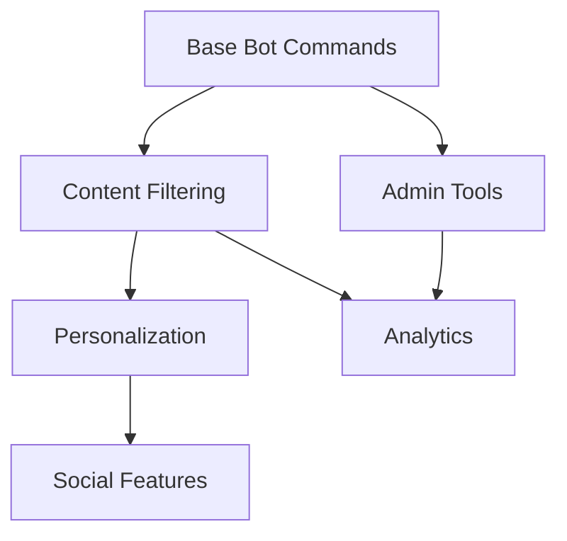
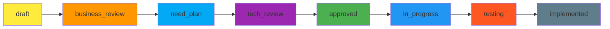

# Улучшение спецификаций NoFluff Bot

## 📋 Обзор

Документ описывает план по улучшению текущей системы спецификаций с сохранением её преимуществ и добавлением бизнес-контекста.

**Принцип:** Эволюционные улучшения без разрушения работающей системы.

---

## 🎯 Текущий анализ

### ✅ Что уже работает отлично:

1. **Техническая полнота**
   - Детальные API контракты
   - Конкретные форматы данных
   - Четкие edge cases

2. **Процессная зрелость**
   - Жизненный цикл (draft → need_plan → approved → implemented)
   - TDD подход
   - Планы имплементации с чекбоксами

3. **Исполнимость**
   - Прямая связь с кодом
   - Конкретные файлы и методы
   - Оптимизированные запросы

### 🔄 Что можно улучшить:

1. **Бизнес-контекст**
   - Приоритеты по бизнес-ценности
   - Метрики успеха
   - Связь с целями продукта

2. **Зависимости**
   - Внутренние зависимости между фичами
   - Внешние зависимости
   - Блокирующие факторы

3. **Риск-менеджмент**
   - Анализ рисков реализации
   - План митигации
   - Альтернативные подходы

---

## 🚀 Предлагаемые улучшения

### 1. Расширить шаблон спецификации

**Добавить новые разделы:**

```markdown
## Бизнес-контекст
### Приоритет: [High/Medium/Low]
### Бизнес-цель: ...
### Метрики успеха: ...
### Ожидаемый impact: ...

## Зависимости и риски
### Внутренние зависимости: ...
### Внешние зависимости: ...
### Риски реализации: ...
### План митигации: ...

## Стратегическое соответствие
### Связь с ROADMAP: ...
### Фаза продукта: ...
### Alignment с целями: ...
```

### 2. Внедрить Priority Framework

**Уровни приоритетов:**

| Priority | Описание | KPI | Пример |
|----------|----------|-----|---------|
| **P0 - Critical** | Блокирует MVP или критична для бизнеса | Revenue/Retention | Базовая фильтрация контента |
| **P1 - High** | Значительно улучшает UX или бизнес-метрики | Engagement/Conversion | Персонализация через фидбек |
| **P2 - Medium** | Улучшает продукт, но не критична | Efficiency/Satisfaction | Улучшенная аналитика |
| **P3 - Low** | Nice-to-have функционал | Innovation/Scalability | Мультиязычность |

### 3. Добавить Success Metrics Framework

**Для каждой спецификации:**

```markdown
## Метрики успеха
### Бизнес-метрики:
- [ ] DAU increase: +15%
- [ ] Retention rate: +20%
- [ ] User satisfaction: 4.5/5

### Продуктовые метрики:
- [ ] Feature adoption rate: 60%
- [ ] Task completion rate: 90%
- [ ] Error rate: <1%

### Технические метрики:
- [ ] Response time: <500ms
- [ ] CPU usage: <70%
- [ ] Test coverage: >95%
```

### 4. Улучшить Dependency Management

**Визуализация зависимостей:**



**Трекинг зависимостей:**

```markdown
## Зависимости
### Блокирующие зависимости:
- ❌ [Spec 047] Channel Deactivation Notification (P0)
- ❌ [Spec 048] Channels Command (P0)

### Зависимые фичи:
- ⏳ [Spec 052] User Analytics (зависит от этой фичи)
- ⏳ [Spec 053] Channel Recommendations (зависит от этой фичи)

### Внешние зависимости:
- 🌐 Telegram Bot API v6.0+
- 🤖 OpenAI API для классификации
- 💰 Stripe для платежей (Phase 3)
```

### 5. Расширить регламент работы

**Новые статусы и переходы:**



**Новые этапы:**
- `business_review` - проверка бизнес-релевантности
- `tech_review` - техническая feasibility проверка
- `in_progress` - активная разработка
- `testing` - фаза тестирования

---

## 📝 Обновленный шаблон спецификации

```markdown
# Спецификация XXX: Название

## Обзор
Краткое описание функционала и его цели в проекте NoFluff Bot.

## Бизнес-контекст
### Приоритет: [P0/P1/P2/P3]
### Бизнес-цель: [Цель продукта]
### Метрики успеха: [KPI и цели]
### Ожидаемый impact: [Бизнес-эффект]
### Стратегическое соответствие: [Phase X, Goal Y]

## Функциональные требования
1. **Требование 1**: Детальное описание
2. **Требование 2**: Детальное описание

## Нефункциональные требования
1. **Производительность**: ...
2. **Масштабируемость**: ...
3. **Надежность**: ...
4. **Usability**: ...

## Требования безопасности
1. **Аутентификация**: ...
2. **Авторизация**: ...
3. **Защита данных**: ...
4. **Logging**: ...

## Зависимости и риски
### Блокирующие зависимости:
- [Spec XXX] Название (Priority)
- External: API/Service/Infrastructure

### Зависимые фичи:
- [Spec YYY] Название (ожидает эту фичу)

### Риски реализации:
1. **Риск 1**: Описание и вероятность
2. **Риск 2**: Описание и вероятность

### План митигации:
1. **Митигация 1**: Как решаем риск 1
2. **Митигация 2**: Как решаем риск 2

## Форматы данных
[Текущий формат без изменений]

## Edge cases и обработка ошибок
[Текущий формат без изменений]

## Критерии выполнения (Definition of Done)
- [ ] Все функциональные требования реализованы
- [ ] Все нефункциональные требования соблюдены
- [ ] Требования безопасности реализованы
- [ ] Unit тесты написаны и проходят
- [ ] Integration тесты написаны и проходят
- [ ] **Бизнес-метрики достигнуты**:
  - [ ] [Metric 1]: [Target]
  - [ ] [Metric 2]: [Target]
- [ ] Documentation обновлена
- [ ] Code review пройден
- [ ] Функционал протестирован в staging environment

## Тестирование
[Unit/Integration/Performance тесты без изменений]

## Зависимости
[Текущий формат + новые разделы зависимостей]

## Статус: draft

## Версия
- **Version**: 1.0
- **Created**: YYYY-MM-DD
- **Updated**: YYYY-MM-DD
- **Author**: Имя автора
- **Reviewer**: Имя ревьюера

## Связанные документы
- [План реализации](../Implementation/Spec_XXX_Name_Implementation.md)
- [ROADMAP](../ROADMAP.md) - ссылка на соответствующие пункты
- [Architecture](../Architecture/) - связанные архитектурные документы
- [Previous specs](../Specs/) - связанные спецификации

## Review history
- **YYYY-MM-DD**: Initial draft
- **YYYY-MM-DD**: Business review completed
- **YYYY-MM-DD**: Tech review completed
- **YYYY-MM-DD**: Approved for implementation
```

---

## 🔄 План внедрения

### Phase 1: Обновление шаблонов (1 день)
- [ ] Создать новый шаблон спецификации
- [ ] Обновить шаблон плана имплементации
- [ ] Создать priority framework документ
- [ ] Обновить регламент работы

### Phase 2: Обучение команды (1 день)
- [ ] Провести workshop по новым шаблонам
- [ ] Объяснить приоритизацию и метрики
- [ ] Демонстрировать dependency tracking
- [ ] Ответить на вопросы команды

### Phase 3: Pilot на 2-3 спецификациях (3 дня)
- [ ] Выбрать существующие спецификации для обновления
- [ ] Применить новый формат
- [ ] Собрать feedback от команды
- [ ] Оптимизировать шаблон на основе feedback

### Phase 4: Полное внедрение (1 неделя)
- [ ] Обновить все черновые спецификации
- [ ] Применять новый формат для всех новых спецификаций
- [ ] Настроить автоматические проверки
- [ ] Создать dashboard для отслеживания приоритетов

---

## 📊 Ожидаемые результаты

### Качественные улучшения:
- ✅ **Лучшее понимание бизнес-ценности** каждой фичи
- ✅ **Улучшенная приоритизация** на основе данных
- ✅ **Прозрачные зависимости** между компонентами
- ✅ **Проактивное управление рисками**

### Количественные метрики:
- 📈 Ускорение review процесса на 25%
- 🎯 Повышение релевантности фич на 30%
- ⚡ Сокращение блокировок из-за зависимостей на 40%
- 📊 Улучшение предсказуемости сроков на 20%

---

## ⚠️ Риски и митигация

### Риск: Увеличение времени на создание спецификаций
- **Митигация:** Автоматизация шаблонов через generators
- **Решение:** Создать rake task для генерации спецификаций

### Риск: Сложность определения приоритетов
- **Митигация:** Четкие критерии и примеры
- **Решение:** Priority matrix с бизнес-кейсами

### Риск: Недостаток данных для метрик
- **Митигация:** Начать с базовых метрик
- **Решение:** Постепенно усложнять систему метрик

---

## 📋 Чеклист внедрения

### Шаблоны и документы:
- [ ] Обновлен шаблон спецификации
- [ ] Обновлен шаблон плана имплементации
- [ ] Создан Priority Framework
- [ ] Обновлен регламент работы

### Процессы:
- [ ] Определен workflow для новых спецификаций
- [ ] Настроены automatic checks
- [ ] Созданы review checklists
- [ ] Обучена команда

### Инструменты:
- [ ] Создан generator для спецификаций
- [ ] Настроен dependency tracking
- [ ] Создан dashboard для приоритетов
- [ ] Интегрирован с existing tools

---

**📍 Документ создан:** 2025-01-31
**👤 Автор:** AI Assistant
**🔄 Статус:** К исполнению
**📅 Следующее обновление:** после pilot phase