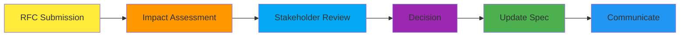

# Регламент процессов согласования NoFluff Bot

## 📋 Обзор

Документ описывает стандартизированные процессы review, approval и change management для спецификаций и планов имплементации.

**Цель:** Обеспечить качество и согласованность при минимизации бюрократии.

---

## 🔄 Жизненный цикл спецификации (Enhanced)


### Описание статусов:

| Статус | Описание | Ответственный | Критерии перехода |
|--------|----------|---------------|-------------------|
| **draft** | Первичная версия спецификации | Author | Базовая структура заполнена |
| **business_review** | Проверка бизнес-релевантности | Product Manager | Соответствие целям продукта |
| **need_plan** | Требуется план имплементации | Tech Lead | Бизнес-аспект одобрен |
| **tech_review** | Техническая feasibility проверка | Senior Developer | Техническая реализуемость |
| **approved** | Одобрена к реализации | Team Lead | Все проверки пройдены |
| **in_progress** | Активная разработка | Developer | Работа начата |
| **testing** | Фаза тестирования | QA Engineer | Код готов к тестам |
| **implemented** | Реализована | Developer | Все тесты проходят |
| **delivered** | Доставлена в production | DevOps | Деплой завершен |

---

## 👥 Роли и ответственности

### Product Manager
- ✅ **Business review** спецификаций
- ✅ Приоритизация фич по бизнес-ценности
- ✅ Проверка alignment с целями продукта
- ✅ Утверждение бизнес-метрик

### Tech Lead
- ✅ **Tech review** спецификаций
- ✅ Проверка технической реализуемости
- ✅ Review архитектурных решений
- ✅ Утверждение планов имплементации

### Senior Developer
- ✅ Code review планов имплементации
- ✅ Проверка test coverage
- ✅ Review API контрактов
- ✅ Валидация dependency analysis

### QA Engineer
- ✅ Review тестовых сценариев
- ✅ Проверка edge cases
- ✅ Валидация критериев качества
- ✅ Утверждение test plans

### DevOps
- ✅ Review инфраструктурных требований
- ✅ Проверка deployment планов
- ✅ Валидация monitoring стратегии
- ✅ Утверждение production readiness

---

## 📋 Процессы проверки

### 1. Business Review Process

**Trigger:** Спецификация готова к бизнес-проверке (статус: draft → business_review)

**Checklist:**
```markdown
## Business Review Checklist

### Цели и стратегия
- [ ] Цель спецификации соответствует бизнес-целям
- [ ] Приоритет определен корректно (P0-P3)
- [ ] Метрики успеха измеримы и релевантны
- [ ] Expected impact обоснован

### Целевая аудитория
- [ ] Решает реальные проблемы пользователей
- [ ] Соответствует портрету ЦА
- [ ] User flow логичен и понятен

### Рыночный контекст
- [ ] Учитывает конкурентную среду
- [ ] Дифференцирующее преимущество ясно
- [ ] Вписывается в стратегию продукта

### Ресурсы и сроки
- [ ] Оценка effort реалистична
- [ ] Не конфликтует с другими приоритетами
- [ ] Timeline достижим

**Decision:**
- ✅ **Approved** - Переход к need_plan
- 🔄 **Changes Required** - Вернуть на доработку
- ❌ **Rejected** - Отклонить с объяснением причин
```

### 2. Technical Review Process

**Trigger:** Бизнес-аспект одобрен (статус: need_plan → tech_review)

**Checklist:**
```markdown
## Technical Review Checklist

### Архитектура
- [ ] Решение соответствует существующей архитектуре
- [ ] Нет технических blockers
- [ ] Scale/performance учтены
- [ ] Security требования соблюдены

### Зависимости
- [ ] Все зависимости идентифицированы
- [ ] Блокирующие факторы учтены
- [ ] External dependencies доступны
- [ ] Timeline с учетом зависимостей реалистичен

### Реализация
- [ ] API design корректен
- [ ] Database schema оптимальна
- [ ] Error handling продуман
- [ ] Testing strategy адекватна

### Риски
- [ ] Технические риски оценены
- [ ] План митигации реалистичен
- [ ] Alternative approaches рассмотрены

**Decision:**
- ✅ **Approved** - Переход к approved
- 🔄 **Changes Required** - Вернуть на доработку
- ❌ **Rejected** - Отклонить с объяснением причин
```

### 3. Implementation Plan Review

**Trigger:** Спецификация утверждена (статус: approved → in_progress)

**Checklist:**
```markdown
## Implementation Plan Review Checklist

### TDD Approach
- [ ] Тесты запланированы первыми
- [ ] Unit тесты покрывают все компоненты
- [ ] Integration тесты продуманы
- [ ] Test scenarios реалистичны

### Разбивка на этапы
- [ ] Этапы логичны и последовательны
- [ ] Задачи измеримы и проверяемы
- [ ] Чекбоксы для отслеживания есть
- [ ] Dependencies между этапами учтены

### Качество кода
- [ ] Code review запланирован
- [ ] Linting и форматирование учтены
- [ ] Performance тесты включены
- [ ] Security тесты запланированы

### Deployment
- [ ] Стратегия деплоя определена
- [ ] Rollback план есть
- [ ] Monitoring настроен
- [ ] Documentation обновлена

**Decision:**
- ✅ **Approved** - Начать реализацию
- 🔄 **Changes Required** - Доработать план
- ❌ **Rejected** - Пересмотреть подход
```

---

## 🔄 Change Management Process

### 1. Request for Change (RFC)

**Когда требуется:** Значительные изменения в утвержденной спецификации

**Процесс:**


**RFC Template:**
```markdown
# Request for Change: [Spec XXX]

## Краткое описание
[Что меняем и почему]

## Тип изменения
- [ ] **Critical** - Блокирует реализацию
- [ ] **Major** - Значительно меняет функционал
- [ ] **Minor** - Небольшие улучшения
- [ ] **Cosmetic** - Текстовые/форматные правки

## Impact Assessment
### Технический impact:
- [ ] Требует изменения архитектуры
- [ ] Влияет на другие компоненты
- [ ] Меняет API контракты
- [ ] Требует дополнительных тестов

### Бизнес impact:
- [ ] Меняет метрики успеха
- [ ] Влияет на таймлайн
- [ ] Меняет приоритет
- [ ] Требует дополнительных ресурсов

## Рекомендация
[Предложенное решение]

## Approval Required
- [ ] Product Manager
- [ ] Tech Lead
- [ ] Senior Developer
- [ ] QA Engineer
```

### 2. Minor Changes Process

**Когда требуется:** Небольшие изменения без impact на другие компоненты

**Process:**
1. Author вносит изменения напрямую
2. Обновляет version и changelog
3. Комментирует изменения в PR
4. Получает approval от Tech Lead

### 3. Emergency Changes Process

**Когда требуется:** Critical fixes в production

**Process:**
1. Немедленное изменение кода
2. Post-mortem анализ в течение 24 часов
3. Обновление спецификации после исправления
4. Review командой для предотвращения в будущем

---

## 📊 Quality Gates

### Gate 1: Business Alignment
**Location:** draft → business_review
**Criteria:**
- Бизнес-цель ясна и измерима
- Целевая аудитория определена
- Приоритет обоснован
- Метрики успеха установлены

### Gate 2: Technical Feasibility
**Location:** need_plan → tech_review
**Criteria:**
- Архитектурное решение корректно
- Зависимости проанализированы
- Риски оценены и митигированы
- Timeline реалистичен

### Gate 3: Implementation Readiness
**Location:** tech_review → approved
**Criteria:**
- План имплементации детализирован
- TDD подход включен
- Ресурсы определены
- Quality gates установлены

### Gate 4: Production Readiness
**Location:** testing → implemented
**Criteria:**
- Все тесты проходят
- Performance метрики достигнуты
- Security требования соблюдены
- Documentation обновлена

---

## ⚡ Automation и Tools

### 1. Automatic Quality Checks

**Pre-commit hooks:**
```bash
#!/bin/bash
# Проверка спецификации перед коммитом

echo "🔍 Checking specification quality..."

# Проверка структуры
if ! grep -q "## Бизнес-контекст" "$1"; then
  echo "❌ Missing business context section"
  exit 1
fi

if ! grep -q "## Метрики успеха" "$1"; then
  echo "❌ Missing success metrics section"
  exit 1
fi

# Проверка формата приоритета
if ! grep -q "### Приоритет: \[P[0-3]\]" "$1"; then
  echo "❌ Invalid priority format"
  exit 1
fi

echo "✅ Specification quality checks passed"
```

### 2. Review Bot Integration

**GitHub Actions:**
```yaml
name: Specification Review
on:
  pull_request:
    paths:
      - 'docs/Specs/*.md'

jobs:
  review:
    runs-on: ubuntu-latest
    steps:
      - uses: actions/checkout@v2

      - name: Validate Spec Structure
        run: |
          # Check required sections
          # Validate priority format
          # Check metrics completeness

      - name: Generate Review Report
        run: |
          # Generate summary
          # Check completion status
          # Create review checklist

      - name: Notify Reviewers
        uses: actions/github-script@v6
        with:
          script: |
            // Automatic reviewer assignment
            // Notification logic
```

### 3. Dashboard для отслеживания

**Metrics для мониторинга:**
- 📊 Количество спецификаций по статусам
- ⏱️ Среднее время review по этапам
- 🎯 Hit rate метрик успеха
- 🔄 Частота изменений
- 📈 Trend по качеству спецификаций

---

## 📋 Templates и Checklists

### 1. Spec Creation Template

```bash
#!/bin/bash
# Генерация новой спецификации

SPEC_NAME="$1"
SPEC_NUMBER=$(ls docs/Specs/ | sort -V | tail -1 | grep -o '^[0-9]\+' | head -1)
NEXT_NUMBER=$((SPEC_NUMBER + 1))
NEXT_NUMBERFormatted=$(printf "%03d" $NEXT_NUMBER)

cat > "docs/Specs/${NEXT_NUMBERFormatted}_${SPEC_NAME}_Specification.md" << 'EOF'
# Спецификация XXX: Название

## Обзор
[Описание функционала и его цели]

## Бизнес-контекст
### Приоритет: [P0/P1/P2/P3]
### Бизнес-цель: ...
### Метрики успеха: ...
### Ожидаемый impact: ...

[Остальные разделы по шаблону]

## Статус: draft
EOF

echo "✅ Specification created: docs/Specs/${NEXT_NUMBERFormatted}_${SPEC_NAME}_Specification.md"
```

### 2. Review Request Template

```markdown
## Review Request: Spec XXX

**Author:** @username
**Reviewers:** @product-manager @tech-lead @senior-dev
**Type:** [Business Review / Tech Review / Implementation Review]

### Summary
[Краткое описание спецификации]

### Key Points for Review
1. [Точка 1 для внимания]
2. [Точка 2 для внимания]
3. [Точка 3 для внимания]

### Specific Questions
1. [Вопрос к ревьюерам]
2. [Вопрос к ревьюерам]

### Files to Review
- [Спецификация](link-to-spec)
- [План имплементации](link-to-impl) (если есть)

### Timeline
**Review requested:** YYYY-MM-DD
**Review needed by:** YYYY-MM-DD
**Target implementation start:** YYYY-MM-DD
```

---

## ⚠️ Common Issues и Solutions

### Issue 1: Analysis Paralysis
**Problem:** Чрезмерный анализ задерживает процесс
**Solution:**
- Timeboxing для review этапов
- Clear criteria для каждого этапа
- Escalation process для блокирующих ситуаций

### Issue 2: Unclear Priorities
**Problem:** Трудности с приоритизацией фич
**Solution:**
- Priority matrix с примерами
- Regular priority review meetings
- Data-driven приоритизация

### Issue 3: Scope Creep
**Problem:** Спецификации постоянно растут
**Solution:**
- Strict change management process
- MVP-first approach
- Regular scope validation

### Issue 4: Low Quality Reviews
**Problem:** Поверхностные ревью без ценной обратной связи
**Solution:**
- Structured review checklists
- Required review criteria
- Review quality metrics

---

## 📊 Success Metrics

### Process Metrics:
- 📈 **Time to approval:** < 5 дней
- 🎯 **Review quality score:** > 90%
- ⚡ **Spec-to-implementation ratio:** > 80%
- 🔄 **Change request rate:** < 20%

### Business Metrics:
- 📊 **Feature alignment:** > 95%
- 🎯 **Priority accuracy:** > 85%
- 📈 **Timeline predictability:** > 80%
- ✅ **Success rate:** > 90%

---

**📍 Документ создан:** 2025-01-31
**👤 Автор:** AI Assistant
**🔄 Статус:** К исполнению
**📅 Следующий review:** после pilot phase