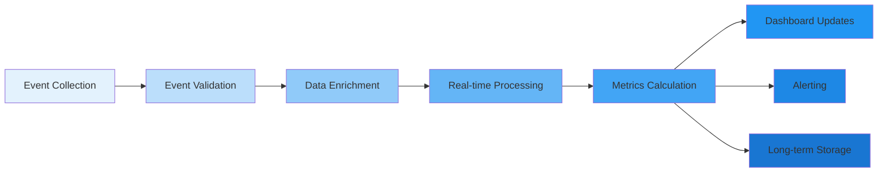

# Фреймворк метрик успеха NoFluff Bot

## 📋 Обзор

Документ определяет систему метрик для измерения успеха продукта, фич и бизнес-показателей. Обеспечивает data-driven подход к принятию решений на всех уровнях.

**Принцип:** Измерять то, что важно, и улучшать то, что измеримо.

---

## 🎯 North Star Metric

### Time Saved per User
**Определение:** Среднее время, сэкономленное пользователю еженедельно благодаря автоматической фильтрации контента.

**Расчет:**
```
Time Saved = (Manual Reading Time - Filtered Reading Time) × Relevance Score
Manual Reading Time = 5 мин/пост × 100 постов/неделя = 500 минут
Filtered Reading Time = 2 мин/пост × 10 важных постов/неделя = 20 минут
Time Saved = (500 - 20) × 0.85 (relevance) = 408 минут ≈ 7 часов
```

**Target:** 5+ часов в неделю на пользователя

**Почему это North Star:**
- ✅ Прямо отражает ценность для пользователя
- ✅ Двигает все ключевые бизнес-метрики
- ✅ Фокусирует на ядре продукта
- ✅ Легкоコミмуницируется с командой

---

## 📊 Иерархия метрик

### Level 1: Business Outcomes (Результаты бизнеса)

| Метрика | Описание | Target | Частота измерения |
|---------|----------|--------|-------------------|
| **Monthly Recurring Revenue** | Доход от подписок | $10,000+ | Ежемесячно |
| **Customer Lifetime Value** | Ценность клиента за все время | $60+ | Квартально |
| **Customer Acquisition Cost** | Стоимость привлечения клиента | <$10 | Ежемесячно |
| **Net Revenue Retention** | Удержание дохода с учетом expansion | >100% | Квартально |

### Level 2: Product Success (Успех продукта)

| Метрика | Описание | Target | Частота измерения |
|---------|----------|--------|-------------------|
| **Weekly Active Users** | Активные пользователи за неделю | >80% от MAU | Еженедельно |
| **User Satisfaction Score** | Удовлетворенность пользователей | >4.0/5 | Квартально |
| **Feature Adoption Rate** | Adoptation новых фич | >60% | Ежемесячно |
| **Time Saved per User** | Сэкономленное время на пользователя | >5 часов/неделю | Еженедельно |

### Level 3: Feature Performance (Производительность фич)

| Метрика | Описание | Target | Частота измерения |
|---------|----------|--------|-------------------|
| **Filter Accuracy** | Точность AI-фильтрации | >85% | Еженедельно |
| **Content Relevance** | Релевантность отфильтрованного контента | >80% | Еженедельно |
| **Response Time** | Время ответа бота | <500ms | Постоянно |
| **Error Rate** | Частота ошибок | <1% | Постоянно |

### Level 4: Technical Health (Техническое здоровье)

| Метрика | Описание | Target | Частота измерения |
|---------|----------|--------|-------------------|
| **Uptime** | Доступность сервиса | >99.9% | Постоянно |
| **Test Coverage** | Покрытие кода тестами | >95% | При каждом деплое |
| **API Response Time** | Время ответа API | <200ms | Постоянно |
| **Database Performance** | Производительность БД | <100ms запросы | Постоянно |

---

## 🎯 Метрики по категориям

### User Engagement Metrics

#### Daily Active Users (DAU)
```sql
SELECT COUNT(DISTINCT telegram_user_id)
FROM user_sessions
WHERE DATE(created_at) = CURRENT_DATE;
```
**Target:** 40%+ от MAU

#### Weekly Active Users (WAU)
```sql
SELECT COUNT(DISTINCT telegram_user_id)
FROM user_sessions
WHERE created_at >= DATE_SUB(CURRENT_DATE, INTERVAL 7 DAY);
```
**Target:** 70%+ от MAU

#### Session Duration
```sql
SELECT AVG(session_duration_minutes)
FROM user_sessions
WHERE DATE(created_at) = CURRENT_DATE;
```
**Target:** 2-5 минут

#### Interaction Frequency
```sql
SELECT AVG(interactions_per_week)
FROM (
  SELECT telegram_user_id, COUNT(*) as interactions_per_week
  FROM user_interactions
  WHERE created_at >= DATE_SUB(CURRENT_DATE, INTERVAL 7 DAY)
  GROUP BY telegram_user_id
) as weekly_interactions;
```
**Target:** 3+ взаимодействий в неделю

### Content Quality Metrics

#### Filter Accuracy
**Метод измерения:** User feedback на отфильтрованный контент
```ruby
# Псевдокод для расчета
def calculate_filter_accuracy
  total_feedback = Feedback.where(created_at: 1.week.ago..)
  positive_feedback = total_feedback.where(sentiment: :like)

  (positive_feedback.count.to_f / total_feedback.count * 100).round(2)
end
```
**Target:** >85%

#### Content Relevance Score
**Метод измерения:** Комбинированный показатель
```
Relevance Score = (User Feedback Weight × 0.6) +
                  (Read Time Weight × 0.3) +
                  (Share Rate Weight × 0.1)
```
**Target:** >80%

#### False Positive Rate
**Определение:** % важного контента, отфильтрованного как неважный
```sql
SELECT
  (SELECT COUNT(*) FROM feedback WHERE sentiment = :dislike AND filtered_out = true) * 100.0 /
  (SELECT COUNT(*) FROM feedback WHERE sentiment = :dislike) as false_positive_rate;
```
**Target:** <5%

#### False Negative Rate
**Определение:** % неважного контента, пропущенного фильтром
```sql
SELECT
  (SELECT COUNT(*) FROM feedback WHERE sentiment = :dislike AND filtered_out = false) * 100.0 /
  (SELECT COUNT(*) FROM feedback WHERE sentiment = :dislike) as false_negative_rate;
```
**Target:** <10%

### Business Metrics

#### Conversion Rate (Free → Premium)
```sql
SELECT
  COUNT(DISTINCT CASE WHEN plan = 'premium' THEN telegram_user_id END) * 100.0 /
  COUNT(DISTINCT telegram_user_id) as conversion_rate
FROM subscriptions
WHERE created_at >= DATE_SUB(CURRENT_DATE, INTERVAL 30 DAY);
```
**Target:** 25%+

#### Monthly Churn Rate
```sql
SELECT
  (COUNT(churned_users) * 100.0) / total_users as churn_rate
FROM (
  SELECT
    COUNT(CASE WHEN status = 'cancelled' THEN 1 END) as churned_users,
    COUNT(*) as total_users
  FROM subscriptions
  WHERE created_at >= DATE_SUB(CURRENT_DATE, INTERVAL 30 DAY)
) as churn_data;
```
**Target:** <10% для платящих пользователей

#### Customer Lifetime Value (LTV)
```ruby
# Расчет LTV
def calculate_ltv
  avg_monthly_revenue = 10.0  # $10/month
  gross_margin = 0.8           # 80% margin
  churn_rate = 0.05            # 5% monthly churn

  avg_monthly_revenue * gross_margin / churn_rate
end
# Result: $160
```
**Target:** >$60

#### Customer Acquisition Cost (CAC)
```sql
SELECT
  total_marketing_spend / new_customers as cac
FROM (
  SELECT
    SUM(spend) as total_marketing_spend,
    COUNT(DISTINCT telegram_user_id) as new_customers
  FROM marketing_campaigns mc
  JOIN user_acquisitions ua ON mc.campaign_id = ua.campaign_id
  WHERE mc.created_at >= DATE_SUB(CURRENT_DATE, INTERVAL 30 DAY)
) as acquisition_data;
```
**Target:** <$10

### Technical Performance Metrics

#### API Response Time
```ruby
# Monitoring implementation
class PerformanceMonitor
  def self.track_response_time
    start_time = Time.now
    result = yield
    end_time = Time.now

    response_time = (end_time - start_time) * 1000 # milliseconds

    # Log to monitoring system
    Metrics.histogram('api.response_time', response_time)

    result
  end
end
```
**Target:** <500ms (95th percentile)

#### Error Rate
```sql
SELECT
  (SELECT COUNT(*) FROM error_logs WHERE created_at >= DATE_SUB(NOW(), INTERVAL 1 HOUR)) * 100.0 /
  (SELECT COUNT(*) FROM api_logs WHERE created_at >= DATE_SUB(NOW(), INTERVAL 1 HOUR)) as error_rate;
```
**Target:** <1%

#### System Uptime
```bash
# Uptime calculation script
#!/bin/bash
START_TIME=$(date -d "1 month ago" +%s)
CURRENT_TIME=$(date +%s)
TOTAL_SECONDS=$((CURRENT_TIME - START_TIME))

# Get downtime from monitoring system
DOWNTIME_SECONDS=$(get_downtime_from_monitoring "$START_TIME")

UPTIME_PERCENTAGE=$(echo "scale=2; (1 - $DOWNTIME_SECONDS / $TOTAL_SECONDS) * 100" | bc)
echo "Uptime: $UPTIME_PERCENTAGE%"
```
**Target:** >99.9%

---

## 📈 Feature-Specific Metrics

### AI Content Filtering

#### Classification Accuracy
**Method:** A/B testing с контрольной группой
```ruby
# A/B test framework
class AccuracyTest
  def self.measure_accuracy(test_group, control_group)
    test_feedback = test_group.collect_feedback
    control_feedback = control_group.collect_feedback

    # Compare user satisfaction between groups
    test_satisfaction = calculate_satisfaction(test_feedback)
    control_satisfaction = calculate_satisfaction(control_feedback)

    improvement = ((test_satisfaction - control_satisfaction) / control_satisfaction * 100).round(2)

    {
      test_group_size: test_group.size,
      control_group_size: control_group.size,
      improvement_percentage: improvement,
      statistical_significance: calculate_significance(test_feedback, control_feedback)
    }
  end
end
```

#### Personalization Effectiveness
**Metrics:**
- CTR improvement after personalization
- Time spent reading personalized content
- User feedback on personalized recommendations

### Channel Management

#### Channel Addition Rate
```sql
SELECT
  DATE(created_at) as date,
  COUNT(*) as new_subscriptions
FROM subscriptions
GROUP BY DATE(created_at)
ORDER BY date DESC;
```

#### Channel Removal Rate
```sql
SELECT
  DATE(updated_at) as date,
  COUNT(*) as removed_subscriptions
FROM subscriptions
WHERE status = 'cancelled'
GROUP BY DATE(updated_at)
ORDER BY date DESC;
```

#### Average Channels per User
```sql
SELECT AVG(channel_count) as avg_channels_per_user
FROM (
  SELECT telegram_user_id, COUNT(*) as channel_count
  FROM subscriptions
  WHERE status = 'active'
  GROUP BY telegram_user_id
) as user_channels;
```

### User Preferences

#### Settings Change Frequency
```sql
SELECT
  setting_name,
  COUNT(*) as change_count,
  AVG(change_interval_days) as avg_interval
FROM (
  SELECT
    setting_name,
    telegram_user_id,
    DATEDIFF(created_at, LAG(created_at) OVER (PARTITION BY telegram_user_id, setting_name ORDER BY created_at)) as change_interval_days
  FROM user_setting_changes
) as setting_changes
GROUP BY setting_name;
```

#### Preference Stability
**Metric:** Как часто пользователи меняют настройки
```
Stability Score = 1 - (Average Changes per User per Month)
Target: >0.8 (менее 20% пользователей меняют настройки ежемесячно)
```

---

## 📊 Dashboard Configuration

### Real-time Dashboard

**Primary Widgets:**
1. **Current Active Users** - Live counter
2. **API Response Time** - Last 5 minutes
3. **Error Rate** - Current hour
4. **Content Processing Queue** - Queue size
5. **System Health** - Overall status

### Daily Dashboard

**Key Metrics:**
1. **Daily Active Users**
2. **Content Processed** - Posts analyzed
3. **User Satisfaction** - Daily feedback score
4. **Revenue** - Daily recurring revenue
5. **Support Tickets** - New and resolved

### Weekly Dashboard

**Trend Analysis:**
1. **User Growth** - Week over week
2. **Engagement Trends** - Active user metrics
3. **Content Quality** - Filter accuracy trends
4. **Business Health** - Revenue and costs
5. **Technical Performance** - Response time trends

---

## 🎯 Alerting Thresholds

### Critical Alerts (Immediate)

| Metric | Threshold | Action |
|--------|-----------|--------|
| **System Uptime** | < 99% | Emergency response team |
| **API Error Rate** | > 5% | On-call engineer |
| **Response Time** | > 2s | Scale infrastructure |
| **Queue Size** | > 1000 items | Add workers |

### Warning Alerts (Within 1 hour)

| Metric | Threshold | Action |
|--------|-----------|--------|
| **Filter Accuracy** | < 70% | Review AI models |
| **User Satisfaction** | < 3.0/5 | Product team investigation |
| **Conversion Rate** | < 15% | Marketing review |
| **Churn Rate** | > 15% | Retention campaign |

### Information Alerts (Daily review)

| Metric | Threshold | Action |
|--------|-----------|--------|
| **Weekly Growth** | < 5% | Growth strategy review |
| **Feature Adoption** | < 40% | UX review |
| **Support Tickets** | > 50/day | Support team scaling |
| **Cost per User** | > $2 | Cost optimization |

---

## 📋 Measurement Implementation

### Data Collection Strategy

**Instrumentation Points:**
1. **User Interactions** - Every bot command
2. **Content Processing** - Each filtered post
3. **System Performance** - API calls and database queries
4. **Business Events** - Subscriptions, payments, cancellations

**Event Schema:**
```json
{
  "event_id": "uuid",
  "event_type": "user_action|system_event|business_event",
  "timestamp": "2025-01-31T12:00:00Z",
  "user_id": "telegram_user_id",
  "session_id": "session_uuid",
  "properties": {
    "action": "command_name|feature_used",
    "value": "metric_value",
    "context": "additional_data"
  },
  "metadata": {
    "source": "webhook|api|background_job",
    "version": "app_version",
    "environment": "production|staging"
  }
}
```

### Analytics Pipeline



### Quality Assurance

**Data Quality Checks:**
```ruby
class DataQualityValidator
  def self.validate_event(event)
    errors = []

    # Required fields check
    errors << "Missing event_id" unless event[:event_id]
    errors << "Missing timestamp" unless event[:timestamp]
    errors << "Invalid timestamp" unless valid_timestamp?(event[:timestamp])

    # Business logic checks
    errors << "Invalid user action" unless valid_action?(event[:properties][:action])
    errors << "Suspicious activity" if detect_anomaly?(event)

    {
      valid: errors.empty?,
      errors: errors,
      event: event
    }
  end
end
```

---

## 🔄 Continuous Improvement

### Metrics Review Process

**Weekly Review:**
- 📊 Dashboard health check
- 🎯 Target progress analysis
- ⚠️ Alert performance review
- 📈 Trend identification

**Monthly Review:**
- 📋 KPI achievement assessment
- 🎯 Goal adjustment if needed
- 📊 Deep dive on underperforming metrics
- 🔍 Root cause analysis for issues

**Quarterly Review:**
- 🎯 Strategic objective progress
- 📈 Long-term trend analysis
- 🔄 Metrics framework optimization
- 📊 Benchmark against industry standards

### A/B Testing Framework

```ruby
class ExperimentManager
  def self.run_experiment(name, variants, success_metric)
    # Create experiment configuration
    experiment = Experiment.create!(
      name: name,
      variants: variants,
      success_metric: success_metric,
      status: 'running'
    )

    # Assign users to variants
    assign_users_to_variants(experiment)

    # Monitor results
    schedule_results_collection(experiment)

    experiment
  end

  def self.analyze_results(experiment)
    results = collect_experiment_data(experiment)
    statistical_significance = calculate_significance(results)

    if statistical_significance > 0.95
      determine_winner(experiment, results)
    else
      extend_experiment(experiment)
    end
  end
end
```

---

## 📊 Success Metrics Summary

### Key Performance Indicators Dashboard

| Category | Metric | Current | Target | Status |
|----------|--------|---------|--------|--------|
| **Users** | MAU | TBD | 10,000+ | 📋 Tracking |
| | WAU/MAU Ratio | TBD | >70% | 📋 Tracking |
| | Satisfaction Score | TBD | >4.0/5 | 📋 Tracking |
| **Product** | Filter Accuracy | TBD | >85% | 📋 Tracking |
| | Time Saved per User | TBD | >5hrs/week | 📋 Tracking |
| | Feature Adoption | TBD | >60% | 📋 Tracking |
| **Business** | MRR | TBD | $10,000+ | 📋 Tracking |
| | Conversion Rate | TBD | >25% | 📋 Tracking |
| | LTV | TBD | >$60 | 📋 Tracking |
| **Technical** | Response Time | TBD | <500ms | 📋 Tracking |
| | Uptime | TBD | >99.9% | 📋 Tracking |
| | Error Rate | TBD | <1% | 📋 Tracking |

### Success Criteria

**MVP Success:**
- ✅ 1,000+ active users
- ✅ 70%+ satisfied with filtering
- ✅ < 20% monthly churn
- ✅ < 500ms response time

**Product-Market Fit:**
- ✅ 10,000+ active users
- ✅ 40%+ "very disappointed" without product
- ✅ 25%+ organic growth rate
- ✅ 25%+ conversion to premium

**Business Viability:**
- ✅ $10,000+ MRR
- ✅ $60+ LTV
- ✅ <$10 CAC
- ✅ >100% NRR

---

**📍 Документ создан:** 2025-01-31
**👤 Автор:** AI Assistant
**🔄 Статус:** Ready for Implementation
**📅 Обновление:** Ежеквартально или при значительных изменениях продукта