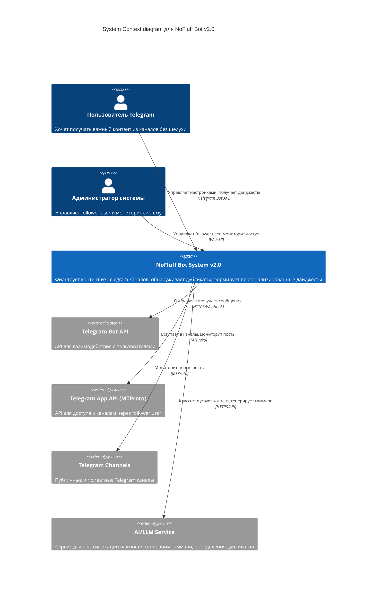

# Архитектура системы "Без шелухи" (NoFluff Bot) - Updated v2.0

## 🚨 Важное изменение архитектуры v2.0

**Проблема**: Telegram Bot API НЕ позволяет ботам самостоятельно вступать в каналы
**Решение**: Переход на User-based подход через Telegram App API (MTProto)

---

## Level 1: System Context Diagram v2.0

Диаграмма показывает систему в контексте взаимодействия с пользователями и внешними системами с учетом user-based доступа.



### Ключевые изменения v2.0:

1. **Двойной API подход**:
   - Telegram Bot API для взаимодействия с пользователями
   - Telegram App API (MTProto) для доступа к каналам

2. **Follower User Account**:
   - Специальный аккаунт пользователя для мониторинга каналов
   - Управляется администратором системы
   - Предоставляет доступ к контенту как обычный пользователь

3. **Разделение ответственности**:
   - Bot API: команды пользователей, настройки, доставка дайджестов
   - App API: мониторинг каналов, получение контента

---

## Level 2: Container Diagram v2.0

```mermaid
C4Container
    title Container diagram для NoFluff Bot v2.0

    Person(user, "Пользователь")
    Person(admin, "Администратор")

    System_Ext(telegram_bot, "Telegram Bot API")
    System_Ext(telegram_app, "Telegram App API (MTProto)")
    System_Ext(ai, "AI/LLM Service")

    Container(rails_app, "Rails API Application", "Ruby on Rails 8", "Обрабатывает команды пользователей, управляет бизнес-логикой")
    Container(user_client, "Telegram User Client", "MTProto Client", "Follower user для доступа к каналам")
    Container(bot_workers, "Background Workers", "Solid Queue", "Асинхронная обработка: мониторинг каналов, формирование дайджестов, AI-анализ")

    ContainerDb(postgres, "Database", "PostgreSQL", "Хранит пользователей, каналы, посты, настройки, follower user данные")
    ContainerDb(cache, "Cache", "Solid Cache", "Кеширует результаты AI, дедупликацию, MTProto сессии")
    ContainerQueue(queue, "Job Queue", "Solid Queue", "Очередь фоновых задач")

    Rel(user, telegram_bot, "Отправляет команды", "Telegram")
    Rel(telegram_bot, rails_app, "Webhook / Long Polling", "HTTPS")
    Rel(admin, rails_app, "Управляет follower user", "HTTPS")

    Rel(rails_app, user_client, "Управляет сессиями", "Internal API")
    Rel(user_client, telegram_app, "Мониторит каналы", "MTProto")
    Rel(telegram_app, telegram_channels, "Доступ к контенту", "MTProto")

    Rel(rails_app, postgres, "Читает/пишет данные", "SQL")
    Rel(rails_app, cache, "Кеширует данные", "Redis Protocol")
    Rel(rails_app, queue, "Ставит задачи в очередь", "SQL")
    Rel(bot_workers, queue, "Забирает задачи", "SQL")
    Rel(bot_workers, user_client, "Использует для мониторинга", "Internal API")
    Rel(bot_workers, postgres, "Обновляет данные", "SQL")
    Rel(bot_workers, telegram_bot, "Отправляет дайджесты", "HTTPS")
    Rel(bot_workers, ai, "Анализирует контент", "HTTPS")
    Rel(bot_workers, cache, "Использует кеш", "Redis Protocol")
```

### Новые контейнеры v2.0:

1. **Telegram User Client**:
   - MTProto клиент для follower user
   - Управление сессиями и авторизацией
   - Доступ к каналам как обычного пользователя
   - Rate limiting и безопасность

2. **Обновленный Background Workers**:
   - Channel Access Workers (вместо Bot Join Workers)
   - Content Monitor Workers через MTProto
   - Интеграция с User Client

---

## Level 3: Component Diagram v2.0

```mermaid
C4Component
    title Component diagram для Rails Application v2.0

    Container_Ext(telegram_bot, "Telegram Bot API")
    Container_Ext(telegram_app, "Telegram App API")
    Container_Ext(workers, "Background Workers")
    ContainerDb_Ext(db, "PostgreSQL")
    ContainerDb_Ext(cache, "Cache")

    Component(webhook_controller, "Telegram Webhook Controller", "Telegram::Bot::UpdatesController", "Принимает обновления от Telegram Bot API")

    Component(bot_concerns, "Bot Command Concerns", "Rails Concerns", "Группы команд: SubscriptionCommands, SettingsCommands, DigestCommands")

    Component(user_service, "User Service", "Service Object", "Управление пользователями и онбордингом")
    Component(channel_service, "Channel Management Service", "Service Object", "Управление подписками на каналы")
    Component(settings_service, "Settings Service", "Service Object", "Управление настройками частоты, формата, фильтрации")

    Component(follower_user_service, "Follower User Service", "Service Object", "Управление аккаунтом follower user")
    Component(user_client_manager, "User Client Manager", "Service Object", "Управление MTProto клиентом и сессиями")
    Component(channel_access_service, "Channel Access Service", "Service Object", "Вступление в каналы и проверка доступа")

    Component(content_filter, "Content Filter Service", "Service Object", "Определяет важность контента на основе AI")
    Component(deduplication, "Deduplication Service", "Service Object", "Находит и удаляет дубликаты постов")
    Component(digest_builder, "Digest Builder Service", "Service Object", "Формирует дайджесты в разных форматах")

    Component(recommendation, "Recommendation Service", "Service Object", "Рекомендует каналы на основе социального графа")
    Component(analytics, "Analytics Service", "Service Object", "Собирает статистику и метрики")
    Component(personalization, "Personalization Service", "Service Object", "Обучается на лайках/дизлайках пользователя")

    Component(models, "Active Record Models", "Models", "TelegramUser, Channel, Post, Subscription, Digest, Feedback, FollowerUser")

    Rel(telegram_bot, webhook_controller, "Webhook updates", "HTTPS")
    Rel(webhook_controller, bot_concerns, "Использует concern'и для команд")

    Rel(bot_concerns, user_service, "Использует")
    Rel(bot_concerns, channel_service, "Использует")
    Rel(bot_concerns, settings_service, "Использует")
    Rel(bot_concerns, analytics, "Использует")

    Rel(user_service, models, "Использует")
    Rel(channel_service, models, "Использует")
    Rel(settings_service, models, "Использует")
    Rel(follower_user_service, models, "Использует FollowerUser")
    Rel(user_client_manager, cache, "Кеширует сессии", "Redis Protocol")
    Rel(channel_access_service, user_client_manager, "Использует для доступа к каналам")
    Rel(channel_access_service, telegram_app, "Вступает в каналы", "MTProto")

    Rel(workers, content_filter, "Вызывает для анализа")
    Rel(workers, user_client_manager, "Использует для мониторинга каналов")
```



### Новые компоненты v2.0:

1. **FollowerUser Model**:
   - Учетные данные follower user
   - Сессии и авторизация
   - Статусы и метрики доступа

2. **User Client Manager**:
   - Управление MTProto клиентом
   - Хранение и восстановление сессий
   - Rate limiting и безопасность

3. **Channel Access Service**:
   - Вступление в каналы через follower user
   - Проверка статуса доступа
   - Обработка ошибок и ретраи

---

## Level 4: Code - User-based Channel Access

### FollowerUser Model
```ruby
class FollowerUser < ApplicationRecord
  enum auth_status: { pending: 0, authorized: 1, revoked: 2 }

  # Защищенные поля
  encrypts :session_string
  encrypts :phone_number

  # Rate limiting
  validates :daily_joins_limit, presence: true
  validates :daily_joins_count, numericality: { less_than_or_equal_to: :daily_joins_limit }

  # Методы
  def can_join_channel?
    daily_joins_count < daily_joins_limit
  end

  def reset_daily_counter
    update!(daily_joins_count: 0, last_reset_date: Date.current)
  end
end
```

### TelegramUserClient Service
```ruby
class TelegramUserClient
  def initialize(follower_user)
    @follower_user = follower_user
    @client = create_mtproto_client
  end

  def join_channel(username)
    return error_result("Rate limit exceeded") unless @follower_user.can_join_channel?

    result = @client.join_channel(username)

    if result.success?
      @follower_user.increment!(:daily_joins_count)
    end

    result
  end

  def check_channel_access(username)
    @client.get_channel_info(username)
  rescue => error
    { success: false, error: error.message }
  end

  private

  def create_mtproto_client
    # Создание MTProto клиента с сессией
  end
end
```

### ChannelAccessService
```ruby
class ChannelAccessService
  def self.join_channel(channel)
    follower_user = FollowerUser.authorized.first
    return error_result("No authorized follower user") unless follower_user

    channel.update!(user_access_status: :joining)

    client = TelegramUserClient.new(follower_user)
    result = client.join_channel(channel.username)

    if result.success?
      channel.update!(
        user_access_status: :joined,
        last_successful_join: Time.current
      )
      notify_admins_success(channel)
    else
      handle_join_failure(channel, result.error)
    end

    result
  end

  def self.check_channel_access(channel)
    follower_user = FollowerUser.authorized.first
    return unless follower_user

    client = TelegramUserClient.new(follower_user)
    access_info = client.check_channel_access(channel.username)

    unless access_info.success?
      channel.update!(user_access_status: :access_revoked)
      notify_admins_access_revoked(channel)
    end

    access_info
  end
end
```

---

## Migration Path from v1.0 to v2.0

### Phase 1: Infrastructure (Week 1-2)
1. Создать Telegram App (получить api_id/api_hash)
2. Создать FollowerUser аккаунт и модель
3. Выбрать и интегрировать MTProto библиотеку
4. Реализовать UserClientManager

### Phase 2: Core Functionality (Week 3-4)
1. Реализовать ChannelAccessService
2. Обновить Channel модель с user_access_status
3. Адаптировать существующие джобы
4. Тестирование на пилотных каналах

### Phase 3: Integration (Week 5-6)
1. Интегрировать с существующим мониторингом
2. Обновить UI для управления follower user
3. Добавить алерты для проблем с доступом
4. Тестирование и отладка

### Phase 4: Production Rollout (Week 7-8)
1. Перенести существующие каналы
2. Мониторинг производительности
3. Обучение администраторов
4. Полное отключение старой Bot-based логики

---

## Security Considerations v2.0

### 1. Follower User Protection
- Защита от блокировок (rate limits, естественное поведение)
- Регулярная ротация сессий
- Мониторинг подозрительной активности

### 2. Data Protection
- Шифрование сессий и учетных данных
- Безопасное хранение API credentials
- Логирование всех операций доступа

### 3. Compliance
- Следование Telegram ToS
- Отслеживание жалоб
- Graceful degradation при проблемах

---

## Benefits of v2.0 Architecture

1. **✅ Полный доступ к каналам** - включая приватные
2. **✅ Больше возможностей мониторинга** - как обычный пользователь
3. **✅ Независимость от администраторов каналов** - не нужно добавлять бота
4. **⚠️ Увеличенная сложность** - управление follower user
5. **⚠️ Риски безопасности** - компрометация учетных данных

---

**Эта архитектура решает фундаментальную проблему доступа к каналам и открывает новые возможности для мониторинга контента!** 🚀