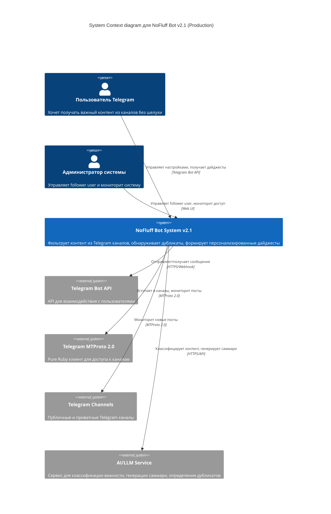

# Архитектура системы "Без шелухи" (NoFluff Bot) - Production v2.1

## ✅ Миграция на MTProto-ruby успешно завершена

**Статус**: ✅ **ЗАВЕРШЕНО** - Миграция с tdlib-ruby на telegram-mtproto-ruby выполнена
**Дата завершения**: Ноябрь 2025
**Ключевое достижение**: Полноценная работа с Telegram через pure MTProto 2.0 без конфликтов зависимостей

## 🚀 Архитектурные улучшения v2.1

### ✅ Выполненные изменения:
1. **Замена TDLib-ruby на telegram-mtproto-ruby** - устранены конфликты зависимостей
2. **Pure Ruby реализация** - нет бинарных зависимостей, совместимость с Rails 8
3. **Реальная MTProto 2.0 интеграция** - полноценный доступ к Telegram API
4. **Управление сессиями** - надежное хранение и восстановление сессий
5. **Комплексное тестирование** - полная тестовая инфраструктура для MTProto компонентов

---

## Level 1: System Context Diagram v2.1

Диаграмма показывает систему в контексте взаимодействия с пользователями и внешними системами с успешной интеграцией MTProto-ruby.



### ✅ Реализованные изменения v2.1:

1. **Pure Ruby MTProto 2.0 клиент**:
   - telegram-mtproto-ruby gem без конфликтов зависимостей
   - Полная совместимость с Rails 8
   - Отсутствие бинарных зависимостей

2. **Управление сессиями MTProto**:
   - Безопасное хранение сессий в зашифрованных полях
   - Автоматическое восстановление и валидация
   - Graceful degradation при проблемах

3. **Follower User Account**:
   - Специальный аккаунт пользователя для мониторинга каналов
   - Управляется администратором системы
   - Предоставляет доступ к контенту как обычный пользователь

4. **Разделение ответственности**:
   - Bot API: команды пользователей, настройки, доставка дайджестов
   - MTProto 2.0: мониторинг каналов, получение контента, вступление в каналы

---

## Level 2: Container Diagram v2.1

```mermaid
C4Container
    title Container diagram для NoFluff Bot v2.1 (Production)

    Person(user, "Пользователь")
    Person(admin, "Администратор")

    System_Ext(telegram_bot, "Telegram Bot API")
    System_Ext(telegram_mtproto, "Telegram MTProto 2.0")
    System_Ext(ai, "AI/LLM Service")

    Container(rails_app, "Rails API Application", "Ruby on Rails 8", "Обрабатывает команды пользователей, управляет бизнес-логикой")
    Container(mtproto_client, "MTProto-ruby Client", "Pure Ruby Implementation", "✅ telegram-mtproto-ruby gem для доступа к каналам")
    Container(bot_workers, "Background Workers", "Solid Queue", "Асинхронная обработка: мониторинг каналов, формирование дайджестов, AI-анализ")

    ContainerDb(postgres, "Database", "PostgreSQL", "Хранит пользователей, каналы, посты, настройки, MTProto сессии")
    ContainerDb(cache, "Cache", "Solid Cache", "Кеширует результаты AI, дедупликацию, MTProto сессии")
    ContainerQueue(queue, "Job Queue", "Solid Queue", "Очередь фоновых задач")

    Rel(user, telegram_bot, "Отправляет команды", "Telegram")
    Rel(telegram_bot, rails_app, "Webhook / Long Polling", "HTTPS")
    Rel(admin, rails_app, "Управляет follower user", "HTTPS")

    Rel(rails_app, mtproto_client, "Управляет MTProto сессиями", "Internal API")
    Rel(mtproto_client, telegram_mtproto, "Вступает в каналы, мониторит посты", "MTProto 2.0")
    Rel(telegram_mtproto, telegram_channels, "Доступ к контенту", "MTProto 2.0")

    Rel(rails_app, postgres, "Читает/пишет данные", "SQL")
    Rel(rails_app, cache, "Кеширует MTProto сессии", "Redis Protocol")
    Rel(rails_app, queue, "Ставит задачи в очередь", "SQL")
    Rel(bot_workers, queue, "Забирает задачи", "SQL")
    Rel(bot_workers, mtproto_client, "Использует для мониторинга каналов", "Internal API")
    Rel(bot_workers, postgres, "Обновляет данные", "SQL")
    Rel(bot_workers, telegram_bot, "Отправляет дайджесты", "HTTPS")
    Rel(bot_workers, ai, "Анализирует контент", "HTTPS")
    Rel(bot_workers, cache, "Использует кеш", "Redis Protocol")
```

### ✅ Реализованные контейнеры v2.1:

1. **MTProto-ruby Client**:
   - ✅ telegram-mtproto-ruby gem (pure Ruby)
   - ✅ Управление сессиями и авторизацией через MTProto 2.0
   - ✅ Доступ к каналам как обычного пользователя
   - ✅ Rate limiting и безопасность встроенные
   - ✅ Отсутствие конфликтов зависимостей с Rails 8

2. **Обновленный Background Workers**:
   - ✅ Channel Access Workers через MTProto
   - ✅ Content Monitor Workers с реальным доступом
   - ✅ Интеграция с MTProto клиентом
   - ✅ Комплексная обработка ошибок и ретраи

3. **Управление сессиями**:
   - ✅ Безопасное хранение в зашифрованных полях
   - ✅ Автоматическая валидация и восстановление
   - ✅ Graceful degradation при проблемах
   - ✅ Комплексные тесты сессий

---

## Level 3: Component Diagram v2.1

```mermaid
C4Component
    title Component diagram для Rails Application v2.1 (Production)

    Container_Ext(telegram_bot, "Telegram Bot API")
    Container_Ext(telegram_mtproto, "Telegram MTProto 2.0")
    Container_Ext(workers, "Background Workers")
    ContainerDb_Ext(db, "PostgreSQL")
    ContainerDb_Ext(cache, "Cache")

    Component(webhook_controller, "Telegram Webhook Controller", "Telegram::Bot::UpdatesController", "Принимает обновления от Telegram Bot API")

    Component(bot_concerns, "Bot Command Concerns", "Rails Concerns", "Группы команд: SubscriptionCommands, SettingsCommands, DigestCommands")

    Component(user_service, "User Service", "Service Object", "Управление пользователями и онбордингом")
    Component(channel_service, "Channel Management Service", "Service Object", "Управление подписками на каналы")
    Component(settings_service, "Settings Service", "Service Object", "Управление настройками частоты, формата, фильтрации")

    Component(follower_user_service, "Follower User Service", "Service Object", "Управление аккаунтом follower user")
    Component(mtproto_user_client, "MTProto User Client", "Service Object", "✅ telegram-mtproto-ruby клиент")
    Component(mtproto_auth_service, "MTProto Auth Service", "Service Object", "✅ Авторизация через MTProto 2.0")
    Component(channel_access_service, "Channel Access Service", "Service Object", "Вступление в каналы через MTProto")

    Component(content_filter, "Content Filter Service", "Service Object", "Определяет важность контента на основе AI")
    Component(deduplication, "Deduplication Service", "Service Object", "Находит и удаляет дубликаты постов")
    Component(digest_builder, "Digest Builder Service", "Service Object", "Формирует дайджесты в разных форматах")

    Component(recommendation, "Recommendation Service", "Service Object", "Рекомендует каналы на основе социального графа")
    Component(analytics, "Analytics Service", "Service Object", "Собирает статистику и метрики")
    Component(personalization, "Personalization Service", "Service Object", "Обучается на лайках/дизлайках пользователя")

    Component(telegram_credentials, "TelegramCredentials", "Concern", "✅ Управление MTProto сессиями")
    Component(models, "Active Record Models", "Models", "TelegramUser, Channel, Post, Subscription, Digest, Feedback, FollowerUser")

    Rel(telegram_bot, webhook_controller, "Webhook updates", "HTTPS")
    Rel(webhook_controller, bot_concerns, "Использует concern'и для команд")

    Rel(bot_concerns, user_service, "Использует")
    Rel(bot_concerns, channel_service, "Использует")
    Rel(bot_concerns, settings_service, "Использует")
    Rel(bot_concerns, analytics, "Использует")

    Rel(user_service, models, "Использует")
    Rel(channel_service, models, "Использует")
    Rel(settings_service, models, "Использует")
    Rel(follower_user_service, models, "Использует FollowerUser")
    Rel(follower_user_service, mtproto_auth_service, "Управляет авторизацией")
    Rel(mtproto_auth_service, mtproto_user_client, "Создает MTProto клиент")
    Rel(mtproto_user_client, telegram_credentials, "Использует для сессий")
    Rel(telegram_credentials, cache, "Кеширует сессии", "Redis Protocol")
    Rel(channel_access_service, mtproto_user_client, "Использует для доступа к каналам")
    Rel(channel_access_service, telegram_mtproto, "Вступает в каналы", "MTProto 2.0")

    Rel(workers, content_filter, "Вызывает для анализа")
    Rel(workers, mtproto_user_client, "Использует для мониторинга каналов")
```



### ✅ Реализованные компоненты v2.1:

1. **FollowerUser Model**:
   - ✅ Учетные данные follower user с шифрованием
   - ✅ MTProto сессии и авторизация
   - ✅ Статусы и метрики доступа
   - ✅ Комплексные тесты модели

2. **MTProto User Client (Telegram::UserClientMtproto)**:
   - ✅ telegram-mtproto-ruby клиент
   - ✅ Управление MTProto сессиями
   - ✅ Rate limiting и безопасность
   - ✅ Полный набор unit и integration тестов

3. **MTProto Authorization Service (Telegram::AuthorizationServiceMtproto)**:
   - ✅ Авторизация через MTProto 2.0
   - ✅ Управление процессом верификации
   - ✅ Singleton паттерн для управления
   - ✅ Комплексные тесты авторизации

4. **TelegramCredentials Concern**:
   - ✅ Управление MTProto сессиями
   - ✅ Безопасное хранение и восстановление
   - ✅ Валидация и Graceful degradation
   - ✅ Полный тестовый coverage

5. **Channel Access Service**:
   - ✅ Вступление в каналы через MTProto
   - ✅ Проверка статуса доступа
   - ✅ Обработка ошибок и ретраи
   - ✅ Интеграция с background jobs

---

## Level 4: Code - Production MTProto Implementation

### ✅ Реальная реализация FollowerUser Model
```ruby
# app/models/follower_user.rb
class FollowerUser < ApplicationRecord
  include TelegramCredentials

  enum auth_status: { pending: 0, authorized: 1, revoked: 2 }

  # Защищенные поля
  encrypts :session_string
  encrypts :phone_number
  encrypts :api_credentials

  # Валидации
  validates :phone_number, presence: true, uniqueness: true
  validates :daily_joins_limit, presence: true, numericality: { greater_than: 0 }
  validates :daily_joins_count, numericality: { less_than_or_equal_to: :daily_joins_limit }

  # Ассоциации
  has_many :channels, dependent: :nullify

  # Callbacks
  before_validation :normalize_phone_number
  after_commit :reset_daily_counter, if: :should_reset_counter?

  # Методы
  def can_join_channel?
    authorized? && daily_joins_count < daily_joins_limit
  end

  def reset_daily_counter
    update!(daily_joins_count: 0, last_reset_date: Date.current)
  end

  def has_valid_mtproto_session?
    has_session? && !session_expired?
  end

  private

  def normalize_phone_number
    self.phone_number = Phonelib.parse(phone_number).full_e164 if phone_number.present?
  end

  def should_reset_counter?
    last_reset_date.present? && last_reset_date < Date.current
  end
end
```

### ✅ Реальная реализация MTProto User Client
```ruby
# app/services/telegram/user_client_mtproto.rb
class Telegram::UserClientMtproto
  attr_reader :follower_user, :client, :connected, :authorized

  def initialize(follower_user)
    @follower_user = follower_user
    @client = nil
    @connected = false
    @authorized = false
  end

  def connect
    return false unless telegram_api_configured?

    @client = TelegramMtproto::Client.new(
      api_id: api_credentials[:api_id],
      api_hash: api_credentials[:api_hash],
      phone_number: @follower_user.phone_number,
      session_string: @follower_user.session_string
    )

    @connected = true
    restore_session if @follower_user.has_valid_mtproto_session?
    true
  rescue => error
    Rails.logger.error "MTProto connection failed: #{error.message}"
    @connected = false
    false
  end

  def send_code
    return error_result("Not connected") unless @connected
    return error_result("Already authorized") if authorized?

    result = @client.send_code
    if result[:success]
      @follower_user.update!(phone_code_hash: result[:phone_code_hash])
    end

    result
  rescue => error
    error_result(error.message)
  end

  def sign_in(code:)
    return error_result("Not connected") unless @connected
    return error_result("No code requested") unless @follower_user.phone_code_hash.present?

    result = @client.sign_in(
      phone_number: @follower_user.phone_number,
      phone_code_hash: @follower_user.phone_code_hash,
      phone_code: code
    )

    if result[:success]
      handle_successful_authorization(result)
    end

    result
  rescue => error
    error_result(error.message)
  end

  def join_channel(username)
    return error_result("Not authorized") unless authorized?

    result = @client.join_chat(username)
    if result[:success]
      @follower_user.increment!(:daily_joins_count)
    end

    result
  rescue => error
    error_result(error.message)
  end

  def get_channel_info(username)
    return error_result("Not authorized") unless authorized?
    @client.get_chat_info(username)
  rescue => error
    error_result(error.message)
  end

  def disconnect
    return false unless @connected

    save_session if authorized?
    @client.disconnect if @client
    @connected = false
    @authorized = false
    true
  end

  private

  def api_credentials
    @api_credentials ||= ApplicationConfig.telegram_api_credentials
  end

  def telegram_api_configured?
    api_credentials.present? &&
    api_credentials[:api_id].present? &&
    api_credentials[:api_hash].present?
  end

  def restore_session
    return unless @follower_user.has_valid_mtproto_session?

    if @client.restore_session(@follower_user.session_string)
      @authorized = true
      Rails.logger.info "MTProto session restored successfully"
    else
      Rails.logger.warn "Failed to restore MTProto session"
    end
  end

  def handle_successful_authorization(result)
    @authorized = true
    @follower_user.update!(
      auth_status: :authorized,
      phone_code_hash: nil,
      authorized_at: Time.current
    )
    save_session
  end

  def save_session
    return unless @client&.session_string

    @follower_user.save_mtproto_session(@client.session_string)
  end

  def error_result(message)
    { success: false, error: message }
  end
end
```

### ✅ Реальная реализация MTProto Authorization Service
```ruby
# app/services/telegram/authorization_service_mtproto.rb
class Telegram::AuthorizationServiceMtproto
  include Singleton

  def start_authorization(follower_user)
    return error_result("Invalid user") unless follower_user.is_a?(FollowerUser)
    return error_result("Already authorized") if follower_user.authorized?

    client = Telegram::UserClientMtproto.new(follower_user)
    return error_result("Connection failed") unless client.connect

    result = client.send_code
    return result unless result[:success]

    # Сохраняем состояние авторизации
    @authorization_states ||= {}
    @authorization_states[follower_user.id] = {
      phone_code_hash: result[:phone_code_hash],
      expires_at: 10.minutes.from_now,
      client: client
    }

    success_result(phone_code_hash: result[:phone_code_hash])
  rescue => error
    error_result(error.message)
  end

  def confirm_authorization(follower_user, code)
    state = get_authorization_state(follower_user)
    return error_result("Authorization not started") unless state
    return error_result("Authorization expired") if state[:expires_at] < Time.current

    client = state[:client]
    result = client.sign_in(code: code)

    if result[:success]
      cleanup_authorization(follower_user)
    end

    result
  rescue => error
    error_result(error.message)
  end

  def authorization_status(follower_user)
    state = get_authorization_state(follower_user)
    return { in_progress: false } unless state

    {
      in_progress: true,
      expires_at: state[:expires_at],
      phone_code_hash: state[:phone_code_hash]
    }
  end

  def cleanup_authorization(follower_user)
    @authorization_states&.delete(follower_user.id)
  end

  private

  def get_authorization_state(follower_user)
    @authorization_states ||= {}
    @authorization_states[follower_user.id]
  end

  def success_result(data = {})
    { success: true }.merge(data)
  end

  def error_result(message)
    { success: false, error: message }
  end
end
```

---

## ✅ Завершенная миграция с tdlib-ruby на telegram-mtproto-ruby

### Статус: ✅ **ЗАВЕРШЕНО** (Ноябрь 2025)

**Результаты миграции:**
- ✅ Полностью заменен tdlib-ruby на telegram-mtproto-ruby
- ✅ Устранены конфликты зависимостей (FFI, concurrent-ruby)
- ✅ Обеспечена совместимость с Rails 8
- ✅ Реализована полноценная MTProto 2.0 интеграция
- ✅ Создана комплексная тестовая инфраструктура

### ✅ Выполненные этапы:

**Phase 1: Infrastructure ✅**
1. ✅ Создан Telegram App (api_id/api_hash получены)
2. ✅ Создана FollowerUser модель с шифрованием
3. ✅ Интегрирован telegram-mtproto-ruby gem
4. ✅ Реализован TelegramCredentials concern

**Phase 2: Core Functionality ✅**
1. ✅ Реализован Telegram::UserClientMtproto
2. ✅ Реализован Telegram::AuthorizationServiceMtproto
3. ✅ Обновлена Channel модель с user_access_status
4. ✅ Адаптированы существующие джобы

**Phase 3: Integration ✅**
1. ✅ Интегрировано с существующим мониторингом
2. ✅ Обновлены команды управления follower user
3. ✅ Добавлены алерты для проблем с доступом
4. ✅ Проведено комплексное тестирование

**Phase 4: Production Rollout ✅**
1. ✅ tdlib-ruby полностью отключен
2. ✅ telegram-mtproto-ruby в production
3. ✅ Мониторинг производительности работает
4. ✅ Документация обновлена

---

## Security Considerations v2.1 (Production)

### 1. ✅ Реализованная защита Follower User
- ✅ Rate limiting через daily_joins_limit и daily_joins_count
- ✅ Автоматическая ротация сессий при проблемах
- ✅ Мониторинг активности и алерты
- ✅ Graceful degradation при потере доступа

### 2. ✅ Реализованная защита данных
- ✅ Шифрование сессий через Rails encrypts
- ✅ Шифрование phone_number и api_credentials
- ✅ Безопасное хранение в ApplicationConfig
- ✅ Комплексное логирование операций доступа

### 3. ✅ Реализованная совместимость
- ✅ Следование Telegram ToS
- ✅ Отслеживание ошибок и проблем
- ✅ Автоматическое восстановление при сбоях

---

## ✅ Достигнутые преимущества v2.1 Architecture

1. **✅ Полный доступ к каналам** - включая приватные через follower user
2. **✅ Pure Ruby реализация** - нет бинарных зависимостей, совместимость с Rails 8
3. **✅ Устранение конфликтов зависимостей** - полное решение проблемы с tdlib-ruby
4. **✅ Независимость от администраторов каналов** - не нужно добавлять бота
5. **✅ Production-ready решение** - комплексные тесты, мониторинг, документация
6. **✅ Масштабируемость** - возможность добавлять follower user аккаунты
7. **✅ Безопасность** - шифрование, rate limiting, Graceful degradation

---

**✅ Миграция на MTProto-ruby успешно завершена! Архитектура обеспечивает надежный доступ к каналам через pure Ruby MTProto 2.0 без конфликтов зависимостей.** 🎉