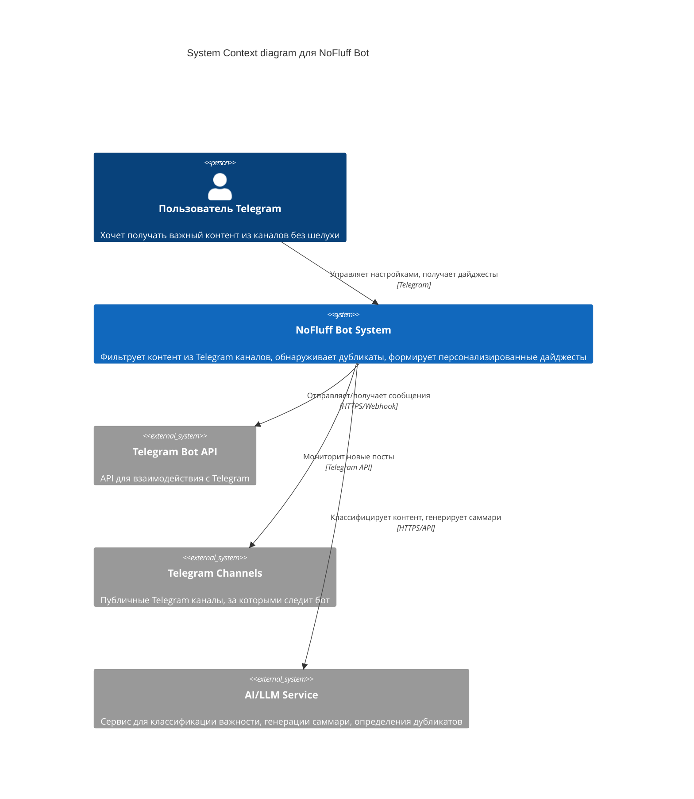
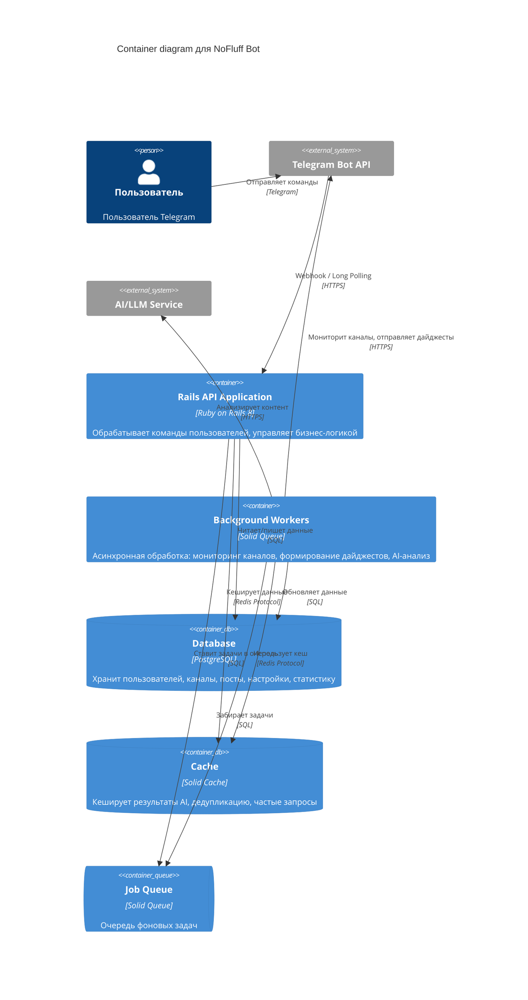
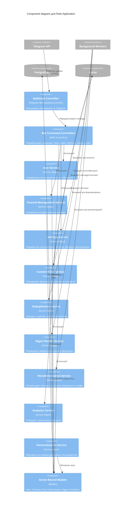
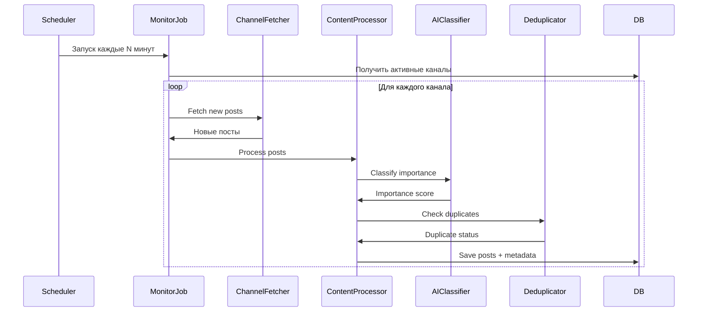
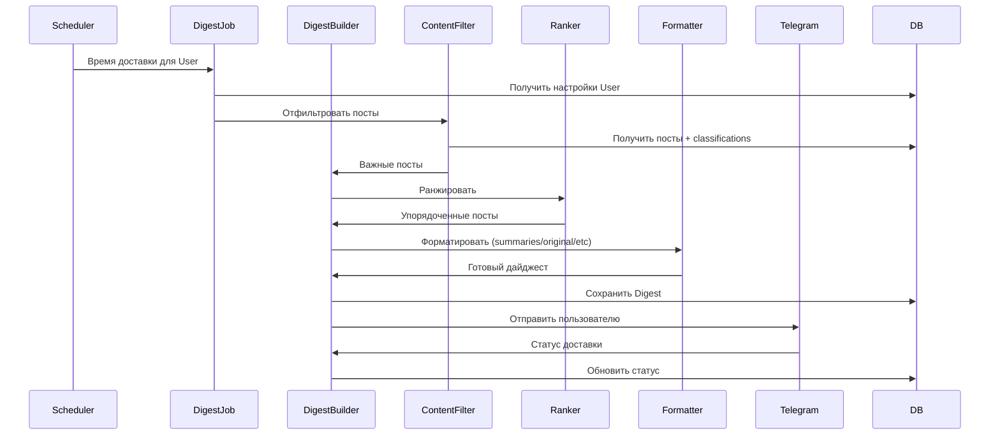
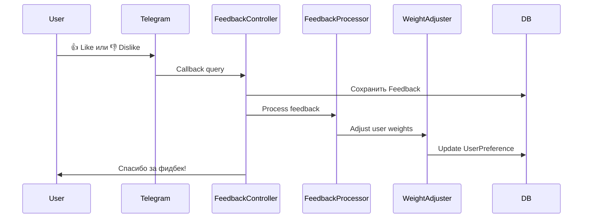

# Архитектура системы "Без шелухи" (NoFluff Bot)

Архитектура описана с использованием C4 Model (Context, Container, Component, Code).

---

## Level 1: System Context Diagram

Диаграмма показывает систему в контексте взаимодействия с пользователями и внешними системами.



### Внешние системы:

1. **Telegram Bot API** - основной интерфейс взаимодействия с пользователями
2. **Telegram Channels** - источники контента для мониторинга
3. **AI/LLM Service** - OpenAI/Anthropic/локальная модель для:
   - Классификации важности контента
   - Генерации саммари
   - Определения дубликатов
   - Тематической фильтрации

---

## Level 2: Container Diagram

Диаграмма показывает основные контейнеры системы и их взаимодействие.



### Контейнеры:

1. **Rails API Application**
   - Обработка Telegram webhook/polling
   - Bot Controllers для команд пользователя
   - API для управления настройками
   - Бизнес-логика

2. **Background Workers** (Solid Queue)
   - Channel Monitor Workers - мониторинг новых постов
   - Content Processor Workers - AI-анализ контента
   - Digest Builder Workers - формирование дайджестов
   - Delivery Workers - отправка дайджестов по расписанию

3. **PostgreSQL Database**
   - Пользователи и их настройки
   - Каналы и подписки
   - Посты и их метаданные
   - Дайджесты и история доставки
   - Статистика и аналитика

4. **Solid Cache**
   - Кеш результатов AI-классификации
   - Кеш векторов для дедупликации
   - Кеш рекомендаций каналов

5. **Solid Queue**
   - Управление фоновыми задачами
   - Ретраи при ошибках
   - Приоритизация задач

---

## Level 3: Component Diagram

Детальная структура компонентов внутри Rails Application.



### Компоненты по слоям:

#### 1. Bot Interface Layer

**Webhook Controller**
- Принимает обновления от Telegram (webhook или polling)
- Маршрутизирует к соответствующим контроллерам команд

**Bot Command Controllers**
- `StartController` - онбординг (/start)
- `ChannelController` - управление каналами (/add, /list, /remove)
- `SettingsController` - настройки (/settings)
- `DigestController` - ручной запрос дайджеста (/digest)
- `FeedbackController` - лайки/дизлайки (/like, /dislike)
- `StatsController` - статистика (/stats)
- `DiscoverController` - рекомендации (/discover)

#### 2. User Management Layer

**User Service**
- Создание и управление пользователями
- Онбординг flow
- Управление состоянием пользователя

**Channel Management Service**
- Добавление/удаление каналов
- Валидация каналов
- Управление подписками
- Приоритизация каналов

**Settings Service**
- Управление частотой доставки
- Выбор формата контента
- Настройка строгости фильтрации
- Тематические фильтры

#### 3. Content Processing Layer

**Content Filter Service**
- Классификация важности контента
- Фильтрация рекламы
- Тематическая фильтрация
- Интеграция с AI/LLM
- Применение персональных весов

**Deduplication Service**
- Генерация эмбеддингов постов
- Косинусное сходство для поиска дубликатов
- Кластеризация похожих постов
- Выбор лучшего варианта из дубликатов

**Content Processor Service**
- Парсинг постов из каналов
- Извлечение метаданных
- Нормализация контента

#### 4. Delivery Layer

**Digest Builder Service**
- Форматирование по выбранному формату:
  - Оригинальные посты
  - Краткие саммари (AI)
  - Единый дайджест
  - Комбо-формат (топ-3 + саммари)
  - Только заголовки
- Группировка по темам
- Ранжирование по важности

**Delivery Scheduler Service**
- Планирование отправки дайджестов
- Учет часового пояса пользователя
- Batch-отправка для масштабирования

#### 5. Analytics & Recommendations Layer

**Analytics Service**
- Сбор метрик использования
- Статистика по каналам
- Статистика фильтрации
- A/B тестирование

**Recommendation Service**
- Построение социального графа каналов
- Коллаборативная фильтрация
- Рекомендации похожих каналов

**Personalization Service**
- Обучение на фидбеке пользователя (like/dislike)
- Корректировка весов важности
- Адаптивная фильтрация

---

## Level 4: Code Level (Детали реализации)

### Структура папок Rails приложения:

```
app/
├── controllers/
│   ├── telegram/
│   │   ├── webhook_controller.rb
│   │   └── commands/
│   │       ├── start_controller.rb
│   │       ├── channel_controller.rb
│   │       ├── settings_controller.rb
│   │       ├── digest_controller.rb
│   │       ├── feedback_controller.rb
│   │       ├── stats_controller.rb
│   │       └── discover_controller.rb
│   └── application_controller.rb
├── services/
│   ├── user/
│   │   ├── creator.rb
│   │   ├── onboarder.rb
│   │   └── state_manager.rb
│   ├── channels/
│   │   ├── manager.rb
│   │   ├── validator.rb
│   │   └── prioritizer.rb
│   ├── settings/
│   │   ├── frequency_manager.rb
│   │   ├── format_manager.rb
│   │   └── filter_manager.rb
│   ├── content/
│   │   ├── processor.rb
│   │   ├── filter.rb
│   │   ├── deduplicator.rb
│   │   └── ai_classifier.rb
│   ├── digest/
│   │   ├── builder.rb
│   │   ├── formatter.rb
│   │   ├── ranker.rb
│   │   └── scheduler.rb
│   ├── analytics/
│   │   ├── collector.rb
│   │   ├── reporter.rb
│   │   └── metrics_calculator.rb
│   ├── recommendation/
│   │   ├── channel_recommender.rb
│   │   └── social_graph_builder.rb
│   └── personalization/
│       ├── feedback_processor.rb
│       ├── weight_adjuster.rb
│       └── adaptive_filter.rb
├── jobs/
│   ├── channels/
│   │   ├── monitor_job.rb
│   │   └── fetch_posts_job.rb
│   ├── content/
│   │   ├── process_post_job.rb
│   │   ├── classify_job.rb
│   │   └── deduplicate_batch_job.rb
│   ├── digest/
│   │   ├── build_job.rb
│   │   └── deliver_job.rb
│   └── analytics/
│       └── collect_metrics_job.rb
├── models/
│   ├── user.rb
│   ├── channel.rb
│   ├── subscription.rb
│   ├── post.rb
│   ├── post_classification.rb
│   ├── digest.rb
│   ├── digest_item.rb
│   ├── feedback.rb
│   ├── user_preference.rb
│   └── channel_recommendation.rb
└── lib/
    ├── telegram_client/
    │   ├── api_wrapper.rb
    │   └── channel_fetcher.rb
    └── ai/
        ├── classifier.rb
        ├── summarizer.rb
        └── embedding_generator.rb
```

### Ключевые модели данных:

#### User
```ruby
class User < ApplicationRecord
  has_many :subscriptions, dependent: :destroy
  has_many :channels, through: :subscriptions
  has_many :digests
  has_many :feedbacks
  has_one :user_preference

  # Настройки
  enum delivery_frequency: {
    realtime: 0,
    three_times_daily: 1,
    twice_daily: 2,
    daily: 3,
    every_two_days: 4,
    weekly: 5,
    on_demand: 6
  }

  enum content_format: {
    original_posts: 0,
    short_summaries: 1,
    unified_digest: 2,
    combo: 3,
    headlines_only: 4
  }

  enum filter_strictness: {
    maximum: 0,
    high: 1,
    medium: 2,
    low: 3,
    adaptive: 4
  }
end
```

#### Channel
```ruby
class Channel < ApplicationRecord
  has_many :subscriptions
  has_many :users, through: :subscriptions
  has_many :posts

  validates :telegram_id, presence: true, uniqueness: true
  validates :username, presence: true
end
```

#### Subscription
```ruby
class Subscription < ApplicationRecord
  belongs_to :user
  belongs_to :channel

  # Приоритет канала для пользователя
  validates :priority, numericality: { greater_than_or_equal_to: 1, less_than_or_equal_to: 10 }
end
```

#### Post
```ruby
class Post < ApplicationRecord
  belongs_to :channel
  has_many :post_classifications
  has_many :digest_items
  has_many :feedbacks

  # Метаданные
  # telegram_message_id, text, media_urls, published_at

  # Классификация
  # is_important, importance_score, is_ad, is_duplicate_of

  scope :important, -> { where(is_important: true) }
  scope :not_ads, -> { where(is_ad: false) }
  scope :unique, -> { where(is_duplicate_of: nil) }
end
```

#### PostClassification
```ruby
class PostClassification < ApplicationRecord
  belongs_to :post
  belongs_to :user

  # Персональная классификация для пользователя
  # importance_score, is_relevant, classification_reason
end
```

#### Digest
```ruby
class Digest < ApplicationRecord
  belongs_to :user
  has_many :digest_items
  has_many :posts, through: :digest_items

  enum status: { pending: 0, sent: 1, failed: 2 }

  # scheduled_for, sent_at, posts_analyzed_count, posts_included_count
end
```

#### Feedback
```ruby
class Feedback < ApplicationRecord
  belongs_to :user
  belongs_to :post

  enum sentiment: { dislike: -1, neutral: 0, like: 1 }
end
```

---

## Ключевые процессы и workflows

### 1. Мониторинг каналов (Channel Monitoring Workflow)



### 2. Формирование и доставка дайджеста (Digest Building Workflow)



### 3. Обработка фидбека (Feedback Processing Workflow)



---

## Применение SOLID принципов

### Single Responsibility Principle (SRP)
- Каждый сервис отвечает за одну четко определенную область:
  - `ContentFilter` - только фильтрация
  - `Deduplicator` - только дедупликация
  - `DigestBuilder` - только построение дайджеста

### Open/Closed Principle (OCP)
- Форматтеры дайджестов наследуются от базового класса:
  ```ruby
  class BaseFormatter
    def format(posts); raise NotImplementedError; end
  end

  class OriginalFormatter < BaseFormatter; end
  class SummaryFormatter < BaseFormatter; end
  class ComboFormatter < BaseFormatter; end
  ```

### Liskov Substitution Principle (LSP)
- Все форматтеры взаимозаменяемы через общий интерфейс
- AI классификаторы (OpenAI, Anthropic, Local) реализуют общий контракт

### Interface Segregation Principle (ISP)
- Контроллеры разделены по командам, не один большой контроллер
- Сервисы имеют минимальные интерфейсы

### Dependency Inversion Principle (DIP)
- Сервисы зависят от абстракций (интерфейсов), а не от конкретных реализаций:
  ```ruby
  class DigestBuilder
    def initialize(filter:, ranker:, formatter:)
      @filter = filter      # Любой объект с методом .filter
      @ranker = ranker      # Любой объект с методом .rank
      @formatter = formatter # Любой объект с методом .format
    end
  end
  ```

---

## Масштабирование и производительность

### Стратегии масштабирования:

1. **Горизонтальное масштабирование воркеров**
   - Solid Queue поддерживает несколько воркеров
   - Разные приоритеты для разных типов задач

2. **Кеширование**
   - AI классификации (TTL: 24 часа)
   - Эмбеддинги для дедупликации (TTL: 7 дней)
   - Рекомендации каналов (TTL: 1 час)

3. **Batch processing**
   - Группировка постов для AI-анализа
   - Batch-отправка дайджестов

4. **Database indexing**
   - Индексы на telegram_id, published_at, importance_score
   - Partial indexes для важных постов

5. **Rate limiting**
   - Лимиты на Telegram API
   - Лимиты на AI API с retry механизмами

---

## Безопасность

### Меры безопасности:

1. **Webhook validation**
   - Проверка токена Telegram
   - HTTPS only

2. **Rate limiting**
   - Защита от спама команд

3. **Data privacy**
   - Шифрование персональных данных
   - GDPR compliance

4. **API keys management**
   - Использование Rails credentials
   - Ротация ключей

---

## Мониторинг и логирование

### Ключевые метрики:

1. **System health**
   - Uptime воркеров
   - Queue depth
   - Database performance

2. **Business metrics**
   - Активные пользователи (DAU/MAU)
   - Retention rate
   - Average posts filtered
   - Digest delivery rate

3. **AI metrics**
   - Classification accuracy (на основе feedback)
   - Duplicate detection rate
   - Summarization quality

### Логирование:

- Structured logging (JSON)
- Correlation IDs для трейсинга
- Error tracking (Sentry/Rollbar)
- Performance monitoring (New Relic/Datadog)

---

## Roadmap

Детальный ROADMAP с разбивкой на подэтапы и чекбоксы доступен в отдельном файле:

**[ROADMAP.md](../Product/ROADMAP.md)**
