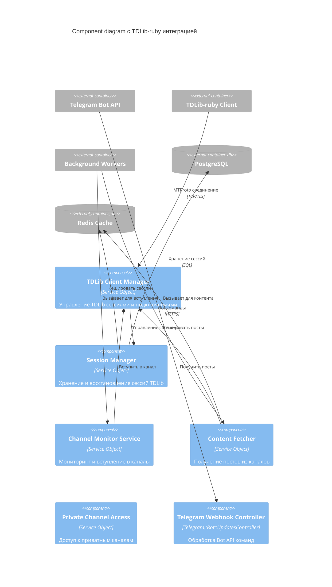

# TDLib-ruby Implementation Details

## ⚠️ ВАЖНО: АРХИВНЫЙ ДОКУМЕНТ

**Статус:** ❌ **АРХИВИРОВАН** (Ноябрь 2025)
**Причина:** Конфликты зависимостей с Rails 8
**Замена:** Полная миграция на telegram-mtproto-ruby

---

### ⚠️ Этот документ больше не используется

**Актуальная реализация:** Смотрите [MTProto Implementation](./mtproto-ruby-implementation.md)

**Почему TDLib-ruby был заменен:**
- Конфликты зависимостей (FFI, concurrent-ruby)
- Невозможность использования в production
- Сложность установки и поддержки

---

## Исторический обзор решения для MTProto интеграции

Документ описывает реализацию User-based подхода для доступа к Telegram через TDLib-ruby библиотеку.

## 🎯 Зачем нужен TDLib-ruby

### Проблема Telegram Bot API:
- ❌ **Нельзя вступить в канал** - боты не могут инициировать вступление в каналы
- ❌ **Ограниченный доступ** - нет доступа к приватным каналам без инвайта
- ❌ **Пассивное мониторинг** - бот не может активно искать и вступать в каналы

### Решение через TDLib-ruby:
- ✅ **Полный User API** - все возможности обычного пользователя Telegram
- ✅ **Автоматическое вступление** - follower аккаунт может вступать в любые каналы
- ✅ **Доступ к приватным каналам** - через публичные ссылки или инвайты
- ✅ **Стабильность** - официальная библиотека от Telegram
- ✅ **Безопасность** - все обновления безопасности от Telegram

## 🏗️ Архитектура TDLib-ruby интеграции

### Component Diagram с TDLib



## 📦 Установка и настройка

### 1. Установка TDLib

```bash
# Ubuntu/Debian
sudo apt-get install -y \
    build-essential \
    cmake \
    git \
    libssl-dev \
    libreadline-dev \
    zlib1g-dev \
    gperf

# Клонируем и компилируем TDLib
git clone https://github.com/tdlib/td.git
cd td
git checkout v1.8.0
mkdir build && cd build
cmake -DCMAKE_BUILD_TYPE=Release ..
cmake --build .
sudo make install
```

### 2. Добавление gem в проект

```ruby
# Gemfile
gem 'tdlib-ruby', '~> 3.0'

# Или для специфической версии TDLib
gem 'tdlib-schema', '~> 1.8.0'
```

```bash
bundle install
```

### 3. Инициализация TDLib клиента

```ruby
# config/initializers/tdlib.rb
require 'tdlib-ruby'

TD.configure do |config|
  # Путь к скомпилированной библиотеке
  config.lib_path = Rails.application.root.join('vendor', 'tdlib')

  # API credentials из my.telegram.org
  config.client.api_id = Rails.application.credentials.tdlib[:api_id]
  config.client.api_hash = Rails.application.credentials.tdlib[:api_hash]

  # Настройки для follower аккаунта
  config.client.database_directory = Rails.root.join('tmp', 'tdlib', 'db')
  config.client.files_directory = Rails.root.join('tmp', 'tdlib', 'files')
  config.client.use_test_dc = Rails.env.development?
  config.client.device_model = 'NoFluff Follower Bot'
  config.client.system_version = '1.0'
  config.client.application_version = NoFluff::VERSION
end

# Установка уровня логов
TD::Api.set_log_verbosity_level(Rails.env.development? ? 2 : 1)
TD::Api.set_log_file_path(Rails.root.join('log', 'tdlib.log')) if Rails.env.production?
```

## 🔧 Реализация сервисов

### 1. TDLib Client Manager

```ruby
# app/services/tdlib/client_manager.rb
class TDLib::ClientManager
  include Singleton

  def initialize
    @client = nil
    @authorized = false
    @phone_number = Rails.application.credentials.tdlib[:phone_number]
    @session_mutex = Mutex.new
  end

  def connect
    @session_mutex.synchronize do
      return @client if @client&.connected?

      @client = TD::Client.new

      # Обработчики событий
      setup_authorization_handler
      setup_update_handlers

      @client.connect
      wait_for_authorization if !@authorized

      @client
    end
  end

  def disconnect
    @session_mutex.synchronize do
      @client&.dispose
      @client = nil
      @authorized = false
    end
  end

  def client
    connect unless @client&.connected?
    @client
  end

  def authorized?
    @authorized
  end

  private

  def setup_authorization_handler
    client.on(TD::Types::Update::AuthorizationState) do |update|
      case update.authorization_state
      when TD::Types::AuthorizationState::WaitPhoneNumber
        client.set_authentication_phone_number(phone_number: @phone_number).wait
      when TD::Types::AuthorizationState::WaitCode
        # В production код должен быть получен из безопасного хранилища
        code = Rails.application.credentials.tdlib[:verification_code]
        client.check_authentication_code(code: code).wait
      when TD::Types::AuthorizationState::WaitPassword
        password = Rails.application.credentials.tdlib[:password]
        client.check_authentication_password(password: password).wait
      when TD::Types::AuthorizationState::Ready
        @authorized = true
        Rails.logger.info "TDLib client authorized successfully"
      end
    end
  end

  def setup_update_handlers
    # Обработка новых сообщений
    client.on(TD::Types::Update::NewMessage) do |update|
      handle_new_message(update.message)
    end

    # Обработка обновлений чатов
    client.on(TD::Types::Update::ChatLastMessage) do |update|
      handle_chat_update(update.chat_id)
    end
  end

  def wait_for_authorization
    timeout = 30
    start_time = Time.now

    while !@authorized && (Time.now - start_time) < timeout
      sleep 0.1
    end

    raise "TDLib authorization timeout" unless @authorized
  end

  def handle_new_message(message)
    return unless message.chat_id

    # Передаем в обработчик контента
    TDLib::ContentFetcherJob.perform_later(
      chat_id: message.chat_id,
      message_id: message.id,
      content: message.content.text&.text
    )
  end

  def handle_chat_update(chat_id)
    # Проверяем, что это канал и мы его мониторим
    TDLib::ChannelMonitorJob.perform_later(chat_id: chat_id)
  end
end
```

### 2. Channel Monitor Service

```ruby
# app/services/tdlib/channel_monitor_service.rb
class TDLib::ChannelMonitorService
  def initialize(client_manager: TDLib::ClientManager.instance)
    @client_manager = client_manager
  end

  def join_channel(username_or_invite_link)
    client = @client_manager.client

    begin
      # Поиск канала по username
      if username_or_invite_link.start_with?('https://t.me/')
        # Публичная ссылка или инвайт
        result = client.join_chat_by_invite_link(invite_link: username_or_invite_link).wait
      else
        # Username канала
        result = client.search_public_chat(username: username_or_invite_link).wait
        chat = result.value

        # Вступаем в чат
        result = client.join_chat(chat_id: chat.id).wait
      end

      if result.ok?
        chat_id = extract_chat_id(result)
        monitor_channel(chat_id)

        {
          success: true,
          chat_id: chat_id,
          message: "Successfully joined and started monitoring"
        }
      else
        {
          success: false,
          error: result.error.message
        }
      end

    rescue TD::Types::Error => e
      {
        success: false,
        error: "Failed to join channel: #{e.message}"
      }
    end
  end

  def leave_channel(chat_id)
    client = @client_manager.client

    begin
      result = client.leave_chat(chat_id: chat_id).wait

      if result.ok?
        # Останавливаем мониторинг
        stop_monitoring_channel(chat_id)

        {
          success: true,
          message: "Successfully left channel"
        }
      else
        {
          success: false,
          error: result.error.message
        }
      end

    rescue TD::Types::Error => e
      {
        success: false,
        error: "Failed to leave channel: #{e.message}"
      }
    end
  end

  def get_channel_info(chat_id)
    client = @client_manager.client

    begin
      result = client.get_chat(chat_id: chat_id).wait

      if result.ok?
        chat = result.value

        {
          id: chat.id,
          title: chat.title,
          username: chat.username,
          type: chat.type.class.name.split('::').last,
          member_count: chat.member_count,
          is_verified: chat.is_verified,
          description: chat.description
        }
      else
        {
          error: result.error.message
        }
      end

    rescue TD::Types::Error => e
      {
        error: "Failed to get channel info: #{e.message}"
      }
    end
  end

  private

  def monitor_channel(chat_id)
    # Сохраняем в базу для мониторинга
    Channel.where(tdlib_chat_id: chat_id).update_all(
      monitoring_status: :active,
      last_monitored_at: Time.current
    )

    Rails.logger.info "Started monitoring channel #{chat_id}"
  end

  def stop_monitoring_channel(chat_id)
    Channel.where(tdlib_chat_id: chat_id).update_all(
      monitoring_status: :stopped,
      stopped_at: Time.current
    )

    Rails.logger.info "Stopped monitoring channel #{chat_id}"
  end

  def extract_chat_id(result)
    # Извлекаем chat_id из результата join
    # Зависит от структуры ответа TDLib
    result.value.dig('chat', 'id') || result.value.dig('id')
  end
end
```

### 3. Content Fetcher Service

```ruby
# app/services/tdlib/content_fetcher_service.rb
class TDLib::ContentFetcherService
  def initialize(client_manager: TDLib::ClientManager.instance)
    @client_manager = client_manager
  end

  def fetch_channel_history(chat_id, limit: 100, from_message_id: nil)
    client = @client_manager.client

    begin
      result = client.get_chat_history(
        chat_id: chat_id,
        limit: limit,
        from_message_id: from_message_id,
        offset: 0,
        only_local: false
      ).wait

      if result.ok?
        messages = result.value

        posts = messages.map do |message|
          next unless message.content.is_a?(TD::Types::MessageText)

          {
            telegram_message_id: message.id,
            text: message.content.text.text,
            date: Time.at(message.date),
            chat_id: message.chat_id,
            views: message.interaction_info&.view_count || 0,
            forwards: message.interaction_info&.forward_count || 0
          }
        end.compact

        {
          success: true,
          posts: posts,
          total_count: posts.length
        }
      else
        {
          success: false,
          error: result.error.message
        }
      end

    rescue TD::Types::Error => e
      {
        success: false,
        error: "Failed to fetch channel history: #{e.message}"
      }
    end
  end

  def get_channel_posts_since(chat_id, since_date:)
    client = @client_manager.client

    begin
      # Получаем историю сообщений
      result = client.get_chat_history(
        chat_id: chat_id,
        limit: 1000, # Большой лимит для получения всех постов
        offset: 0,
        only_local: false
      ).wait

      if result.ok?
        messages = result.value

        # Фильтруем посты с указанной даты
        posts = messages
          .select { |msg| msg.content.is_a?(TD::Types::MessageText) }
          .select { |msg| Time.at(msg.date) >= since_date }
          .map do |message|
            {
              telegram_message_id: message.id,
              text: message.content.text.text,
              date: Time.at(message.date),
              chat_id: message.chat_id,
              views: message.interaction_info&.view_count || 0,
              forwards: message.interaction_info&.forward_count || 0,
              reply_to_message_id: message.reply_to_message_id
            }
          end

        {
          success: true,
          posts: posts,
          total_count: posts.length
        }
      else
        {
          success: false,
          error: result.error.message
        }
      end

    rescue TD::Types::Error => e
      {
        success: false,
        error: "Failed to get channel posts: #{e.message}"
      }
    end
  end
end
```

## 🗄️ Модели данных для TDLib

### Обновление модели Channel

```ruby
# app/models/channel.rb
class Channel < ApplicationRecord
  has_many :subscriptions
  has_many :telegram_users, through: :subscriptions
  has_many :posts, dependent: :destroy

  validates :telegram_id, presence: true, uniqueness: true
  validates :username, presence: true, uniqueness: { allow_blank: true }

  # Статус вступления бота (Bot API)
  enum bot_join_status: {
    not_joined: 0,
    joining: 1,
    joined: 2,
    join_failed: 3
  }

  # Статус мониторинга через TDLib
  enum monitoring_status: {
    inactive: 0,
    active: 1,
    paused: 2,
    stopped: 3,
    error: 4
  }

  # Источник мониторинга
  enum access_method: {
    bot_api: 0,
    tdlib_user: 1,
    both: 2
  }

  # TDLib поля
  attribute :tdlib_chat_id, :bigint
  attribute :tdlib_member_count, :integer
  attribute :tdlib_is_verified, :boolean, default: false
  attribute :tdlib_description, :text
  attribute :tdlib_access_hash, :string
  attribute :last_monitored_at, :datetime
  attribute :monitoring_error, :text

  def bot_can_monitor?
    access_method.in?([:bot_api, :both]) && bot_join_status == 'joined'
  end

  def tdlib_can_monitor?
    access_method.in?([:tdlib_user, :both]) && monitoring_status == 'active'
  end

  def can_monitor?
    bot_can_monitor? || tdlib_can_monitor?
  end

  def active_monitoring_method
    return :tdlib if tdlib_can_monitor?
    return :bot if bot_can_monitor?
    nil
  end
end
```

### Новая модель для TDLib сессий

```ruby
# app/models/tdlib_session.rb
class TDLibSession < ApplicationRecord
  validates :session_name, presence: true, uniqueness: true
  validates :status, presence: true

  enum status: {
    inactive: 0,
    connecting: 1,
    authorizing: 2,
    authorized: 3,
    error: 4
  }

  # Хранение данных сессии в зашифрованном виде
  attribute :encrypted_session_data, :text
  attribute :session_file_path, :string
  attribute :last_authorized_at, :datetime
  attribute :authorization_error, :text

  def self.active_session
    where(status: :authorized).order(last_authorized_at: :desc).first
  end

  def encrypt_session_data(data)
    self.encrypted_session_data = Rails.application.message_verifier.encrypt(data)
  end

  def decrypt_session_data
    return nil unless encrypted_session_data

    Rails.application.message_verifier.verify(encrypted_session_data)
  end
end
```

## 🔄 Background Jobs для TDLib

### 1. Channel Monitor Job

```ruby
# app/jobs/tdlib/channel_monitor_job.rb
class TDLib::ChannelMonitorJob < ApplicationJob
  queue_as :tdlib_monitoring

  retry_on StandardError, wait: :exponentially_longer, attempts: 3

  def perform(chat_id:)
    monitor_service = TDLib::ChannelMonitorService.new

    # Получаем информацию о канале
    channel_info = monitor_service.get_channel_info(chat_id)

    if channel_info[:error]
      Rails.logger.error "Failed to get channel info for #{chat_id}: #{channel_info[:error]}"
      return
    end

    # Находим соответствующий канал в БД
    channel = Channel.find_by(tdlib_chat_id: chat_id)
    if channel
      # Обновляем информацию о канале
      channel.update!(
        tdlib_member_count: channel_info[:member_count],
        tdlib_is_verified: channel_info[:is_verified],
        tdlib_description: channel_info[:description],
        last_monitored_at: Time.current,
        monitoring_status: :active
      )
    end

    # Запускаем получение контента
    TDLib::ContentFetcherJob.perform_later(
      chat_id: chat_id,
      fetch_type: :recent_posts
    )
  end
end
```

### 2. Content Fetcher Job

```ruby
# app/jobs/tdlib/content_fetcher_job.rb
class TDLib::ContentFetcherJob < ApplicationJob
  queue_as :tdlib_content

  retry_on StandardError, wait: :exponentially_longer, attempts: 3

  def perform(chat_id:, fetch_type: :recent_posts, since: nil)
    fetcher_service = TDLib::ContentFetcherService.new

    # Находим канал
    channel = Channel.find_by!(tdlib_chat_id: chat_id)

    case fetch_type
    when :recent_posts
      result = fetcher_service.fetch_channel_history(chat_id, limit: 50)
    when :posts_since
      result = fetcher_service.get_channel_posts_since(chat_id, since_date: since)
    else
      raise ArgumentError, "Unknown fetch_type: #{fetch_type}"
    end

    if result[:success]
      process_posts(result[:posts], channel)
    else
      Rails.logger.error "Failed to fetch content for channel #{chat_id}: #{result[:error]}"

      # Обновляем статус ошибки
      channel.update!(
        monitoring_status: :error,
        monitoring_error: result[:error]
      )
    end
  end

  private

  def process_posts(posts_data, channel)
    posts_data.each do |post_data|
      # Проверяем, существует ли уже пост
      existing_post = Post.find_by(
        channel: channel,
        telegram_message_id: post_data[:telegram_message_id]
      )

      next if existing_post

      # Создаем новый пост
      post = Post.create!(
        channel: channel,
        telegram_message_id: post_data[:telegram_message_id],
        text: post_data[:text],
        published_at: post_data[:date],
        views_count: post_data[:views],
        forwards_count: post_data[:forwards],
        reply_to_message_id: post_data[:reply_to_message_id]
      )

      # Запускаем AI-классификацию
      Content::ClassifyJob.perform_later(post.id)
    end

    # Обновляем время последнего мониторинга
    channel.update!(last_monitored_at: Time.current)
  end
end
```

### 3. Join Channel Job

```ruby
# app/jobs/tdlib/join_channel_job.rb
class TDLib::JoinChannelJob < ApplicationJob
  queue_as :tdlib_operations

  retry_on StandardError, wait: :exponentially_longer, attempts: 3

  def perform(channel_identifier, user_id = nil)
    monitor_service = TDLib::ChannelMonitorService.new

    # Пытаемся вступить в канал
    result = monitor_service.join_channel(channel_identifier)

    if result[:success]
      # Создаем или обновляем запись о канале
      channel = find_or_create_channel(channel_identifier, result[:chat_id])
      channel.update!(
        tdlib_chat_id: result[:chat_id],
        access_method: :tdlib_user,
        monitoring_status: :active
      )

      # Отправляем уведомление пользователю если нужно
      if user_id
        Telegram::Notifications::ChannelJoinedNotification.new(channel, user_id).deliver_now
      end

      Rails.logger.info "Successfully joined channel via TDLib: #{channel_identifier}"
    else
      Rails.logger.error "Failed to join channel #{channel_identifier}: #{result[:error]}"

      # Уведомляем об ошибке
      if user_id
        Telegram::Notifications::ChannelJoinFailedNotification.new(
          channel_identifier, result[:error], user_id
        ).deliver_now
      end
    end
  end

  private

  def find_or_create_channel(identifier, tdlib_chat_id)
    # Сначала ищем по tdlib_chat_id
    channel = Channel.find_by(tdlib_chat_id: tdlib_chat_id)

    # Если не нашли, ищем по username
    channel ||= Channel.find_by(username: identifier.gsub('@', ''))

    # Если все еще не нашли, создаем новую запись
    channel ||= Channel.create!(
      username: identifier.gsub('@', '').gsub('https://t.me/', ''),
      telegram_id: "tdlib_#{tdlib_chat_id}", # Временный ID
      tdlib_chat_id: tdlib_chat_id,
      access_method: :tdlib_user,
      monitoring_status: :active
    )

    channel
  end
end
```

## 🔐 Безопасность и управление сессиями

### 1. Хранение API ключей

```yaml
# config/credentials.yml.enc
tdlib:
  api_id: 12345678
  api_hash: "abcdef1234567890abcdef1234567890"
  phone_number: "+79991234567"
  verification_code: "12345" # Только для development
  password: "my_2fa_password" # Если есть 2FA
```

### 2. Управление сессиями

```ruby
# app/services/tdlib/session_manager_service.rb
class TDLib::SessionManagerService
  def self.restore_session
    session = TDLibSession.active_session

    if session
      # Восстанавливаем сессию
      session_data = session.decrypt_session_data

      # Подключаемся с сохраненными данными
      client_manager = TDLib::ClientManager.instance
      client_manager.restore_session(session_data) if client_manager.respond_to?(:restore_session)

      Rails.logger.info "Restored TDLib session: #{session.session_name}"
      true
    else
      Rails.logger.info "No active TDLib session found"
      false
    end
  end

  def self.save_session(session_data)
    session = TDLibSession.active_session || TDLibSession.create!(
      session_name: "default_session",
      status: :authorized
    )

    session.update!(
      status: :authorized,
      last_authorized_at: Time.current,
      encrypted_session_data: session.encrypt_session_data(session_data)
    )

    Rails.logger.info "Saved TDLib session: #{session.session_name}"
  end

  def self.handle_authorization_error(error)
    session = TDLibSession.active_session
    if session
      session.update!(
        status: :error,
        authorization_error: error.message
      )
    end

    Rails.logger.error "TDLib authorization error: #{error.message}"
  end
end
```

## 📊 Мониторинг и логирование

### 1. Метрики TDLib

```ruby
# app/services/tdlib/metrics_service.rb
class TDLib::MetricsService
  def self.collect_metrics
    client_manager = TDLib::ClientManager.instance

    {
      session_status: client_manager.authorized? ? :authorized : :unauthorized,
      active_channels: Channel.where(monitoring_status: :active).count,
      total_posts_fetched: Post.where.not(tdlib_chat_id: nil).count,
      last_successful_fetch: Post.where.not(tdlib_chat_id: nil).maximum(:created_at),
      tdlib_connection_uptime: client_manager.uptime_seconds
    }
  end

  def self.health_check
    metrics = collect_metrics

    {
      status: metrics[:session_status] == :authorized ? :healthy : :unhealthy,
      metrics: metrics,
      timestamp: Time.current
    }
  end
end
```

### 2. Логирование TDLib операций

```ruby
# config/initializers/tdlib_logging.rb
if Rails.env.production?
  # Отдельный лог файл для TDLib
  tdlib_logger = Logger.new(Rails.root.join('log', 'tdlib.log'))
  tdlib_logger.level = Logger::INFO

  # Перехватываем логи TDLib
  TD::Api.set_log_file_path(Rails.root.join('log', 'tdlib_raw.log'))

  # Создаем логгер для TDLib операций
  $tdlib_logger = tdlib_logger
else
  $tdlib_logger = Rails.logger
end
```

## 🚀 Использование в существующих сервисах

### Интеграция с Content Filter

```ruby
# app/services/content/filter.rb (дополнение)
class Content::Filter
  def initialize(post:)
    @post = post
  end

  def call
    # Проверяем, можно ли получить контент через TDLib
    if post.channel.tdlib_can_monitor?
      fetch_additional_content_via_tdlib
    end

    # ... существующая логика фильтрации
  end

  private

  def fetch_additional_content_via_tdlib
    fetcher = TDLib::ContentFetcherService.new

    # Получаем дополнительный контент (например, комментарии или реакции)
    additional_data = fetcher.get_message_reactions(
      post.channel.tdlib_chat_id,
      post.telegram_message_id
    )

    if additional_data[:success]
      @post.update!(
        reactions_count: additional_data[:reactions_count],
        comments_count: additional_data[:comments_count]
      )
    end
  rescue => e
    Rails.logger.error "Failed to fetch additional TDLib content: #{e.message}"
  end
end
```

## 📋 План миграции

### Этап 1: Подготовка (1-2 дня)
- [ ] Скомпилировать TDLib на сервере
- [ ] Добавить tdlib-ruby в Gemfile
- [ ] Получить API credentials
- [ ] Настроить follower аккаунт Telegram

### Этап 2: Базовая интеграция (3-5 дней)
- [ ] Реализовать TDLib::ClientManager
- [ ] Настроить авторизацию и управление сессиями
- [ ] Создать базовые сервисы для работы с каналами

### Этап 3: Функциональность (5-7 дней)
- [ ] Реализовать встпление в каналы
- [ ] Настроить мониторинг и получение контента
- [ ] Интегрировать с существующими Post и Channel моделями

### Этап 4: Production готовность (2-3 дня)
- [ ] Настроить логирование и мониторинг
- [ ] Добавить обработку ошибок и retry логику
- [ ] Тестирование нагрузки и безопасности

### Этап 5: Запуск (1 день)
- [ ] Разворот на production
- [ ] Мониторинг работы
- [ ] Обновление документации

## 🎯 Преимущества подхода

1. **Полный доступ к Telegram** - все возможности пользователя
2. **Стабильность** - официальная библиотека от Telegram
3. **Безопасность** - автоматические обновления безопасности
4. **Масштабируемость** - возможность использовать несколько follower аккаунтов
5. **Гибкость** - работа с любыми типами каналов, включая приватные
6. **Надежность** - встроенные механизмы retry и восстановления соединений

Эта реализация позволяет системе "Без шелухи" преодолеть ограничения Bot API и предоставить пользователям доступ к более широкому спектру Telegram каналов.