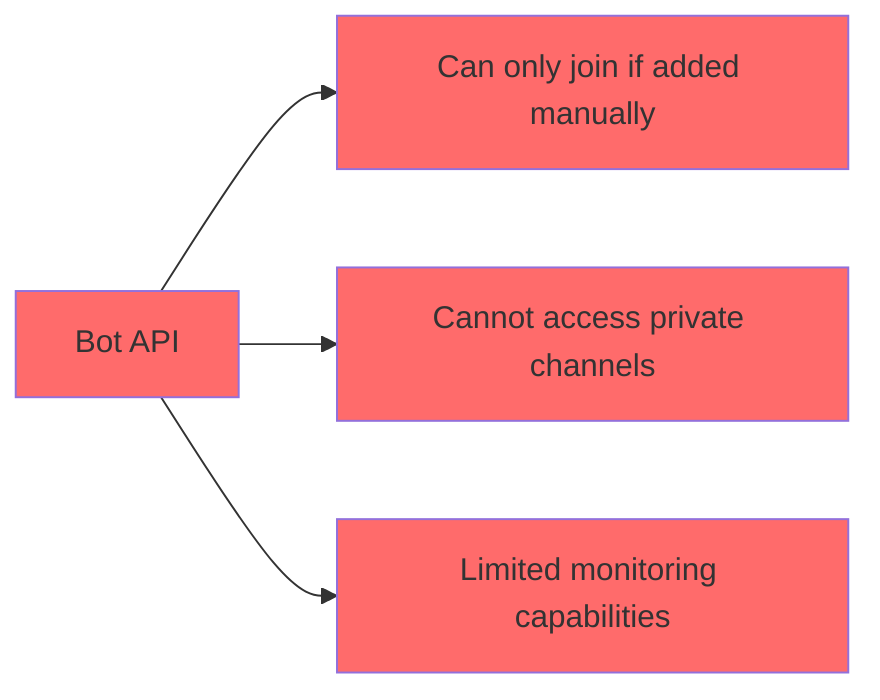
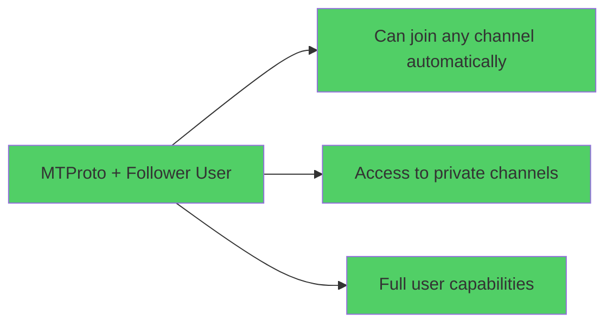

# Migration from Bot-based to User-based Channel Access

## 🚨 Executive Summary

**Problem**: Telegram Bot API limitations prevent bots from joining channels automatically
**Solution**: Migration to User-based access via Telegram App API (MTProto)
**Impact**: Complete architectural change required for channel monitoring

---

## Current Architecture v1.0 (Bot-based)

### Limitations


### Current Flow
1. Admin adds channel → Bot must be manually added
2. Bot can only monitor channels where it's a member
3. No access to private channels without admin intervention
4. Limited functionality compared to regular users

---

## Target Architecture v2.0 (User-based)

### Advantages


### Target Flow
1. Admin adds channel → Follower user joins automatically
2. Full access to all channel content
3. Works with private channels (with invites)
4. Complete monitoring capabilities

---

## Detailed Migration Plan

### Phase 1: Foundation Setup (Week 1-2)

#### 1.1 Telegram App Registration
```bash
# Tasks
- [ ] Register app at https://my.telegram.org
- [ ] Obtain api_id and api_hash
- [ ] Create dedicated follower user account
- [ ] Test basic MTProto connection
- [ ] Document credentials securely
```

#### 1.2 Database Schema Changes
```ruby
# New model
class CreateFollowerUsers < ActiveRecord::Migration[8.0]
  def change
    create_table :follower_users do |t|
      t.string :phone_number, null: false
      t.string :username
      t.string :first_name
      t.string :last_name
      t.enum :auth_status, default: :pending, null: false
      t.text :session_string_encrypted
      t.jsonb :device_info
      t.integer :daily_joins_limit, default: 50, null: false
      t.integer :daily_joins_count, default: 0, null: false
      t.date :last_reset_date
      t.timestamps
    end

    add_index :follower_users, :auth_status
    add_index :follower_users, :daily_joins_count
  end
end

# Channel model updates
class AddUserAccessToChannels < ActiveRecord::Migration[8.0]
  def change
    add_column :channels, :user_access_status, :integer, default: 0
    add_column :channels, :join_error_reason, :text
    add_column :channels, :join_attempts, :jsonb, default: []
    add_column :channels, :last_successful_join, :timestamp
    add_column :channels, :last_access_check, :timestamp
    add_index :channels, :user_access_status
  end
end
```

#### 1.3 Core Services
```ruby
# app/services/telegram/user_client_manager.rb
class Telegram::UserClientManager
  def initialize(follower_user)
    @follower_user = follower_user
  end

  def create_client
    # MTProto client initialization
  end

  def save_session(session_string)
    @follower_user.update!(session_string_encrypted: session_string)
  end

  def restore_session
    # Restore MTProto session
  end
end
```

### Phase 2: Core Functionality (Week 3-4)

#### 2.1 Channel Access Implementation
```ruby
# app/services/channels/channel_access_service.rb
class Channels::ChannelAccessService
  def self.join_channel(channel)
    follower_user = FollowerUser.authorized.first
    return error("No authorized follower user") unless follower_user

    channel.update!(user_access_status: :joining)

    client = Telegram::UserClientManager.new(follower_user)

    begin
      result = client.join_channel(channel.username)

      if result.success?
        channel.update!(
          user_access_status: :joined,
          last_successful_join: Time.current,
          join_error_reason: nil
        )
        notify_admins(:channel_joined, channel)
      else
        handle_join_failure(channel, result.error)
      end

    rescue => error
      handle_join_error(channel, error)
    end
  end

  def self.check_channel_access(channel)
    # Periodic access verification
  end

  private

  def self.handle_join_failure(channel, error)
    channel.update!(
      user_access_status: :join_failed,
      join_error_reason: error.message,
      join_attempts: channel.join_attempts + [error.message]
    )
    notify_admins(:channel_join_failed, channel, error)
  end
end
```

#### 2.2 Updated Background Jobs
```ruby
# app/jobs/channels/channel_join_job.rb
class Channels::ChannelJoinJob < ApplicationJob
  queue_as :channel_access

  def perform(channel_id)
    channel = Channel.find(channel_id)
    Channels::ChannelAccessService.join_channel(channel)
  end
end

# app/jobs/channels/channel_access_check_job.rb
class Channels::ChannelAccessCheckJob < ApplicationJob
  queue_as :channel_monitoring

  def perform
    Channel.joined.find_each do |channel|
      Channels::ChannelAccessService.check_channel_access(channel)
    end
  end
end
```

### Phase 3: Integration (Week 5-6)

#### 3.1 Update Existing Channel Management
```ruby
# Update ChannelService to use user-based access
class ChannelService
  def add_channel(username, telegram_user)
    channel = Channel.find_or_initialize_by(username: username)

    if channel.new_record?
      channel.save!
      # Start user-based join process
      Channels::ChannelJoinJob.perform_later(channel.id)
    end

    subscription = Subscription.find_or_initialize_by(
      telegram_user: telegram_user,
      channel: channel
    )
    subscription.save!

    channel
  end

  def monitoring_active_channels
    Channel.where(user_access_status: :joined)
  end
end
```

#### 3.2 Admin UI Updates
```ruby
# Add follower user management to admin interface
class Admin::FollowerUsersController < ApplicationController
  def index
    @follower_user = FollowerUser.first_or_create
  end

  def update_session
    @follower_user = FollowerUser.first
    # Handle session update/reset
  end

  def status
    # Show follower user status and metrics
  end
end
```

### Phase 4: Production Rollout (Week 7-8)

#### 4.1 Data Migration
```ruby
# Migrate existing channels
class MigrateExistingChannelsJob < ApplicationJob
  def perform
    Channel.where(user_access_status: :not_joined).find_each do |channel|
      # Try user-based join for existing channels
      Channels::ChannelJoinJob.perform_later(channel.id)
    end
  end
end
```

#### 4.2 Monitoring and Alerts
```ruby
# app/services/admin/channel_monitoring_service.rb
class Admin::ChannelMonitoringService
  def self.check_follower_user_health
    follower_user = FollowerUser.authorized.first
    return unless follower_user

    alerts = []

    # Check daily join limit
    if follower_user.daily_joins_count >= follower_user.daily_joins_limit
      alerts << "Daily join limit reached"
    end

    # Check last successful join
    if follower_user.last_successful_join < 1.day.ago
      alerts << "No successful joins in last 24h"
    end

    # Check auth status
    unless follower_user.authorized?
      alerts << "Follower user not authorized"
    end

    notify_admins(alerts) if alerts.any?
  end
end
```

---

## Risk Mitigation Strategy

### 1. Account Security
```ruby
# Secure session management
class FollowerUser < ApplicationRecord
  encrypts :session_string
  encrypts :phone_number

  # Automatic session rotation
  def rotate_session_if_needed
    return unless session_stale?
    # Implement session rotation
  end

  private

  def session_stale?
    created_at < 30.days.ago || last_used_at < 7.days.ago
  end
end
```

### 2. Rate Limiting Protection
```ruby
class Telegram::UserClientManager
  RATE_LIMITS = {
    joins_per_hour: 50,
    joins_per_day: 200,
    min_interval_between_joins: 30.seconds
  }

  def can_join_channel?
    return false if hourly_limit_reached?
    return false if daily_limit_reached?
    return false if last_join_too_recent?
    true
  end

  private

  def hourly_limit_reached?
    joins_count_last_hour >= RATE_LIMITS[:joins_per_hour]
  end

  def daily_limit_reached?
    @follower_user.daily_joins_count >= @follower_user.daily_joins_limit
  end
end
```

### 3. Fallback Strategy
```ruby
class ChannelAccessService
  def self.join_channel_with_fallback(channel)
    # Try user-based join first
    result = join_channel(channel)

    # Fallback to manual admin notification
    unless result.success?
      notify_admins_manual_intervention_required(channel, result.error)
    end

    result
  end
end
```

---

## Testing Strategy

### 1. Unit Tests
```ruby
# test/services/channels/channel_access_service_test.rb
class Channels::ChannelAccessServiceTest < ActiveSupport::TestCase
  test "joins channel successfully" do
    # Test successful channel join
  end

  test "handles rate limiting" do
    # Test rate limiting behavior
  end

  test "handles access revoked scenario" do
    # Test when user is kicked from channel
  end
end
```

### 2. Integration Tests
```ruby
# test/integration/user_based_channel_monitoring_test.rb
class UserBasedChannelMonitoringTest < ActionDispatch::IntegrationTest
  test "full channel monitoring flow" do
    # Test complete flow from channel addition to content monitoring
  end

  test "fallback to manual intervention" do
    # Test fallback scenarios
  end
end
```

### 3. End-to-End Tests
```ruby
# test/system/channel_access_e2e_test.rb
class ChannelAccessE2ETest < ApplicationSystemTestCase
  test "admin adds channel through user-based access" do
    # Test complete user flow
  end
end
```

---

## Performance Considerations

### 1. Resource Usage
- **Memory**: Additional MTProto client ~50MB
- **CPU**: Minimal overhead for MTProto operations
- **Network**: Similar to existing monitoring traffic

### 2. Database Impact
- **New tables**: FollowerUsers (~100 rows)
- **Channel table updates**: +5 columns
- **Query performance**: Minimal impact with proper indexing

### 3. Rate Limits
- **Telegram**: 30 joins/hour per user (safe limit)
- **Internal**: Configurable daily limits
- **Monitoring**: Real-time usage tracking

---

## Rollback Plan

If user-based approach fails:

1. **Immediate**: Disable new channel joins
2. **Data**: Preserve existing channel data
3. **Functionality**: Revert to admin-only channel management
4. **Timeline**: Full rollback within 24 hours

```ruby
# Emergency rollback switch
class ChannelAccessService
  USER_ACCESS_ENABLED = Rails.application.credentials.user_access_enabled

  def self.join_channel(channel)
    return fallback_to_admin(channel) unless USER_ACCESS_ENABLED
    # ... normal user-based flow
  end
end
```

---

## Success Metrics

### Technical Metrics
- Channel join success rate > 95%
- Access check accuracy > 99%
- System uptime > 99.9%
- Response time < 2 seconds for join operations

### Business Metrics
- Time-to-monitor new channels < 5 minutes
- Reduction in admin intervention < 80%
- Channel coverage increase > 200%

### User Experience Metrics
- Admin satisfaction with channel management
- System reliability notifications
- Feature adoption rates

---

**This migration transforms our channel monitoring capabilities and removes the fundamental limitation of bot-based access!** 🚀