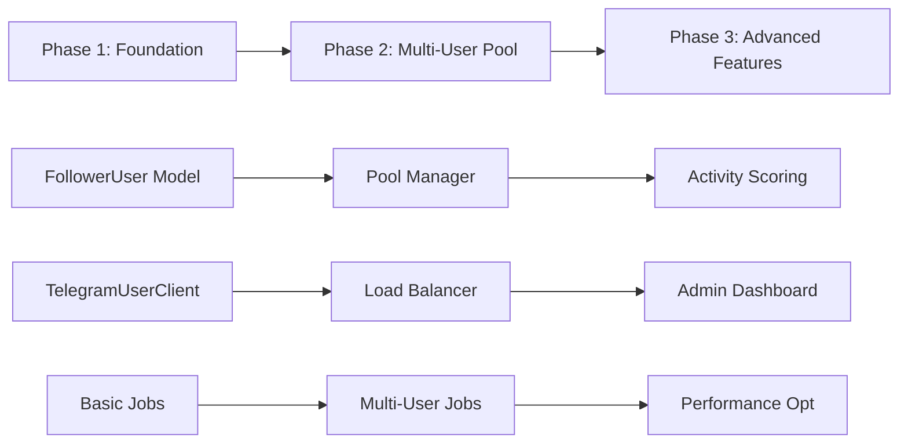

# Master Plan: Spec 046 - User-based Channel Access System

## 📋 Обзор

Master план для спецификации 046 по созданию User-based Channel Access системы с пулом FollowerUser аккаунтов.

**Общий подход**: 3 отдельных этапа с четкими dependencies и milestone'ами.

---

## 📊 Статус и Progress

**Статус**: approved
**Последнее обновление**: 2025-01-31
**Ответственный**: Данил Письменный
**Timeline**: 8 недель (56 дней)
**Priority**: P0 (Critical)

---

## 🎯 Структура имплементации

### Phase 1: Foundation Setup (2 недели)
- 📁 **Файл**: `Spec_046_Phase_1_Foundation_Setup.md`
- 🎯 **Цель**: Базовая инфраструктура для одного follower user
- ✅ **Результат**: Работающий прототип автоматического вступления в каналы

### Phase 2: Multi-User Pool (3 недели)
- 📁 **Файл**: `Spec_046_Phase_2_Multi_User_Pool.md`
- 🎯 **Цель**: Пул пользователей с load balancing
- ✅ **Результат**: Масштабируемая система до 50 follower users

### Phase 3: Advanced Features (3 недели)
- 📁 **Файл**: `Spec_046_Phase_3_Advanced_Features.md`
- 🎯 **Цель**: Продвинутые функции и оптимизация
- ✅ **Результат**: Полнофункциональная система с admin интерфейсом

---

## 🔄 Dependencies Workflow

---

## 🎯 Success Criteria по этапам

### Phase 1 ✅
- [ ] FollowerUser может вступить в канал
- [ ] Background jobs работают стабильно
- [ ] Базовая обработка ошибок реализована
- [ ] Мониторинг одного канала работает

### Phase 2 🚀
- [ ] Load balancing работает между 5+ пользователями
- [ ] Health monitoring функционален
- [ ] Failover работает автоматически
- [ ] Система выдерживает 1000+ каналов

### Phase 3 🏆
- [ ] Admin dashboard работает
- [ ] Activity scoring оптимален
- [ ] Система готова к 20000 каналов
- [ ] Все метрики достигнуты

---

## 📊 Timeline Summary

| Phase | Duration | Start After | Dependencies | Success Criteria |
|-------|----------|-------------|-------------|------------------|
| **Phase 1** | 2 недели | Day 1 | None | Single user working |
| **Phase 2** | 3 недели | Week 3 | Phase 1 completion | Load balancing working |
| **Phase 3** | 3 недели | Week 6 | Phase 2 completion | Full functionality |

**Total Timeline**: 8 недель

---

## 🚀 Рекомендации по имплементации

### 1. **Sequential Development**
- Не начинать Phase 2 до полного завершения Phase 1
- Каждый этап должен быть production-ready
- Backward compatibility обязательна

### 2. **Testing Strategy**
- Phase 1: Unit + Integration тесты
- Phase 2: Multi-user тесты + Load testing
- Phase 3: End-to-end + Performance тесты

### 3. **Documentation**
- Каждый этап имеет свою документацию
- API docs обновляются после каждого этапа
- Operational runbooks создаются progressively

---

## 📋 Action Items

### Immediate (Day 1)
- [ ] Перейти к Phase 1 плану
- [ ] Подготовить окружение для разработки
- [ ] Зарегистрировать Telegram App API

### Phase 1 Completion (Week 2)
- [ ] Review Phase 1 results
- [ ] Утвердить Phase 2 запуск
- [ ] Обновить архитектуру на основе learnings

### Phase 2 Completion (Week 5)
- [ ] Load testing результатов
- [ ] Планирование Phase 3 приоритетов
- [ ] Подготовка к production deployment

### Phase 3 Completion (Week 8)
- [ ] Full system testing
- [ ] Production readiness review
- [ ] Документация и handover

---

## 📝 Notes

- **Critical Path**: FollowerUser → Telegram API → Load Balancing → Activity Scoring
- **Risk Areas**: Telegram API stability, Session management, Rate limiting
- **Success Factors**: Incremental development, Comprehensive testing, User feedback

---

**📍 Status**: Ready for Phase 1 implementation
**👤 Owner**: Данил Письменный
**📅 Created**: 2025-01-31
**🔄 Last Updated**: 2025-01-31