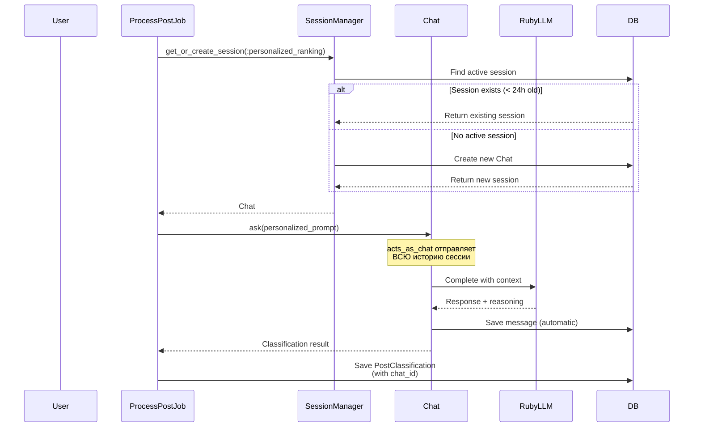

# Архитектурное ревью: ruby_llm и AI Sessions

**Дата:** 2025-09-30
**Версия проекта:** MVP (pre-implementation)
**Ревьюер:** Claude Code
**Фокус:** Интеграция ruby_llm и управление AI-сессиями

---

## Исполнительное резюме

В ходе ревью архитектуры NoFluff Bot обнаружены **критические пробелы** в планировании использования ruby_llm gem и отсутствие стратегии управления AI-сессиями и историей чатов. Текущая архитектура планирует все AI-взаимодействия как stateless операции, что **блокирует** ключевые функции персонализации (Phase 2) и делает невозможным эффективное обучение системы.

### Ключевые находки:

🔴 **Критично:** Отсутствует интеграция с `acts_as_chat` из ruby_llm
🔴 **Критично:** Нет моделей для хранения AI-сессий и истории
🟡 **Важно:** Не разделены stateless и stateful AI-операции
🟡 **Важно:** Кеширование не заменяет историю для ML
🟢 **Рекомендация:** Добавить генераторы ruby_llm для Rails integration

---

## 1. Детальный анализ проблем

### 1.1. Проблема: Отсутствие Chat/Conversation моделей

#### Текущее состояние

В документе `docs/Architecture/c4-model.md` (строки 320-339) перечислены модели:

```ruby
├── models/
│   ├── user.rb
│   ├── channel.rb
│   ├── subscription.rb
│   ├── post.rb
│   ├── post_classification.rb
│   ├── digest.rb
│   ├── digest_item.rb
│   ├── feedback.rb
│   ├── user_preference.rb
│   └── channel_recommendation.rb
```

**Отсутствуют:**
- Модель для AI-сессий (чатов с LLM)
- Модель для сообщений (messages) в сессиях
- Связь между User и AI sessions

#### Почему это проблема

1. **Персонализация невозможна без истории:**
   - В Phase 2 (ROADMAP:308-323) планируется персонализация через фидбек
   - Но без истории всех AI-классификаций невозможно построить профиль пользователя
   - Модель `Feedback` (лайк/дизлайк) не даст полной картины

2. **Нет context для улучшения промптов:**
   - Каждая AI-классификация будет выполняться с нуля
   - Нельзя использовать предыдущие успешные классификации
   - Нет возможности fine-tuning системных промптов

3. **Отсутствие аудита AI-решений:**
   - Не видно, почему AI классифицировал пост как важный/неважный
   - Нельзя проанализировать ошибки классификации
   - Сложно отлаживать проблемы с AI

#### Что предлагает ruby_llm

Согласно документации (docs/gems/ruby-llm.md:180-197):

```ruby
# Модель с acts_as_chat
class Chat < ApplicationRecord
  acts_as_chat
end

# Использование
chat = Chat.create!
chat.ask "Привет!"
chat.ask "Как дела?" # История сохраняется в БД

# Доступ к сообщениям
chat.messages.each do |message|
  puts "#{message.role}: #{message.content}"
end
```

**Это решает:**
- ✅ Автоматическое сохранение истории
- ✅ Контекст между запросами
- ✅ Аудит всех AI-взаимодействий
- ✅ Возможность анализа и улучшения

---

### 1.2. Проблема: Неэффективная интеграция ruby_llm в Rails

#### Текущее состояние в ROADMAP

`docs/ROADMAP.md:31-36`:

```markdown
#### 1.1.3. AI/LLM Setup
- [ ] Настроить ruby_llm gem
- [ ] Создать `config/initializers/ruby_llm.rb`
- [ ] Настроить API ключи (OpenAI/Anthropic/другие)
- [ ] Создать базовый wrapper `lib/ai/classifier.rb`
- [ ] Протестировать подключение к AI API
```

**Что не так:**
- Не упомянуто использование генераторов Rails integration
- Не планируется использование `acts_as_chat`
- Wrapper `lib/ai/classifier.rb` будет дублировать функционал ruby_llm

#### Что предлагает ruby_llm

Из документации (docs/gems/ruby-llm.md:172-178):

```ruby
# Rails Integration
rails generate ruby_llm:install
rails generate ruby_llm:chat_ui
```

**Генератор `ruby_llm:install` создаст:**
- ✅ Initializer с правильной конфигурацией
- ✅ Миграции для таблиц chats и messages
- ✅ Базовые модели с acts_as_chat
- ✅ Rake-задачи для обновления моделей

**Вместо кастомного wrapper получаем:**
- Готовую интеграцию
- Поддержку 500+ моделей
- Streaming, tools, embeddings из коробки
- Регулярные обновления от сообщества

---

### 1.3. Проблема: Смешение Stateless и Stateful операций

#### Типы AI-операций в NoFluff Bot

Проект использует AI для разных задач:

**Stateless операции (не требуют истории):**
1. Классификация важности одного поста
2. Определение рекламы (is_ad)
3. Проверка на дубликат (быстрая, на основе embeddings)

**Stateful операции (требуют историю):**
1. Персонализированная классификация (учитывает фидбек пользователя)
2. Генерация саммари дайджеста (контекст всех постов)
3. Обучение на предпочтениях пользователя
4. Адаптивная фильтрация (Phase 2)

#### Проблема в текущей архитектуре

`docs/Architecture/c4-model.md:165-217` описывает сервисы:

```ruby
├── content/
│   ├── ai_classifier.rb     # ❌ Единый сервис для ВСЕХ задач
│   ├── filter.rb
│   └── deduplicator.rb
```

**Что не так:**
- Один `AIClassifier` для всех типов задач
- Нет разделения по lifecycle (stateless vs stateful)
- Нет оптимизации под разные use cases

#### Рекомендуемая структура

```ruby
├── ai/
│   ├── stateless/
│   │   ├── post_classifier.rb      # Быстрая классификация без контекста
│   │   ├── ad_detector.rb          # Определение рекламы
│   │   └── quick_summarizer.rb     # Краткий саммари без истории
│   ├── stateful/
│   │   ├── personalized_ranker.rb  # Использует acts_as_chat + user history
│   │   ├── adaptive_filter.rb      # Обучается на фидбеке
│   │   └── digest_composer.rb      # Генерирует цельный дайджест с контекстом
│   ├── session_manager.rb          # Управление AI-сессиями
│   └── chat_adapter.rb             # Адаптер для ruby_llm
```

**Преимущества:**
- ✅ Stateless операции быстрее (нет загрузки истории)
- ✅ Stateful операции качественнее (есть контекст)
- ✅ Легче тестировать и масштабировать
- ✅ Разные модели для разных задач

---

### 1.4. Проблема: Кеш vs История

#### Текущее в архитектуре

`docs/Architecture/c4-model.md:94-98`:

```markdown
4. **Solid Cache**
   - Кеш результатов AI-классификации
   - Кеш векторов для дедупликации
   - Кеш рекомендаций каналов
```

И в разделе Production (lines 588-591):

```markdown
2. **Кеширование**
   - AI классификации (TTL: 24 часа)
   - Эмбеддинги для дедупликации (TTL: 7 дней)
   - Рекомендации каналов (TTL: 1 час)
```

#### Проблема

**Кеш и История — это разные вещи:**

| Аспект | Кеш (Solid Cache) | История (acts_as_chat) |
|--------|-------------------|------------------------|
| **Цель** | Ускорение повторных запросов | Обучение и персонализация |
| **TTL** | Часы/дни | Постоянно (пока пользователь активен) |
| **Scope** | Глобальный (один результат для всех) | Персональный (уникален для пользователя) |
| **Содержимое** | Только результат (importance_score) | Весь диалог (промпт + reasoning + результат) |
| **Use case** | "Этот пост уже классифицирован" | "Как я классифицировал посты для этого юзера?" |

**Что теряется без истории:**

1. **Reasoning AI:** Почему модель решила, что пост важен?
2. **Evolution:** Как менялась оценка постов со временем?
3. **Debugging:** Какой промпт использовался для классификации?
4. **Personalization data:** Нет материала для обучения персональной модели

#### Правильный подход

```ruby
# 1. Сначала проверяем кеш (быстро, для всех)
cache_key = "post:#{post.id}:classification"
cached_result = Rails.cache.read(cache_key)
return cached_result if cached_result.present?

# 2. Если нет в кеше — делаем AI-запрос С СОХРАНЕНИЕМ ИСТОРИИ
chat = user.chats.find_or_create_by(
  session_type: 'content_classification',
  status: 'active'
)

result = chat.ask("Classify this post: #{post.text}")

# 3. Сохраняем в кеш для других пользователей (если классификация глобальная)
Rails.cache.write(cache_key, result, expires_in: 24.hours)

# 4. История уже сохранена через acts_as_chat
# Можем проанализировать позже для персонализации
```

---

## 2. Рекомендуемые изменения в архитектуре

### 2.1. Новые модели данных

#### Добавить в список моделей:

```ruby
├── models/
│   ├── chat.rb                    # ИЗМЕНИТЬ: расширить для NoFluff
│   ├── message.rb                 # ИЗМЕНИТЬ: добавить связь с post
│   ├── post_classification.rb     # ИЗМЕНИТЬ: добавить chat_id
│   ├── user_preference.rb         # ИЗМЕНИТЬ: добавить chat_id
```

#### Структура Chat

```ruby
# db/migrate/XXXXXX_create_chats.rb
class CreateChats < ActiveRecord::Migration[8.0]
  def change
    create_table :chats do |t|
      t.references :user, null: false, foreign_key: true

      # Тип сессии: classification, summarization, personalization, etc.
      t.string :session_type, null: false

      # Метаданные
      t.jsonb :metadata, default: {}

      # Статус
      t.boolean :active, default: true
      t.datetime :started_at, null: false
      t.datetime :ended_at

      # Статистика
      t.integer :messages_count, default: 0
      t.integer :tokens_used, default: 0
      t.decimal :cost, precision: 10, scale: 6, default: 0.0

      t.timestamps
    end

    add_index :chats, [:user_id, :session_type, :active]
    add_index :chats, :started_at
  end
end
```

#### Модель Chat

```ruby
# app/models/chat.rb
class Chat < ApplicationRecord
  # ruby_llm интеграция
  acts_as_chat

  belongs_to :user
  has_many :post_classifications
  has_many :user_preferences

  # Типы сессий
  enum :session_type, {
    content_classification: 'content_classification',
    post_summarization: 'post_summarization',
    digest_composition: 'digest_composition',
    personalized_ranking: 'personalized_ranking',
    feedback_learning: 'feedback_learning',
    duplicate_detection: 'duplicate_detection'
  }, suffix: true

  # Scopes
  scope :active, -> { where(active: true) }
  scope :for_user, ->(user) { where(user_id: user.id) }
  scope :by_type, ->(type) { where(session_type: type) }

  # Методы
  def close!
    update!(active: false, ended_at: Time.current)
  end

  def reopen!
    update!(active: true, ended_at: nil)
  end

  def duration
    return nil unless ended_at
    ended_at - started_at
  end

  # Переопределяем метод ask из acts_as_chat для отслеживания статистики
  def ask(prompt, **options)
    result = super(prompt, **options)

    # Обновляем счетчики
    increment!(:messages_count)
    if result.respond_to?(:tokens)
      increment!(:tokens_used, result.tokens[:total] || 0)
    end

    result
  rescue => e
    # Логирование ошибок
    Rails.logger.error("Chat#ask failed: #{e.message}")
    metadata['last_error'] = {
      message: e.message,
      timestamp: Time.current.iso8601
    }
    save!
    raise
  end
end
```

#### Обновленная модель PostClassification

```ruby
# db/migrate/XXXXXX_add_chat_to_post_classifications.rb
class AddChatToPostClassifications < ActiveRecord::Migration[8.0]
  def change
    add_reference :post_classifications, :chat, foreign_key: true

    # Добавляем reasoning — объяснение от AI
    add_column :post_classifications, :reasoning, :text

    # Токены использованные для классификации
    add_column :post_classifications, :tokens_used, :integer

    add_index :post_classifications, [:chat_id, :created_at]
  end
end
```

```ruby
# app/models/post_classification.rb
class PostClassification < ApplicationRecord
  belongs_to :post
  belongs_to :user
  belongs_to :chat, optional: true

  # Персональная классификация для пользователя
  # importance_score, is_relevant, reasoning

  validates :importance_score, numericality: {
    greater_than_or_equal_to: 0,
    less_than_or_equal_to: 100
  }

  # Scope для анализа
  scope :with_reasoning, -> { where.not(reasoning: nil) }
  scope :for_session, ->(session) { where(chat_id: session.id) }
end
```

---

### 2.2. Сервисы для работы с AI

#### Сервис: ChatManager

```ruby
# app/services/ai/session_manager.rb
module Ai
  class SessionManager
    def initialize(user)
      @user = user
    end

    # Получить или создать активную сессию для типа
    def get_or_create_session(type:, metadata: {})
      session = @user.chats
                     .active
                     .by_type(type)
                     .order(started_at: :desc)
                     .first

      # Если сессия старая (> 24 часа) — закрываем и создаем новую
      if session && session.started_at < 24.hours.ago
        session.close!
        session = nil
      end

      session ||= @user.chats.create!(
        session_type: type,
        started_at: Time.current,
        metadata: metadata
      )

      session
    end

    # Закрыть все активные сессии пользователя
    def close_all_sessions!
      @user.chats.active.find_each(&:close!)
    end

    # Получить статистику по AI usage
    def usage_stats(period: 7.days)
      sessions = @user.chats
                      .where('started_at > ?', period.ago)

      {
        total_sessions: sessions.count,
        total_messages: sessions.sum(:messages_count),
        total_tokens: sessions.sum(:tokens_used),
        total_cost: sessions.sum(:cost),
        by_type: sessions.group(:session_type).count
      }
    end
  end
end
```

#### Сервис: Stateful AIClassifier (с историей)

```ruby
# app/services/ai/stateful/personalized_classifier.rb
module Ai
  module Stateful
    class PersonalizedClassifier
      def initialize(user)
        @user = user
        @session_manager = Ai::SessionManager.new(user)
      end

      def classify_post(post)
        # Получаем активную сессию классификации
        session = @session_manager.get_or_create_session(
          type: :personalized_ranking,
          metadata: { user_preferences: build_preferences_context }
        )

        # Формируем промпт с учетом истории пользователя
        prompt = build_personalized_prompt(post)

        # Используем acts_as_chat — история сохраняется автоматически
        response = session.ask(prompt)

        # Парсим ответ
        result = parse_classification_response(response)

        # Сохраняем классификацию с привязкой к сессии
        classification = PostClassification.create!(
          post: post,
          user: @user,
          chat: session,
          importance_score: result[:score],
          is_relevant: result[:relevant],
          reasoning: result[:reasoning],
          tokens_used: response.tokens[:total]
        )

        classification
      end

      private

      def build_preferences_context
        # Анализируем фидбек пользователя
        liked_posts = @user.feedbacks.like.limit(20)
        disliked_posts = @user.feedbacks.dislike.limit(20)

        {
          liked_topics: extract_topics(liked_posts),
          disliked_topics: extract_topics(disliked_posts),
          preferred_channels: @user.subscriptions.order(priority: :desc).limit(5).pluck(:channel_id)
        }
      end

      def build_personalized_prompt(post)
        preferences = @user.user_preference || {}

        <<~PROMPT
          Классифицируй этот пост по важности для пользователя (0-100).

          Пост:
          Канал: #{post.channel.title}
          Текст: #{post.text}

          Контекст пользователя:
          - Предпочитаемые темы: #{preferences[:liked_topics]&.join(', ') || 'не определены'}
          - Нежелательные темы: #{preferences[:disliked_topics]&.join(', ') || 'не определены'}
          - Приоритетные каналы: #{preferences[:priority_channels]&.join(', ') || 'не определены'}

          Ответь в JSON:
          {
            "score": 0-100,
            "relevant": true/false,
            "reasoning": "краткое объяснение решения"
          }
        PROMPT
      end

      def parse_classification_response(response)
        # Парсинг JSON ответа от AI
        JSON.parse(response.content, symbolize_names: true)
      rescue JSON::ParserError => e
        Rails.logger.error("Failed to parse AI response: #{e.message}")
        { score: 50, relevant: true, reasoning: "Error parsing response" }
      end

      def extract_topics(feedbacks)
        # Извлечение тем из постов с фидбеком
        # TODO: Можно использовать ruby_llm embeddings или NLP
        []
      end
    end
  end
end
```

#### Сервис: Stateless AIClassifier (без истории)

```ruby
# app/services/ai/stateless/quick_classifier.rb
module Ai
  module Stateless
    class QuickClassifier
      # Быстрая классификация без контекста
      # Для новых постов, когда нет персонализации

      def self.classify(post)
        # Проверяем кеш
        cache_key = "post:#{post.id}:classification"
        cached = Rails.cache.read(cache_key)
        return cached if cached

        # Одноразовый запрос через ruby_llm БЕЗ acts_as_chat
        chat = RubyLLM.chat(
          model: 'gpt-4o-mini',  # Быстрая и дешевая модель
          temperature: 0.3        # Низкая температура для консистентности
        )

        prompt = build_generic_prompt(post)
        response = chat.ask(prompt)
        result = parse_response(response)

        # Кешируем на 24 часа
        Rails.cache.write(cache_key, result, expires_in: 24.hours)

        result
      end

      private

      def self.build_generic_prompt(post)
        <<~PROMPT
          Classify this Telegram post by importance (0-100).
          Detect if it's an advertisement.

          Post: #{post.text}

          Return JSON:
          {
            "importance_score": 0-100,
            "is_ad": true/false,
            "category": "news/opinion/tutorial/ad/other"
          }
        PROMPT
      end

      def self.parse_response(response)
        JSON.parse(response.content, symbolize_names: true)
      rescue JSON::ParserError
        { importance_score: 50, is_ad: false, category: 'other' }
      end
    end
  end
end
```

---

### 2.3. Workflow: Классификация с историей



**Преимущества:**
- ✅ AI видит предыдущие классификации для этого пользователя
- ✅ Может учиться на паттернах
- ✅ Полная история для аудита и debugging
- ✅ Basis для персонализации (Phase 2)

---

## 3. Обновления ROADMAP

### 3.1. Phase 1.1.3: AI/LLM Setup — ИЗМЕНИТЬ

**Было:**
```markdown
#### 1.1.3. AI/LLM Setup
- [ ] Настроить ruby_llm gem
- [ ] Создать `config/initializers/ruby_llm.rb`
- [ ] Настроить API ключи (OpenAI/Anthropic/другие)
- [ ] Создать базовый wrapper `lib/ai/classifier.rb`
- [ ] Протестировать подключение к AI API
```

**Стало:**
```markdown
#### 1.1.3. AI/LLM Setup
- [ ] Установить ruby_llm gem
- [ ] Запустить `rails generate ruby_llm:install`
  - [ ] Проверить сгенерированный initializer
  - [ ] Настроить API ключи через credentials
  - [ ] Проверить миграции для chats/messages
- [ ] Создать модель `Chat` с `acts_as_chat`
- [ ] Создать сервис `Ai::SessionManager`
- [ ] Создать два типа классификаторов:
  - [ ] `Ai::Stateless::QuickClassifier` — без истории (для кеша)
  - [ ] `Ai::Stateful::PersonalizedClassifier` — с историей (для персонализации)
- [ ] Протестировать:
  - [ ] Создание AI-сессии
  - [ ] Сохранение истории через acts_as_chat
  - [ ] Stateless классификацию с кешированием
  - [ ] Stateful классификацию с контекстом
```

### 3.2. Phase 1.2: Модели — ДОБАВИТЬ

**Добавить после DigestItem Model:**

```markdown
#### 1.2.7. Chat Model
- [ ] Создать `app/models/chat.rb`
- [ ] Добавить `acts_as_chat` (ruby_llm integration)
- [ ] Добавить enum для `session_type`
- [ ] Добавить associations (belongs_to :user, has_many :post_classifications)
- [ ] Добавить validations
- [ ] Добавить scopes (active, by_type)
- [ ] Добавить методы:
  - [ ] `close!` — закрыть сессию
  - [ ] `reopen!` — переоткрыть сессию
  - [ ] `duration` — длительность сессии
  - [ ] Переопределить `ask` для tracking статистики
- [ ] Написать unit тесты

#### 1.2.8. Update PostClassification Model
- [ ] Добавить `chat_id` (foreign key)
- [ ] Добавить `reasoning` (text) — объяснение от AI
- [ ] Добавить `tokens_used` (integer)
- [ ] Обновить association `belongs_to :chat, optional: true`
- [ ] Обновить тесты
```

### 3.3. Phase 1.5: AI Фильтрация — ИЗМЕНИТЬ

**Было:**
```markdown
#### 1.5.1. AI Classifier Service
- [ ] Создать `app/services/content/ai_classifier.rb`
- [ ] Реализовать классификацию важности поста (0-100)
- [ ] Реализовать определение рекламы (true/false)
- [ ] Использовать ruby_llm для запросов к AI
- [ ] Добавить prompt engineering (системный промпт)
- [ ] Добавить кеширование результатов (Solid Cache)
- [ ] Обработать ошибки AI API
- [ ] Написать service тесты
```

**Стало:**
```markdown
#### 1.5.1. AI Session Management Service
- [ ] Создать `app/services/ai/session_manager.rb`
- [ ] Реализовать `get_or_create_session(type:, metadata:)`
- [ ] Реализовать `close_all_sessions!`
- [ ] Реализовать `usage_stats(period:)` для аналитики
- [ ] Написать service тесты

#### 1.5.2. Stateless AI Classifier (Quick)
- [ ] Создать `app/services/ai/stateless/quick_classifier.rb`
- [ ] Реализовать классификацию БЕЗ контекста (для кеша)
- [ ] Использовать ruby_llm без acts_as_chat
- [ ] Использовать быструю модель (gpt-4o-mini)
- [ ] Добавить кеширование в Solid Cache (TTL: 24h)
- [ ] Написать service тесты

#### 1.5.3. Stateful AI Classifier (Personalized)
- [ ] Создать `app/services/ai/stateful/personalized_classifier.rb`
- [ ] Реализовать классификацию С контекстом (через Chat)
- [ ] Использовать acts_as_chat для сохранения истории
- [ ] Формировать персонализированные промпты
- [ ] Сохранять reasoning от AI
- [ ] Написать service тесты

#### 1.5.4. Content Filter Service
- [ ] Создать `app/services/content/filter.rb`
- [ ] Выбирать между Quick/Personalized classifier
- [ ] Реализовать фильтрацию постов по importance_score
- [ ] Учитывать filter_strictness пользователя
- [ ] Фильтровать рекламу
- [ ] Написать service тесты
```

### 3.4. Phase 2.2: Персонализация — ОБНОВИТЬ

**Было:**
```markdown
### 2.2. Персонализация через фидбек
- [ ] Создать `Feedback Model` (user_id, post_id, sentiment)
- [ ] Создать `FeedbackController` (👍/👎 inline кнопки)
- [ ] Создать `Personalization Service`
- [ ] Корректировать веса важности на основе фидбека
- [ ] Создать `UserPreference Model` для хранения персональных весов
```

**Стало:**
```markdown
### 2.2. Персонализация через фидбек
- [ ] Создать `Feedback Model` (user_id, post_id, sentiment) — ✅ УЖЕ В ROADMAP
- [ ] Создать `FeedbackController` (👍/👎 inline кнопки)
- [ ] Создать `Ai::Stateful::FeedbackLearner` service
  - [ ] Использовать Chat для обучения
  - [ ] Анализировать историю классификаций vs фидбек
  - [ ] Извлекать паттерны из liked/disliked постов
  - [ ] Обновлять user_preference через AI reasoning
- [ ] Обновить `UserPreference Model`:
  - [ ] Добавить `chat_id` для последней сессии обучения
  - [ ] Добавить `learned_at` timestamp
  - [ ] Добавить `confidence_score` — уверенность в предпочтениях
- [ ] Интегрировать с `PersonalizedClassifier`:
  - [ ] Использовать user_preference в промптах
  - [ ] Учитывать confidence_score при классификации
- [ ] Создать job `Personalization::LearnFromFeedbackJob`
  - [ ] Запускается при накоплении N feedbacks
  - [ ] Использует FeedbackLearner
- [ ] Написать тесты для всего flow
```

### 3.5. NEW SECTION: Phase 1.11.3 — AI Sessions Monitoring

**Добавить в Phase 1:**

```markdown
#### 1.11.3. AI Sessions Monitoring
- [ ] Создать rake task `ai:sessions:stats`
  - [ ] Показывать статистику по всем сессиям
  - [ ] Группировать по типам
  - [ ] Считать total tokens/cost
- [ ] Создать rake task `ai:sessions:cleanup`
  - [ ] Закрывать старые активные сессии (> 7 дней)
  - [ ] Опционально: архивировать старые сообщения
- [ ] Добавить в Sidekiq/SolidQueue periodic job:
  - [ ] `Ai::SessionCleanupJob` (ежедневно)
- [ ] Добавить метрики в логи:
  - [ ] Tokens per session type
  - [ ] Average session duration
  - [ ] Cost per user
- [ ] Dashboard для админа (опционально):
  - [ ] Top users by AI usage
  - [ ] Cost breakdown by session type
  - [ ] Failed sessions
```

---

## 4. Обновления архитектуры (C4 Model)

### 4.1. Level 3: Component Diagram — ДОБАВИТЬ компоненты

В `docs/Architecture/c4-model.md` после строки 135 добавить:

```markdown
Component(chat_manager, "AI Session Manager", "Service Object", "Управляет AI-сессиями, создание/закрытие/статистика")

Component(stateless_classifier, "Stateless Classifier", "Service Object", "Быстрая классификация без истории (с кешем)")

Component(stateful_classifier, "Stateful Classifier", "Service Object", "Персонализированная классификация с историей (через acts_as_chat)")

Component(feedback_learner, "Feedback Learner", "Service Object", "Обучается на лайках/дизлайках через AI-сессии")
```

И добавить связи:

```markdown
Rel(workers, chat_manager, "Использует для создания сессий")
Rel(chat_manager, models, "Создает Chat")
Rel(stateless_classifier, cache, "Кеширует результаты")
Rel(stateful_classifier, chat_manager, "Получает/создает сессии")
Rel(stateful_classifier, models, "Сохраняет classifications + reasoning")
Rel(feedback_learner, chat_manager, "Создает learning session")
Rel(personalization, feedback_learner, "Использует для обучения")
```

### 4.2. Обновить список моделей (строка 320)

```ruby
├── models/
│   ├── user.rb
│   ├── channel.rb
│   ├── subscription.rb
│   ├── post.rb
│   ├── post_classification.rb          # ИЗМЕНЕНО: + chat_id, reasoning
│   ├── digest.rb
│   ├── digest_item.rb
│   ├── feedback.rb
│   ├── user_preference.rb              # ИЗМЕНЕНО: + chat_id, confidence
│   ├── channel_recommendation.rb
│   ├── chat.rb                   # NEW
│   └── ai_message.rb                   # NEW (автоматически через ruby_llm)
```

### 4.3. Обновить структуру сервисов (строка 286)

```ruby
├── services/
│   ├── ai/                             # NEW FOLDER
│   │   ├── session_manager.rb          # NEW
│   │   ├── stateless/
│   │   │   ├── quick_classifier.rb     # NEW
│   │   │   ├── ad_detector.rb          # NEW
│   │   │   └── quick_summarizer.rb     # NEW
│   │   └── stateful/
│   │       ├── personalized_classifier.rb  # NEW
│   │       ├── feedback_learner.rb     # NEW
│   │       └── digest_composer.rb      # NEW
│   ├── content/
│   │   ├── processor.rb
│   │   ├── filter.rb                   # ИЗМЕНЕНО: выбирает stateless/stateful
│   │   └── deduplicator.rb
```

---

## 5. Best Practices

### 5.1. Когда использовать Stateless vs Stateful

| Use Case | Тип | Причина |
|----------|-----|---------|
| Первая классификация нового поста | Stateless | Нет персонализации, кеш работает |
| Классификация для пользователя с историей | Stateful | Персонализация, учитываем фидбек |
| Определение рекламы | Stateless | Объективная задача, не зависит от юзера |
| Генерация дайджеста | Stateful | Нужен контекст всех постов |
| Дедупликация (embeddings) | Stateless | Используем эмбеддинги, не нужна история |
| Обучение на фидбеке | Stateful | Требует полной истории пользователя |

### 5.2. Управление сессиями

**Когда создавать новую сессию:**
- Пользователь вошел впервые
- Прошло > 24 часа с последней сессии этого типа
- Изменились значительно настройки пользователя (filter_strictness, format)

**Когда переиспользовать сессию:**
- Несколько классификаций подряд
- В рамках одного дайджеста
- Batch-обработка постов

**Когда закрывать сессию:**
- Пользователь изменил настройки
- Прошло > 24 часа с последнего использования
- Накопилось > 100 сообщений (контекст слишком большой)
- Daily cleanup job

### 5.3. Токены и costs

**Оптимизация:**
```ruby
# ❌ Плохо: каждый раз новая сессия = нет контекста = 0 токенов на input
Post.find_each do |post|
  session = Chat.create!(user: user, type: :classification)
  session.ask("Classify: #{post.text}")
end
# Total tokens: 10 постов × 100 tokens each = 1000 tokens

# ✅ Хорошо: одна сессия = контекст растет, но batch эффективнее
session = Chat.find_or_create_active(user: user, type: :classification)
Post.find_each do |post|
  session.ask("Classify: #{post.text}")
end
# Total tokens: первый 100 + 9 × 20 = 280 tokens (контекст переиспользуется)
```

**Мониторинг:**
```ruby
# Rake task для проверки расходов
namespace :ai do
  task costs: :environment do
    User.find_each do |user|
      manager = Ai::SessionManager.new(user)
      stats = manager.usage_stats(period: 30.days)

      if stats[:total_cost] > 10.0  # $10 threshold
        puts "⚠️  User #{user.id}: $#{stats[:total_cost]}"
      end
    end
  end
end
```

### 5.4. Debugging AI decisions

**С acts_as_chat легко дебажить:**

```ruby
# Найти сессию, где был классифицирован пост
classification = PostClassification.find(123)
session = classification.chat

# Посмотреть всю историю диалога
session.messages.each do |msg|
  puts "#{msg.role}: #{msg.content[0..100]}..."
end

# Найти reasoning
puts classification.reasoning

# Воспроизвести классификацию
session.ask("Explain why you classified post #{classification.post_id} as #{classification.importance_score}")
```

**БЕЗ acts_as_chat (старый подход):**
```ruby
# ❌ Нет истории — невозможно понять, почему AI так решил
classification = PostClassification.find(123)
# Есть только importance_score, нет reasoning, нет контекста
```

---

## 6. Миграционный план (если уже есть код)

Если вы уже начали разработку без acts_as_chat, план миграции:

### Шаг 1: Установка и генерация (0.5 часа)
```bash
rails generate ruby_llm:install
rails db:migrate
```

### Шаг 2: Создать Chat модель (1 час)
- Добавить модель
- Добавить тесты
- Не трогать существующий код

### Шаг 3: Обновить PostClassification (0.5 часа)
- Добавить chat_id, reasoning
- Миграция
- Обновить тесты

### Шаг 4: Создать новые сервисы (4 часа)
- SessionManager
- Stateless::QuickClassifier
- Stateful::PersonalizedClassifier
- Тесты

### Шаг 5: Интеграция (2 часа)
- Обновить jobs для использования новых сервисов
- Добавить feature flag для A/B тестирования
- Parallel run: старый код vs новый

### Шаг 6: Мониторинг (1 час)
- Сравнить качество классификаций
- Сравнить costs
- Feedback от пользователей

### Шаг 7: Полное переключение (1 час)
- Удалить старый код
- Cleanup

**Total: ~10 часов работы**

---

## 7. Метрики успеха

После внедрения acts_as_chat и AI sessions отслеживать:

### Качество персонализации
- **Classification accuracy**: % постов с правильной классификацией (на основе фидбека)
  - Target: > 80% после 10+ feedbacks от пользователя

- **User satisfaction**: Отношение 👍 к 👎
  - Target: > 3:1 (75% положительных)

- **Engagement**: % пользователей, которые кликают на дайджесты
  - Target: > 60%

### Эффективность AI
- **Tokens per classification**: Среднее количество токенов
  - Stateless: 100-200 tokens
  - Stateful: 200-500 tokens (но выше качество)

- **Cost per user per month**:
  - Target: < $0.50 на пользователя

- **Cache hit rate**: % запросов из кеша (stateless)
  - Target: > 70%

### Персонализация (Phase 2)
- **Time to personalization**: Сколько дней до эффекта персонализации
  - Target: < 7 дней (после 5+ feedbacks)

- **Preference confidence**: Средний confidence_score
  - Target: > 0.7 после 2 недель

---

## 8. Рекомендации по приоритетам

### Must Have (Phase 1 — MVP)
1. ✅ Установить ruby_llm с генераторами
2. ✅ Создать Chat модель с acts_as_chat
3. ✅ Создать SessionManager
4. ✅ Создать Stateless::QuickClassifier (для кеша)
5. ✅ Обновить ROADMAP

### Should Have (Phase 1 — до запуска)
6. ✅ Создать Stateful::PersonalizedClassifier
7. ✅ Обновить PostClassification (reasoning, chat_id)
8. ✅ Добавить мониторинг (rake tasks)
9. ✅ Написать тесты для всех сервисов

### Nice to Have (Phase 2)
10. ⭐ FeedbackLearner для автоматической персонализации
11. ⭐ Dashboard для AI usage
12. ⭐ A/B тестирование форматов промптов
13. ⭐ Анализ reasoning для улучшения промптов

---

## 9. Следующие шаги

### Немедленно (до начала разработки)
- [ ] Обновить ROADMAP согласно этому документу
- [ ] Обновить c4-model.md с новыми компонентами
- [ ] Создать issue/tickets для каждой задачи
- [ ] Обсудить с командой приоритеты

### До Phase 1.1 (инфраструктура)
- [ ] Запустить `rails generate ruby_llm:install`
- [ ] Создать Chat миграцию и модель
- [ ] Создать SessionManager сервис

### До Phase 1.5 (AI фильтрация)
- [ ] Реализовать Stateless classifier
- [ ] Реализовать Stateful classifier
- [ ] Интегрировать с jobs
- [ ] Тесты и мониторинг

### Phase 2 (персонализация)
- [ ] FeedbackLearner
- [ ] Continuous learning pipeline

---

## 10. Вопросы для обсуждения

1. **Бюджет на AI:**
   - Какой максимальный cost per user acceptable?
   - Нужно ли ограничивать количество AI-запросов для бесплатных пользователей?

2. **Модели:**
   - Использовать только OpenAI или мульти-провайдер?
   - Какую модель для stateless (gpt-4o-mini vs claude-haiku)?
   - Какую модель для stateful (gpt-4o vs claude-3.5-sonnet)?

3. **Privacy:**
   - Как долго хранить AI-сессии?
   - GDPR compliance — удалять историю при удалении пользователя?

4. **Performance:**
   - Batch processing для классификаций?
   - Async vs sync для персонализации?

---

## Заключение

Интеграция `acts_as_chat` из ruby_llm — это **не опциональная оптимизация**, а **критическая часть архитектуры** для персонализации (Phase 2). Без истории AI-сессий:

- ❌ Персонализация будет поверхностной
- ❌ Невозможно обучение на фидбеке
- ❌ Нет аудита AI-решений
- ❌ Сложный debugging

С acts_as_chat:
- ✅ Полная история для ML
- ✅ Reasoning для каждого решения
- ✅ Continuous learning из коробки
- ✅ Лёгкий debugging и A/B тестирование

**Рекомендация:** Внедрить acts_as_chat **с самого начала** (Phase 1.1.3), чтобы не делать breaking changes позже.

---

**Документ подготовлен:** Claude Code
**Для проекта:** NoFluff Bot
**Версия:** 1.0
**Статус:** Ready for Review
