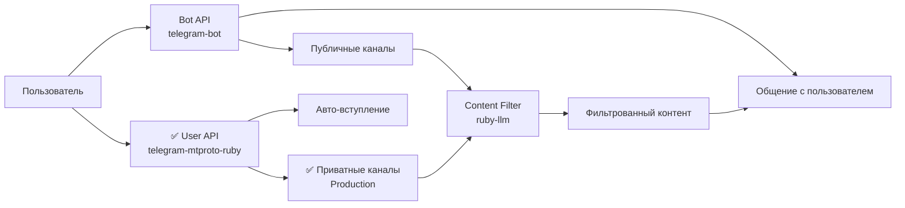

# Gems Documentation

Документация по основным библиотекам, используемым в проекте "Без шелухи".

## 📚 Основные библиотеки

### Telegram API
- **[telegram-bot](./telegram-bot.md)** - основной gem для Bot API взаимодействия
- **[tdlib-ruby](./tdlib-ruby.md)** - ❌ ЗАМЕНЕН: User API (архив, конфликт с Rails 8)
- ✅ **[MTProto Implementation](../Architecture/mtproto-ruby-implementation.md)** - telegram-mtproto-ruby (production)

### AI и обработка контента
- **[ruby-llm](./ruby-llm.md)** - унифицированный API для AI провайдеров (OpenAI, Anthropic, Gemini и др.)

---

## 🚀 Quick Start

### 1. Telegram Bot API

Для базового функционала бота используется `telegram-bot` gem:

```ruby
# app/controllers/telegram_webhook_controller.rb
class TelegramWebhookController < Telegram::Bot::UpdatesController
  def start!(*)
    respond_with :message, text: "Привет! Я помогу отфильтровать контент из каналов."
  end
end
```

### 2. TDLib-ruby (расширенные возможности)

Для доступа к приватным каналам и автоматического вступления:

```ruby
# Пример вступить в канал
service = TDLib::ChannelService.new
result = service.join_channel('https://t.me/private_channel')

if result[:success]
  puts "Успешно вступили в канал!"
end
```

### 3. AI обработка контента

Для классификации и анализа контента:

```ruby
# Классификация важности поста
chat = RubyLLM.chat(model: 'gpt-4o')
response = chat.ask("Оцени важность этого поста по шкале 1-10: #{post.text}")

importance_score = response.content.to_i
```

---

## 🏗️ Архитектура интеграции

### Двойной подход

Проект использует гибридный подход для максимального охвата:



### Когда что использовать

| Ситуация | Bot API | TDLib-ruby |
|-----------|---------|-------------|
| Команды пользователя | ✅ | ❌ |
| Отправка дайджестов | ✅ | ❌ |
| Публичные каналы | ✅ | ✅ |
| Приватные каналы | ❌ | ✅ |
| Авто-вступление | ❌ | ✅ |
| Анализ статистики | ✅ | ✅ |

---

## 📦 Установка и настройка

### 1. Gemfile

```ruby
# Gemfile
gem 'telegram-bot'           # Bot API
# gem 'tdlib-ruby'           # ❌ ЗАМЕНЕН: конфликт с Rails 8
gem 'telegram-mtproto-ruby'  # ✅ User API (production)
gem 'ruby_llm'               # AI провайдеры
```

### 2. API Keys

```bash
# Telegram Bot API (от @BotFather)
TELEGRAM_BOT_TOKEN=your_bot_token

# TDLib (от my.telegram.org/apps)
TDLIB_API_ID=12345678
TDLIB_API_HASH=abcdef123456

# AI провайдеры
OPENAI_API_KEY=your_openai_key
ANTHROPIC_API_KEY=your_anthropic_key
```

### 3. Инициализация

```ruby
# config/initializers/telegram.rb
Telegram.bots_config = {
  default: ENV['TELEGRAM_BOT_TOKEN']
}
```

```ruby
# config/initializers/tdlib.rb
TD.configure do |config|
  config.client.api_id = Rails.application.credentials.tdlib[:api_id]
  config.client.api_hash = Rails.application.credentials.tdlib[:api_hash]
end
```

```ruby
# config/initializers/ruby_llm.rb
RubyLLM.configure do |config|
  config.openai_api_key = ENV['OPENAI_API_KEY']
  config.anthropic_api_key = ENV['ANTHROPIC_API_KEY']
end
```

---

## 🔧 Примеры использования

### 1. Обработка нового поста из канала

```ruby
# app/jobs/process_post_job.rb
class ProcessPostJob < ApplicationJob
  def perform(post_id)
    post = Post.find(post_id)

    # AI классификация
    chat = RubyLLM.chat
    response = chat.ask("Оцени важность: #{post.text}")
    importance_score = response.content.to_i

    post.update!(
      importance_score: importance_score,
      is_important: importance_score >= 7
    )

    # Отправка пользователям, если важно
    if post.is_important?
      notify_interested_users(post)
    end
  end
end
```

### 2. Вступление в новый канал

```ruby
# app/services/channel_join_service.rb
class ChannelJoinService
  def self.join_channel(channel_identifier, user_id)
    # Пытаемся через TDLib
    service = TDLib::ChannelService.new
    result = service.join_channel(channel_identifier)

    if result[:success]
      # Создаем запись о канале
      channel = Channel.create!(
        identifier: channel_identifier,
        tdlib_chat_id: result[:chat_id],
        access_method: :tdlib_user
      )

      # Начинаем мониторинг
      TDLib::ChannelMonitorJob.perform_later(result[:chat_id])

      # Уведомляем пользователя
      Telegram::NotificationsChannel.broadcast_to(
        user_id,
        "✅ Успешно вступили в канал: #{channel_identifier}"
      )
    else
      # Сообщаем об ошибке
      Telegram::NotificationsChannel.broadcast_to(
        user_id,
        "❌ Не удалось вступить в канал: #{result[:error]}"
      )
    end
  end
end
```

### 3. Формирование дайджеста

```ruby
# app/services/digest_builder_service.rb
class DigestBuilderService
  def self.build_digest(user)
    posts = fetch_posts_for_user(user)

    # AI суммаризация
    chat = RubyLLM.chat(system: "Ты создаешь краткие саммари новостей")
    summary = chat.ask(
      "Сделай краткое саммари этих постов:\n#{posts.map(&:text).join('\n\n')}"
    )

    Digest.create!(
      user: user,
      content: summary.content,
      posts: posts,
      delivered_at: Time.current
    )
  end

  private

  def self.fetch_posts_for_user(user)
    Post.where(
      channel: user.subscribed_channels,
      created_at: user.last_digest_at..Time.current,
      is_important: true
    ).limit(10)
  end
end
```

---

## 🔍 Мониторинг и отладка

### TDLib статус

```ruby
# Проверка статуса TDLib
status = TDLib::ClientManager.instance.authorized?
Rails.logger.info "TDLib authorized: #{status}"
```

### AI провайдеры

```ruby
# Проверка доступности AI
begin
  chat = RubyLLM.chat
  response = chat.ask("Test")
  Rails.logger.info "AI provider working: #{response.content}"
rescue RubyLLM::Error => e
  Rails.logger.error "AI provider error: #{e.message}"
end
```

---

## ⚠️ Важные ограничения

### TDLib-ruby
- Требует компиляции TDLib на сервере
- Нужен отдельный аккаунт для follower
- Rate limiting как у обычных пользователей

### telegram-bot
- Не может вступать в каналы самостоятельно
- Ограниченный доступ к приватным каналам

### ruby-llm
- Стоимость зависит от выбранного провайдера
- Требует стабильного интернет-соединения

---

## 📖 Дополнительная документация

### Детальная документация
- ❌ **[TDLib-ruby Implementation](../Architecture/tdlib-ruby-implementation.md)** - архив (конфликт с Rails 8)
- ✅ **[MTProto Implementation](../Architecture/mtproto-ruby-implementation.md)** - production реализация
- ✅ **[Migration Summary](../Architecture/MTProto_Migration_Complete_Summary.md)** - итоги миграции
- **[C4 Model](../Architecture/c4-model.md)** - архитектура системы
- **[User-based Migration](../Architecture/user-based-access-migration.md)** - план миграции

### Внешние ресурсы
- **Telegram Bot API:** https://core.telegram.org/bots/api
- **TDLib:** https://github.com/tdlib/td
- **RubyLLM:** https://rubyllm.com/
- **Telegram Bot RB:** https://github.com/telegram-bot-rb/telegram-bot

---

## 🆘 Поддержка

При возникновении проблем:

1. **Проверьте логи:** `tail -f log/production.log`
2. **TDLib статус:** `rails console` → `TDLib::ClientManager.instance.authorized?`
3. **AI провайдеры:** `rails console` → `RubyLLM.chat.ask("test")`

Для технических вопросов обратитесь к соответствующей документации или создайте issue в репозитории проекта.