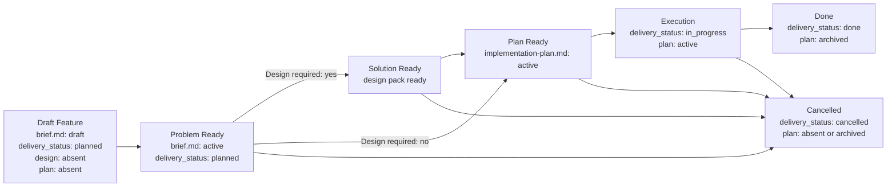

# Feature Flow

Этот документ задает порядок появления feature-артефактов. Агент должен вести feature package по стадиям и не создавать downstream-артефакты раньше, чем созрел их upstream-owner.

## Priming Inputs

Прочитай [`feature.yaml`](priming/feature.yaml). Выполни `bootstrap_brief`,
затем добавляй source sets перед соответствующими стадиями. `design` обязателен
при `Design required: yes`; `ui_design`, `interaction_runtime_design` и
`scenario_design` обязательны при выборе соответствующего artifact; далее
выполни `plan_ready` и `execution_continuation`. Перед созданием Execution
Handoff выполни `execution_handoff`.

Task owner добавляет exact affected implementation and test paths в
`implementation-plan.md`. Stage priming не заменяет execution grounding с
immutable revision и `GRND-*` evidence.

## Package Rules

1. Все документы одной фичи живут в `memory-bank/features/FT-XXX/`.
2. **Feature = одна проверяемая delivery-unit.** По умолчанию это vertical slice пользовательской ценности, пронизывающий все затронутые слои системы (UI, API, storage, infra). Для чисто инфраструктурной работы допустима одна independently verifiable engineering/operations delivery-unit с observable outcome; горизонтальная нарезка ("все endpoints", "весь UI") должна быть явно обоснована через `NS-*`. Behavior-preserving restructuring следует [`Refactoring Flow`](refactoring.md).
3. `brief.md` — canonical owner problem space: problem, outcome, scope, non-scope, assumptions, constraints, unresolved blocking decisions, validation profile decision и canonical verify contract delivery-единицы.
4. Design layer — conditional semantic owner solution space. Он создаётся только когда фича требует explicit design reasoning; design pack aggregate-владеет feature-local solution facts, а root `design.md` служит manifest и default owner неделегированных facts.
5. `README.md` создается вместе с `brief.md` и остается routing-слоем на всем lifecycle.
6. Lifecycle owner для `delivery_status` — только canonical `brief.md`. `design.md`, feature-level `README.md` и `implementation-plan.md` не дублируют это поле.
7. `design.md` появляется только после `Problem Ready` и только если `brief.md` фиксирует `Design required: yes`.
8. `implementation-plan.md` — derived execution-документ. В новых feature packages он не должен существовать, пока upstream owners не готовы: `brief.md` active и, если design required, весь design pack прошёл `Solution Ready`.
9. Для canonical `brief.md`, canonical `design.md`, feature-level `README.md` и `implementation-plan.md` используй wrapper-шаблоны из `memory-bank/flows/templates/feature/`: сам template-файл имеет `doc_function: template`, а frontmatter/body инстанцируемого документа живут внутри embedded template contract.
10. Смысл стабильных идентификаторов (`REQ-*`, `SOL-*`, `SD-*`, `STEP-*` и т.д.) задается в [`Feature Requirements, Identifiers And Traceability`](feature-requirements.md#stable-identifiers).
11. Acceptance scenarios (`SC-*`) покрывают delivery-unit end-to-end: для пользовательского slice — от входного события до наблюдаемого результата через все затронутые слои; для infrastructure/engineering/operations change — от system, operator или pipeline trigger до observable operational outcome. Тестирование отдельного слоя в изоляции допустимо как implementation detail плана, но не заменяет end-to-end acceptance.
12. Для observable behavior применяй [`Behavior Specification Practice`](behavior-specification.md): discovery findings маршрутизируются в существующие owners, concrete examples формулируются через `SC-*` / `NEG-*`, а automation связывается через `CHK-*` и `EVID-*`. BDD не вводит отдельный route или `BDD-*` identifiers.
13. **Связь с task tracker.** При создании feature package агент обязан добавить в исходную задачу или ticket ссылку на `brief.md`, а после появления downstream-документов — ссылки на существующие `design.md` и `implementation-plan.md`.
14. До Bootstrap / Brief агент обязан прочитать весь текущий `memory-bank/prd/*.md` corpus. Это обязательный context baseline независимо от того, зависит ли feature от конкретного PRD; PRD не заменяет сам feature package.
15. Если фича создает новый устойчивый сценарий проекта или materially changes существующий, соответствующий `UC-*` в `memory-bank/use-cases/` должен быть создан или обновлен до closure.
16. Optional feature-support docs (`runtime-surfaces.md`, `diagrams/<name>-sequence.md`, `ui-reference/README.md`, `use-cases/README.md`) допустимы для сложных фич как grounding / review / traceability aids. Они не становятся canonical owner problem space, solution space, acceptance inventory или execution sequencing.
17. Полное чтение PRD corpus не создаёт semantic dependency от каждого PRD. `brief.md: derived_from` импортирует только фактические upstream-owner references и не копирует весь upstream scope.
18. Если работа крупнее одной delivery-feature и требует общего roadmap, cross-feature risk register или нескольких delivery units, не расширяй feature package: повтори [`Task Routing`](routing.md), выбери [`Epic Flow`](epic.md) и после epic handoff веди каждую утвержденную delivery-единицу как отдельный feature package.
19. Validation profile выбирается в `brief.md` по [`validation-profiles.md`](../engineering/validation-profiles.md). `design.md` может уточнить risk facts, а `implementation-plan.md` разворачивает minimum contract в команды, suites и checkpoints, но ни один из них не дублирует profile decision.

## Feature Package Anatomy

Полный перечень problem, solution, execution и review artifacts, их triggers, ownership и template availability определяет [Feature Artifact Catalog](feature-artifact-catalog.md). Каталог является меню, а не checklist.

Минимальные lifecycle rules:

1. Bootstrap создает только `README.md` и `brief.md`.
2. Любой дополнительный artifact создается только когда снимает реальную неоднозначность задачи.
3. Компактный материал остается секцией canonical owner; отдельный файл появляется при самостоятельной review boundary или заметном росте объема.
4. Feature `README.md` индексирует только существующие artifacts и не содержит placeholder links.
5. Любой solution artifact индексируется также из `design.md#design-pack`; manifest row явно фиксирует `Relation`, `Direct canonical ownership` и `Readiness / source` по relation contract ниже.
6. Reference/support artifacts не вводят новые requirements, selected solution, canonical contracts или execution sequence.
7. `implementation-plan.md` создается только для feature, которая действительно переходит к execution.

## Шаблон `brief.md`

Новые feature packages используют один problem-space template: `memory-bank/flows/templates/feature/brief.md`.

`brief.md` масштабируется содержанием:

- compact feature package заполняет минимальный набор `REQ-*`, `NS-*`, `SC-*`, `CHK-*`, `EVID-*`;
- сложная problem-space часть добавляет `MET-*`, `ASM-*`, `CON-*`, `DEC-*`, `NEG-*`, несколько acceptance scenarios, richer traceability и evidence contract;
- solution-space complexity не расширяет `brief.md`; для выбранного подхода, contracts, C4, failure modes и rollout/backout используется sibling `design.md`.

Если problem-space сложный, расширяй тот же `brief.md` содержанием, а не выбирай другой template.

## Когда Нужен `design.md`

`brief.md` обязан фиксировать **Design Requirement Decision** до перехода в `Problem Ready`: `Design required: yes/no` и короткую причину. Это не selected design, а gate decision для выбора downstream path.

`design.md` обязателен, если выполняется хотя бы одно условие:

1. feature меняет API, event, schema, file format, CLI, env/config contract, background job topology, queue/storage boundary, security boundary, financial calculation, integration contract или operational rollout;
2. solution требует alternatives/trade-off reasoning, ADR dependency, C4/data-flow diagram, migration strategy, rollout/backout design или explicit failure-mode design;
3. `implementation-plan.md` иначе должен был бы принимать architecture decisions, contracts или invariants перед тем, как расписать steps;
4. feature имеет design-pack из нескольких артефактов; `design.md` должен индексировать их и указать owner-а каждого design fact.

Если change остается локальным, не меняет runtime/interface/contract boundary и решение очевидно из существующего паттерна, `design.md` можно не создавать. В этом случае `brief.md` фиксирует `Design required: no` и причину; `implementation-plan.md` не должен изобретать solution facts.

## C4 Analysis Requirements

Если `design.md` required, он обязан зафиксировать **C4 applicability decision** до `Solution Ready`: какой минимальный C4 level нужен, или почему C4 не нужен. Цель правила — не рисовать диаграммы ради диаграмм, а явно проверить architecture boundaries до execution plan.

### Когда C4 Не Нужен

C4 можно не создавать, если изменение одновременно:

1. остается внутри одного уже существующего компонента/модуля;
2. не меняет API/event/schema/file format/env/queue/storage/integration/security boundary;
3. не вводит новый runtime/deployable/container или новый background execution path;
4. не перераспределяет ответственность между bounded contexts, engines, services или внешними системами.

В этом случае `design.md` фиксирует `C4-00: not required` и короткую причину.

### Минимальный Уровень C4

| Trigger в design analysis | Required C4 level | Что показать |
| --- | --- | --- |
| Меняется взаимодействие пользователя, внешней системы, внешнего API, payment/fiscal/KYT/AML/provider integration или trust boundary с системой | C1 System Context | Система, actor/external systems, direction of interaction, trust/data boundary |
| Меняется runtime/deployable/container boundary: frontend/backend, app/worker, queues, cache/storage, Docker/Kubernetes/CI | C2 Container | Containers/runtime nodes, data stores, queues, protocols, ownership of data flow |
| Меняется внутренняя декомпозиция внутри одного container: application services/readers/writers, orchestration, state machine, domain module split, shared component boundary, financial/security-critical collaboration | C3 Component | Components/modules inside the container, responsibilities, call/event/data direction |
| Нужно объяснить class-level design как architecture decision: framework extension, reusable library contract, non-trivial algorithm object graph, concurrency/locking primitive | C4 Code | Только critical classes/interfaces and relationships; не использовать для обычных CRUD/service changes |

Если trigger попадает в несколько строк, выбирается самый глубокий требуемый уровень и сохраняется traceability к более верхним границам.

### C4 Artifact Rules

1. C4 artifact может быть Mermaid, PlantUML, Structurizr DSL, image или markdown table, если он однозначно передает выбранный C4 level.
2. Feature-local C4 artifact индексируется как `derived-view` внутри design pack; существующий внешний canonical C4 artifact индексируется как `external-dependency` и не входит в pack.
3. C4 artifact не должен содержать execution steps, file-level TODO или test commands.
4. Если C4 level required, `Solution Ready` недостижим без artifact-а или ссылки на уже существующий canonical C4/design artifact, который покрывает affected boundary.

## 4+1 Viewpoint Coverage Requirements

Каждый required `design.md` до `Solution Ready` обязан проверить решение через
модель 4+1: Logical, Process, Development, Physical и driving Scenarios. Это
stakeholder/concern coverage поверх canonical facts, а не пять новых владельцев
архитектуры и не обязательство создать пять документов или диаграмм.

- **Logical View** показывает предоставляемое поведение, domain meaning и
  requirements. Он ссылается на canonical `brief.md`, `UC-*`, PRD и domain
  owners и обязателен для любой designed feature.
- **Process View** показывает runtime behavior: взаимодействия, ordering,
  state transitions, concurrency, failure и recovery. Не путай его с Feature
  Flow: Feature Flow управляет delivery lifecycle, а Process View описывает
  исполняемую систему.
- **Development View** показывает устойчивую организацию code modules,
  components, interfaces и ownership с точки зрения разработчика.
  `implementation-plan.md` не является Development View: он владеет порядком
  работы, а не архитектурой реализации.
- **Physical View** показывает runtime/deployment topology: deployable nodes,
  queues, stores, environment/config bindings и operational boundaries.
- **Scenarios (+1)** связывают остальные views через `SC-*`, применимые
  project-level `UC-*` и negative/error paths. Scenario используется как input
  design analysis и затем как основа проверки, а не только как финальный test.

### View Applicability Predicates

| View | `covered` обязателен, когда | `N/A` допустим, когда |
| --- | --- | --- |
| Logical | Всегда: designed feature реализует или изменяет capability, rule или observable engineering/operations outcome из `brief.md` | Никогда |
| Process | Selected solution меняет runtime interactions, state transitions, ordering, sync/async boundary, concurrency, failure propagation или recovery behavior | Все runtime semantics остаются у существующих canonical owners без изменений, а scenario не вводит новый temporal/failure path |
| Development | Selected solution меняет module/component/interface responsibilities, code ownership, dependency direction или внутреннюю decomposition | Решение полностью использует существующую implementation structure и не перераспределяет ответственность или dependencies |
| Physical | Selected solution меняет deployable/runtime nodes, queue/store boundary, environment/config binding, network/trust placement или deployment topology | Решение выполняется в существующей topology и не меняет runtime placement или bindings |
| Scenarios (+1) | Всегда: каждый `SC-*` участвует в Cross-View Correspondence | Никогда |

Если evidence недостаточно, чтобы доказать `N/A`, view остается `covered` и
анализ продолжается. Неопределённость applicability сама по себе не является
Human Gate; примени
[`Structured Decision Protocol`](../engineering/autonomy-boundaries.md#structured-decision-protocol)
и эскалируй только при outcome `escalate`.

Logical View и Scenarios всегда получают `covered`. Process, Development и
Physical получают `covered` по predicates выше либо обоснованный `N/A`.
Каждая строка называет stakeholder/concern, canonical owner/refs и optional
supporting projection. Supporting views ссылаются на canonical IDs и не вводят
новые requirements, decisions, contracts или topology facts.

До `Solution Ready` каждый `SC-*` из `brief.md` должен присутствовать в
Cross-View Correspondence: scenario/requirement → применимые runtime semantics
→ code/component ownership → deployment topology → `CHK-*`/`EVID-*`. Для
неприменимого view фиксируется `N/A`, а не выдумывается искусственная связь.

4+1 дополняет, но не заменяет C4 и Architecture Coverage Decision: 4+1
проверяет stakeholder concerns, C4 выбирает структурный zoom level, а
Architecture Coverage проверяет components, connectors, configuration,
behavioral semantics и quality/evolution concerns.

## Architecture Coverage Requirements

Каждый required `design.md` до `Solution Ready` обязан явно проверить достаточность архитектурного описания по пяти аспектам: components, connectors, configuration, behavioral semantics и quality/evolution concerns. Это обязательный analysis decision, а не требование создать пять разделов, отдельные файлы или diagrams: компактные факты остаются в `design.md`, а неприменимый аспект получает обоснованный `N/A`.

### Components, Connectors And Configuration

1. **Components** — затронутые элементы решения, их ответственности и предоставляемые/потребляемые интерфейсы. Имена элементов без распределения ответственности не дают достаточного coverage.
2. **Connectors** — first-class механизмы или bindings, связывающие стороны решения, а не только wire shape. Connector kind может быть API call, event, queue, callback, shared store/file access, cache interaction, authentication handoff, locking/concurrency mechanism или runtime/config binding. Не смешивай connector kind с protocol/format (`schema`, encoding) или parties/roles (producer, consumer, provider, initiator, target).
3. **Configuration** — конкретная topology и bindings между components/connectors. Для cross-component change покажи direction, connector kind, conditional/optional links и затронутую runtime/deployment topology, если она влияет на решение. Один перечень components без bindings недостаточен.

Для значимого connector описание по риску фиксирует roles (producer/consumer/initiator), protocol/format и direction, sync/async boundary, ordering/delivery guarantees, timeout/retry/idempotency, trust/security boundary, failure/degradation semantics, compatibility/versioning и observability. Компактное описание остается в `design.md`; отдельный interaction contract создается только при самостоятельной review boundary или заметном росте объема.

C4, data-flow и sequence views остаются conditional. Если они используются, C4 показывает boundaries и topology, data-flow — sources, transformations, sinks, ownership и connector direction, а sequence — temporal semantics. Ни одна отдельная нотация не заменяет Architecture Coverage Decision.

### Risk-Based Design Verification

До `Solution Ready` `design.md` обязан выбрать анализы по риску и зафиксировать для каждого класса `required: yes/no`, method и result/evidence. Минимальный selection inventory: contract compatibility, state/transition completeness, failure propagation, concurrency/ordering, security boundaries, capacity/latency и migration/evolution safety.

Это selection gate, а не обязательство выполнить каждый вид анализа. `no` требует краткой причины; `yes` требует завершенного результата или ссылки на evidence/canonical artifact до `status: active`. Если анализ выявляет design gap, сначала обновляется canonical solution owner, а не `implementation-plan.md`.

## Design Layer And Design Pack

`Design layer` — conditional semantic layer Feature Flow, который владеет
feature-local solution space. Он существует, когда canonical `brief.md`
фиксирует `Design required: yes`.

`Design pack` — документальное представление design layer для одной feature:
ровно один root `design.md` и ноль или более проиндексированных design
artifacts. Feature-local canonical artifacts и derived views входят в pack;
внешние canonical owners индексируются как dependencies, но не становятся его
частью. Добавление или удаление companion artifacts не меняет identity pack,
пока он относится к той же feature.

`design.md` — root manifest, entry point и default owner feature-local solution
facts, которые не делегированы другому canonical document owner. Manifest
использует ровно одно из четырёх отношений для каждого artifact:

| Relation | Значение |
| --- | --- |
| `root` | Обязательный `design.md`, manifest и default solution owner |
| `constituent` | Artifact внутри design pack; может владеть явно делегированными canonical facts |
| `derived-view` | Проекция canonical facts; не вводит новые canonical facts |
| `external-dependency` | Внешний canonical owner, решение или model; импортируется, но не входит в pack |

На aggregate уровне design pack владеет feature-local solution facts. Каждый
canonical stable ID имеет ровно одного непосредственного document owner:
неделегированный факт определяется в `design.md`, делегированный — в одном
явно указанном constituent, а shared/project-wide факт остаётся у внешнего
canonical owner. Root manifest индексирует owner и не дублирует его semantics.

### Optional Design-Pack Artifacts

`design.md` остается обязательной точкой входа любого non-empty design-pack. Interaction contracts, C4/sequence/state/data-flow views, data model, migration, security, observability и другие design artifacts создаются независимо друг от друга только по triggers из [Feature Artifact Catalog](feature-artifact-catalog.md#solution-and-design-artifacts).

Компактный material остается в `design.md`. Каждый отдельный design artifact
обязан быть проиндексирован с явным `Relation`, перечислить delegated ownership,
если оно есть, и не принимать новый selected solution вне `design.md` /
accepted ADR.

## Optional Feature Support Docs

Support docs создаются только когда снимают реальную неоднозначность или делают review существенно точнее. Selection triggers для feature-local use cases, runtime surfaces, UI reference, mockups и sequence views определяет [Feature Artifact Catalog](feature-artifact-catalog.md).

Support docs используют `doc_kind: feature-support`, ссылаются на canonical owners и явно пишут, что не подменяют `brief.md`, `design.md`, delegated contract или `implementation-plan.md`. Если support doc обнаруживает изменение canonical fact, сначала обновляется соответствующий owner.

Feature-local `ui-reference/README.md` ссылается на `engineering/ui-design-guide/README.md` или на нужный surface document внутри него как на project-level discovery reference и не копирует catalog shared components, helpers и examples в feature package.

## Migration Strategy

- Новые feature packages обязаны сразу следовать структуре `brief.md -> optional design.md -> implementation-plan.md`.
- Новый `design.md` обязан сразу содержать 4+1 Viewpoint Coverage Decision и Cross-View Correspondence.
- Existing active/archived `design.md`, который уже прошёл `Solution Ready` до принятия 4+1 rules, сохраняет прежний gate state, пока его canonical solution facts не меняются; documented prior review или pinned template revision служит evidence grandfathering.
- При material change существующего design pack grandfathering прекращается: перед повторным `Solution Ready` добавь 4+1 coverage и correspondence по текущему contract. Одна только execution continuation без изменения canonical solution facts не требует retroactive backfill.
- При миграции старого package layout сначала назначь canonical owners: problem-space content переносится в `brief.md`, required solution-space content — в root `design.md` или явно проиндексированный constituent.
- После миграции package не должен сохранять duplicate active owners для problem space или solution space.
- Миграция может происходить постепенно, package-by-package.

## Lifecycle



## Transition Gates

Каждый gate — набор проверяемых предикатов. Переход допустим тогда и только тогда, когда все предикаты истинны.

### Bootstrap Feature Package

- [ ] `README.md` создан по шаблону `templates/feature/README.md`
- [ ] `brief.md` создан по шаблону `templates/feature/brief.md`
- [ ] `design.md` отсутствует
- [ ] `implementation-plan.md` отсутствует

### Draft Feature → Problem Ready

- [ ] `brief.md` → `status: active`
- [ ] секция `What` содержит ≥ 1 `REQ-*` и ≥ 1 `NS-*`
- [ ] для каждого baseline requirement class зафиксировано `applicable`, обоснованное `not-applicable` или `covered-upstream` с canonical ref по [`feature-requirements.md`](feature-requirements.md)
- [ ] секция `Verify` содержит ≥ 1 `SC-*`
- [ ] каждый `REQ-*` прослеживается к ≥ 1 `SC-*` или `NEG-*` через traceability matrix; основной changed behavior всегда имеет positive `SC-*`
- [ ] verdict-changing вопросы из behavior discovery разрешены либо зафиксированы как blocking `DEC-*`; найденные stable flows, shared rules и deferred work переданы соответствующим `UC-*`, domain owner и `NS-*` / отдельной delivery-unit
- [ ] каждый required `SC-*` / `NEG-*` однозначно задаёт существенный context, одно событие и observable outcome; при structured BDD triggers из [`Behavior Specification Practice`](behavior-specification.md) используется `Given / When / Then` или эквивалентная структура
- [ ] секция `Verify` содержит ≥ 1 `CHK-*` и ≥ 1 `EVID-*`
- [ ] если deliverable нельзя принять без negative/edge coverage → ≥ 1 `NEG-*`
- [ ] `brief.md` содержит Design Requirement Decision: `Design required: yes/no` и причину
- [ ] `brief.md` содержит один validation profile, triggers/rationale и required downgrade approval ref
- [ ] `brief.md` не содержит accepted solution decisions, `How`, to-be C4 architecture model, `Change Surface`, solution-level `Flow`, `CTR-*`, `FM-*`, `RB-*` или rollout/backout prose

### Problem Ready → Solution Ready

- [ ] `brief.md` фиксирует `Design required: yes`
- [ ] `design.md` создан по шаблону `templates/feature/design.md`
- [ ] `design.md` → `status: active`
- [ ] Design Pack manifest содержит ровно один `root` и классифицирует каждый artifact как `root`, `constituent`, `derived-view` или `external-dependency`
- [ ] каждый canonical stable ID имеет ровно одного непосредственного owner; root manifest индексирует delegated ownership без дублирования semantics
- [ ] каждый canonical constituent owner и каждая external canonical dependency, являющиеся governed-документами, имеют `status: active`; применимый entity lifecycle также finalized для downstream consumption
- [ ] каждый делегированный interaction contract имеет `Contract Status: accepted`
- [ ] каждый required derived view проиндексирован и согласован со своими canonical owners; standalone/embedded non-document assets индексируются active governed-документом с canonical source и version/revision, когда применимо
- [ ] между root, constituents, views и external dependencies нет противоречащих canonical facts
- [ ] `design.md` содержит ≥ 1 `SOL-*`
- [ ] `design.md` ссылается минимум на один canonical `REQ-*` из sibling `brief.md`
- [ ] `design.md` фиксирует C4 applicability decision; если C4 level required, C4 artifact или ссылка на canonical C4/design artifact присутствует в design-pack
- [ ] 4+1 Viewpoint Coverage Decision применяет View Applicability Predicates и фиксирует `covered` для Logical View и Scenarios, а для Process, Development и Physical — `covered` или evidence-backed `N/A`, stakeholder/concern, canonical refs и optional supporting projection
- [ ] Cross-View Correspondence содержит каждый `SC-*` из `brief.md` и связывает его с requirement, применимыми Process/Development/Physical refs и `CHK-*`/`EVID-*`; существенные `NEG-*` / edge examples связаны с применимыми `FM-*`, `CTR-*`, `INV-*` или обоснованным `N/A`
- [ ] Architecture Coverage Decision фиксирует `covered` или обоснованный `N/A` для components, connectors, configuration, behavioral semantics и quality/evolution concerns
- [ ] при cross-component interaction явно показаны bindings/topology, direction, connector kind и значимые interaction semantics; один перечень components недостаточен
- [ ] Design Verification выбирает каждый analysis class по риску через `required: yes/no`; required analyses имеют method и result/evidence, а `no` имеет причину
- [ ] selected design стабилизирован настолько, что downstream execution sequencing больше не конкурирует с ним за ownership
- [ ] accepted feature-local decisions перенесены в `SD-*`, а architectural / reusable / cross-feature decisions оформлены в accepted ADR
- [ ] если solution зависит от ADR, соответствующий ADR имеет `status: active` и `decision_status: accepted`
- [ ] для нового feature package `implementation-plan.md` отсутствует; для migrated package с уже существующим планом разрешено создать `design.md`, после чего план должен быть обновлён так, чтобы ссылаться на canonical solution refs до следующего существенного execution update

### Upstream Ready → Plan Ready

Plan Ready artifact-review convergence допускает не более пяти review-improve
итераций. Последняя итерация с исправлениями не считается clean verdict без
последующего re-review; исчерпание budget оставляет gate непройденным. Примени
[`Structured Decision Protocol`](../engineering/autonomy-boundaries.md#structured-decision-protocol),
пересмотри hypothesis, upstream facts, plan и review scope; продолжай через
обоснованный replan или `bounded_probe`. Human Gate нужен только при outcome
`escalate`.

- [ ] агент выполнил grounding до sequencing: прошёлся по текущему состоянию системы против зафиксированного immutable commit SHA repository revision и сохранил `GRND-*` evidence в `implementation-plan.md`; `HEAD`, branch name и tag не допускаются
- [ ] `implementation-plan.md` содержит упорядоченный `Implementation Priming`: exact repo-relative paths или stable external sources, section/symbol, `GRND-*` refs, purpose и required `STEP-*`; categories, globs, `TODO` и предполагаемые paths не допускаются
- [ ] если `brief.md` фиксирует `Design required: yes`, весь design pack по-прежнему удовлетворяет `Solution Ready`, включая publication/lifecycle статусы constituents и external dependencies
- [ ] если `brief.md` фиксирует `Design required: no`, `implementation-plan.md` не принимает architecture decisions, contracts или invariants
- [ ] `implementation-plan.md` создан по шаблону `templates/feature/implementation-plan.md`
- [ ] пока plan формируется и проходит artifact review, `implementation-plan.md` имеет `status: draft`
- [ ] `implementation-plan.md` содержит ≥ 1 `PRE-*`, ≥ 1 `STEP-*`, ≥ 1 `CHK-*`, ≥ 1 `EVID-*`
- [ ] grounding evidence содержит inspected paths/commands, наблюдаемые current-state facts и влияние каждого факта на plan; placeholder paths, предполагаемые файлы и пересказ intended solution не считаются grounding
- [ ] discovery context в `implementation-plan.md` содержит: grounded immutable commit SHA repository revision, relevant paths, local reference patterns, dependencies, unresolved questions (`OQ-*` или явное `none`, если после discovery их нет), existing/planned test surfaces и execution environment
- [ ] минимум один `GRND-*` подтверждает существующий implementation pattern или current change surface, а минимум один — существующую test surface либо evidence-backed отсутствие подходящего покрытия
- [ ] шаги и workstreams в `implementation-plan.md` ссылаются на canonical IDs из `brief.md` и, если design layer существует, solution refs из их непосредственных design-pack owners / external dependencies
- [ ] для designed feature план содержит явное refinement применимых `SOL-*`, `C4-*`, `SD-*`, `CTR-*`, `INV-*`, `FM-*`, `RB-*` и accepted ADR refs через `realization target -> STEP/CHK/EVID`; каждый применимый ref встречается минимум в одной mapping-строке, а найденный solution gap сначала обновляет canonical owner
- [ ] `Test Strategy`, approvals и checkpoints покрывают применимые obligations validation profile из `brief.md`, не дублируя решение; каждый required `SC-*` / `NEG-*` имеет planned test surface, automation status, required local/CI suites и evidence
- [ ] candidate revisions `brief.md`, полного optional design pack, всех referenced external dependencies, `implementation-plan.md` и grounded immutable commit SHA repository revision заморожены для Plan Ready artifact review
- [ ] Plan Ready artifact review проверил достаточность grounding, consistency с upstream owners, ownership boundaries, traceability, executability, test strategy, approvals и stop/fallback conditions
- [ ] все critical/important artifact findings исправлены; остальные findings явно disposition как допустимые non-blocking/deferred с owner; после последнего исправления получен clean re-review текущих candidate revisions
- [ ] artifact review evidence хранится вне reviewed `implementation-plan.md`, указывает reviewer, candidate revisions, findings/dispositions и verdict; автор plan не считается его reviewer-ом
- [ ] clean artifact-review verdict существует отдельно от любого implementation/code review и не закрывает его obligations
- [ ] после clean Plan Ready artifact-review verdict draft revision `implementation-plan.md` → `status: active`, resulting active revision заморожен как candidate revision и получает clean re-review; только этот verdict закрывает Plan Ready

### Plan Ready → Execution

- [ ] `brief.md` → `delivery_status: in_progress`
- [ ] если design layer существует, весь design pack и referenced external dependencies сохраняют `Solution Ready`; изменение любой reviewed revision возвращает feature к соответствующему gate
- [ ] `implementation-plan.md` → `status: active`
- [ ] implementing agent до первого write прочитал `Implementation Priming` и подтвердил, что стартовая repository revision совпадает с grounded immutable commit SHA; при расхождении execution остановлен для re-grounding/replan
- [ ] `implementation-plan.md` фиксирует test strategy: automated coverage surfaces, required local/CI suites
- [ ] каждый manual-only gap имеет причину, ручную процедуру и `AG-*` с approval ref

### Execution → Done

- [ ] все `CHK-*` из `brief.md` имеют результат pass/fail в evidence
- [ ] все `EVID-*` из `brief.md` заполнены конкретными carriers (путь к файлу, CI run, screenshot)
- [ ] каждый required `SC-*` / `NEG-*` прослеживается через `CHK-*` к automated test или явно approved manual-only gap; test name, tag или metadata сохраняет scenario ref, если это допускают project conventions
- [ ] delivered behavior не противоречит accepted `SOL-*` / `SD-*` / ADR refs, если design layer существует
- [ ] automated tests для change surface добавлены или обновлены
- [ ] required test suites зелёные локально и в CI
- [ ] minimum validation/evidence contract выбранного profile закрыт concrete evidence
- [ ] каждый manual-only gap явно approved человеком (approval ref в `AG-*`)
- [ ] required implementation/code review проверил delivered repository diff против active `brief.md`, полного optional design pack, referenced finalized external dependencies и execution plan; его verdict/evidence не подменяются Plan Ready artifact review
- [ ] simplify review выполнен: код минимально сложен или complexity обоснована ссылкой на `CON-*`, `FM-*`, `SD-*` или accepted ADR
- [ ] если feature добавляет новый stable flow или materially changes существующий project-level scenario, соответствующий `UC-*` создан или обновлен и зарегистрирован в `memory-bank/use-cases/README.md`
- [ ] `brief.md` → `delivery_status: done`
- [ ] `implementation-plan.md` → `status: archived`

### → Cancelled (из любой стадии после Draft Feature)

- [ ] `brief.md` → `delivery_status: cancelled`
- [ ] `implementation-plan.md` отсутствует ∨ `status: archived`

## Outcome / Exit Contract

### Observable Outcome

Одна delivery-unit принята end-to-end в границах `brief.md`: либо vertical slice пользовательского поведения работает, либо плановый infrastructure/engineering/operations outcome подтверждён observable evidence.

### Required Evidence

- active `brief.md` и optional active `design.md` с непрерывной traceability;
- validation profile decision и evidence его minimum contract;
- выполненные `CHK-*` и конкретные carriers для `EVID-*`;
- automated coverage, required local/CI results и approval refs для manual-only gaps;
- Plan Ready artifact review и required implementation/code review имеют отдельные clean verdicts по своим reviewed revisions;
- все изменения закоммичены и отправлены в remote branch, required CI полностью зелёный;
- обновлённый `UC-*`, когда изменился устойчивый project-level scenario.

### Terminal State

`Done`: выполнен gate Execution → Done, `brief.md` имеет `delivery_status: done`, а `implementation-plan.md` архивирован. Альтернативный terminal state — `Cancelled` по соответствующему gate.

### Handoff

Закрой delivery issue и передай эксплуатационные или release-действия их owner-ам. Новые требования, решения и follow-up работу обнови у canonical owner и повторно маршрутизируй.

### Worked Execution Handoff Example

Ниже synthetic example формы, а не факт о существующей feature. Конкретная
передача заменяет все placeholder значения direct primary-source references по
[Execution Handoff Contract](execution-handoff.md).

```text
Starting point
- claim: FT-042 is at Execution → Done verification.
  primary_source: memory-bank/features/FT-042/brief.md#delivery-status

Declared priming context
- claim: the execution continuation source set was resolved for FT-042.
  primary_source: memory-bank/flows/priming/feature.yaml#execution_continuation

Observed execution
- claim: STEP-03 was executed at immutable revision <commit-sha>.
  primary_source: <commit-url-or-command-log>#STEP-03

Verification
- claim: CHK-02 passed.
  primary_source: <ci-run-url-or-test-output>#CHK-02

Continuation
- claim: release approval is still required before production action.
  primary_source: memory-bank/features/FT-042/implementation-plan.md#AG-01
- next action: release owner requests AG-01 approval; stop if the approved
  revision differs from <commit-sha>.
  primary_source: memory-bank/features/FT-042/implementation-plan.md#AG-01
```

Здесь declared priming context показывает, что должно было быть загружено;
observed execution доказывается отдельным commit, command log или CI carrier.
Ни одна строка handoff не меняет `brief.md`, design owner или plan.

## Boundary Rules

1. `brief.md` обязан содержать секции `What` и `Verify`.
2. `brief.md` владеет только problem space и связанными gate decisions: problem, outcome, scope, non-scope, assumptions, constraints, unresolved blocking decisions, Design Requirement Decision, validation profile decision и canonical verify contract.
3. `brief.md` не должен содержать `How`, selected design, to-be C4 architecture model, accepted solution decisions, change surface, internal flow, concrete solution contracts, solution-level failure modes, rollout/backout semantics или execution sequencing.
4. `DEC-*` в `brief.md` означает только unresolved blocking decisions. Как только решение принято, оно переезжает в `design.md` как `SD-*` или в ADR.
5. Если design layer нужен, design pack aggregate-владеет feature-local solution space. Root `design.md` владеет manifest, selected design и всеми неделегированными solution facts; constituent владеет только явно делегированными canonical facts; derived view не владеет canonical facts; external dependency сохраняет собственного canonical owner.
6. `delivery_status` остается только на `brief.md`; `design.md` и `implementation-plan.md` не дублируют lifecycle state delivery-единицы.
7. `design.md` не должен переопределять business requirements, scope, acceptance criteria, canonical checks, evidence contract, detailed current-system inventory или execution sequencing.
8. Feature-support docs не должны переопределять canonical facts. Они могут давать surface inventory, UI reference, mockups, derived use cases, behavior example maps и review mappings только как support context; derived example не может вводить новый verdict, отсутствующий в `brief.md`.
9. Если feature зависит от ADR, ADR остаётся canonical owner решения, а `design.md` индексирует его как `external-dependency`; только `status: active` + `decision_status: accepted` считается finalized design.
10. Если feature зависит от канонического use case, `brief.md` ссылается на соответствующий файл в `memory-bank/use-cases/`. Use case остается owner-ом trigger/preconditions/main flow/postconditions на уровне проекта, а `brief.md` фиксирует только slice-specific проблему и verify.
11. `implementation-plan.md` остается derived execution-документом: он ссылается на canonical IDs из `brief.md` и, если есть, применимые `SOL-*`, `C4-*`, `SD-*`, `CTR-*`, `INV-*`, `FM-*`, `RB-*` и accepted ADR refs, показывает их realization в `STEP/CHK/EVID`, фиксирует discovery context и test strategy для исполнения и не переопределяет scope, selected design, C4 architecture model, blockers, acceptance criteria или evidence contract.
12. Если меняются scope, assumptions, constraints, acceptance criteria или evidence contract, сначала обновляется `brief.md`. Если меняются selected design, to-be C4 architecture model, local accepted decisions, contracts, failure modes или rollout/backout semantics, сначала обновляется их непосредственный owner: `design.md`, delegated constituent или ADR. Только потом обновляется downstream-план.
13. Если support doc выявляет конфликт с canonical owner, конфликт нельзя решать внутри support doc: обнови `brief.md`, непосредственный design-pack owner, external dependency или `implementation-plan.md` по ownership.
14. Если численный target threshold относится только к одной delivery-единице, canonical owner — соответствующий `brief.md`. Поднимать такой KPI в project-level документ можно только после того, как он стал shared upstream fact для нескольких feature.
15. Хороший `implementation-plan.md` начинается с discovery context: relevant paths, local reference patterns, unresolved questions, test surfaces и execution environment должны быть зафиксированы до sequencing изменений.
16. Для действий, пересекающих canonical Human Gate из [autonomy boundaries](../engineering/autonomy-boundaries.md#human-gate--остановись-и-спроси), `implementation-plan.md` должен явно отделять автономные preparation/validation steps от требующего approval execution step и не скрывать gate внутри prose шага.
17. Если feature исполняет часть upstream initiative, `brief.md` должен ссылаться только на релевантные upstream artifacts и imported IDs, а не копировать весь upstream scope. Если используются upstream solution decisions, `design.md` или ADR ссылается на их canonical owner.
18. Upstream roadmap, cross-feature risks и delivery-unit registries принадлежат upstream owner-документам, а не feature package.
19. **Artifact review и implementation review различаются.** Artifact review проверяет governed brief/design/plan, их grounding, ownership, completeness и traceability до lifecycle gate. Implementation review проверяет delivered code и repository diff после execution. Они имеют разные reviewed revisions, findings и verdicts и не заменяют друг друга.
20. Review evidence не записывается внутрь проверяемого artifact после freeze: используй issue/PR review record, orchestration ledger или другой repository-approved внешний carrier, чтобы не инвалидировать reviewed revision самим verdict-ом.

## Test Ownership Summary

Canonical testing policy живёт в [../engineering/testing-policy.md](../engineering/testing-policy.md). Ниже — выжимка, достаточная для создания feature package без обращения к policy-документу.

1. **Canonical test cases** delivery-единицы задаются в `brief.md` через `SC-*`, feature-specific `NEG-*`, `CHK-*` и `EVID-*`.
2. Design pack, если нужен, aggregate-владеет solution-level `CTR-*`, `INV-*`, `FM-*` и `RB-*`; непосредственный owner — `design.md` или явно указанный constituent. Ни один design artifact не владеет test strategy и не подменяет canonical verify contract.
3. `implementation-plan.md` владеет только стратегией исполнения: какие suites добавить, какие gaps временно manual-only и почему.
4. **Sufficient coverage** = покрыт основной changed behavior, новые или измененные contracts из их design-pack owner / external dependency, критичные failure modes из `FM-*` и feature-specific negative/edge scenarios, если они меняют verdict. Процент line coverage сам по себе недостаточен.
5. **Manual-only допустим** только как явное исключение (live infra, hardware, недетерминированная среда). Для каждого gap — причина, ручная процедура или `EVID-*`, owner follow-up и approval ref через `AG-*`.
6. **К Problem Ready** `brief.md` уже фиксирует test case inventory: минимум один `SC-*`, traceability к `REQ-*` и Design Requirement Decision. **К Solution Ready** весь required design pack готов и согласован по gate выше. **К Done** — automated tests добавлены, обязательные suites зелёные локально и в CI.
7. **BDD automation не означает E2E-only.** Для `SC-*` / `NEG-*` выбирай самый низкий надёжный unit, component, contract, integration или E2E surface, который доказывает observable outcome; Gherkin и Cucumber не обязательны.
8. **Simplify review** — отдельный проход после функциональных тестов, до closure. Цель: убедиться, что код минимально сложен. Три похожие строки лучше premature abstraction. Complexity оправдана только со ссылкой на `CON-*`, `INV-*`, `FM-*`, `SD-*` или accepted ADR.
9. **Verification context separation** — функциональная верификация, simplify review и acceptance test — три логически отдельных прохода. Между проходами агент формулирует выводы до начала следующего. Для compact feature packages допустимо в одной сессии, но simplify review не пропускается.

## Stable Identifiers

The canonical registry moved to
[Feature Requirements, Identifiers And Traceability](feature-requirements.md#stable-identifiers).
The headings below remain as compatibility bridges for existing deep links.

## Requirement Taxonomy And Traceability

See [Requirement Taxonomy And Traceability](feature-requirements.md#requirement-taxonomy-and-traceability).

### Feature IDs

See [Feature IDs](feature-requirements.md#feature-ids).

### Solution IDs

See [Solution IDs](feature-requirements.md#solution-ids).

### Plan IDs

See [Plan IDs](feature-requirements.md#plan-ids).

### Support IDs

See [Support IDs](feature-requirements.md#support-ids).

### Required Minimum

1. Любой canonical `brief.md` использует как минимум `REQ-*`, `NS-*`, `SC-*`, `CHK-*`, `EVID-*`.
2. Любой `brief.md` со `status: active` задает хотя бы один explicit test case через `SC-*`.
3. `brief.md` может использовать только минимальный problem-space набор для compact feature package или расширенный набор feature IDs по необходимости; отдельные problem-space templates не используются.
4. Любой новый required `design.md` и существующий design pack, повторно входящий в `Solution Ready` после material solution change, использует как минимум один `SOL-*`, один `C4-*` decision, 4+1 Viewpoint Coverage Decision, Cross-View Correspondence, Architecture Coverage Decision и Design Verification selection и связывает solution refs минимум с одним `REQ-*` из sibling `brief.md`; grandfathered packages следуют Migration Strategy.
5. Любой `design.md` фиксирует selection rationale для C4 applicability; выбранные C4 views используют `C4-*` и связываются с `SOL-*`, `SD-*`, `CTR-*`, `INV-*` или ADR refs.
6. Любой `design.md`, где есть принятые feature-local решения, использует `SD-*`; `ALT-*`, `TRD-*`, `CTR-*`, `INV-*`, `FM-*` и `RB-*` применяются только когда соответствующая solution-semantics действительно нужна.
7. Любой optional support doc использует только local support IDs и traceability к canonical refs; он не вводит новые canonical `REQ-*`, `SC-*`, `CHK-*` или `EVID-*`.
8. Любой `implementation-plan.md` использует как минимум `GRND-*`, `PRE-*`, `STEP-*`, `CHK-*`, `EVID-*`; при наличии ambiguity или human approval gates используются `OQ-*` и `AG-*`.
9. Any new active `brief.md` records applicability for every baseline class and the minimum fields for each applicable `REQ-*`.

### Traceability Contract

1. Scope в `brief.md` фиксируется через `REQ-*`, non-scope через `NS-*`.
2. Verify в `brief.md` связывает `REQ-*` с concrete examples через `Acceptance Scenarios`, feature-specific `NEG-*`, `Traceability matrix`, `Test matrix` и `Evidence contract`; structured examples сохраняют rule refs, context, event, observable outcome и `CHK-*` mapping.
3. `design.md`, если есть, связывает каждый `SC-*` и применимые `REQ-*` из `brief.md` с Logical, Process, Development и Physical refs через Cross-View Correspondence; существенные `NEG-*` / edge examples связываются с применимыми `FM-*`, `CTR-*`, `INV-*` или `N/A`; canonical solution traceability отдельно связывает `REQ-*` с `SOL-*`, `ALT-*`, `TRD-*`, `C4-*`, `SD-*`, `CTR-*`, `INV-*`, `FM-*`, `RB-*` и accepted ADR refs.
4. `implementation-plan.md` ссылается на canonical IDs из `brief.md` и, если есть, применимые `SOL-*`, `C4-*`, `SD-*`, `CTR-*`, `INV-*`, `FM-*`, `RB-*` и accepted ADR refs в Design Realization Mapping и `Implements`; `Verifies` содержит связанные `CHK-*`, а `Evidence IDs` — подтверждающие `EVID-*`, образуя trace chain от canonical ref до evidence.
5. The plan maps every changed implementation/test/config surface to a `REQ-*` or explicit supporting rationale using exact path plus symbol/section.
6. Если sequencing блокируется неизвестностью, план фиксирует её как `OQ-*`, а не прячет в prose.
7. Если выполнение требует человеческого подтверждения для рискованных действий, план фиксирует это через `AG-*`.
8. Если design или to-be C4 architecture model меняется после `Solution Ready`, сначала обновляется непосредственный owner из Design Pack manifest или external dependency, затем root manifest и план.

### Worked Traceability Examples

See [Worked Traceability Examples](feature-requirements.md#worked-traceability-examples).

### Migration And Compatibility

See [Migration And Compatibility](feature-requirements.md#migration-and-compatibility).
